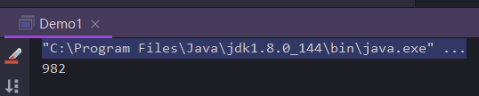

#### 1.1 为什么需要多线程
众所周知，CPU，内存，I/O设备的速度是有极大差异的，为了合理利用CPU的高性能，平衡这三者的速度差异，计算机体系结构、操作系统、编译程序都做出了贡献。
1. CPU增加了缓存，以均衡与内存的速度差异；//导致**可见性**问题
1. 操作系统增加了进程、线程，以分时复用CPU，进而均衡CPU与I/O设备的速度差异；//导致**原子性**问题
1. 编译程序优化指令执行次序，使得缓存能够得到更加合理的利用。//导致**有序性**问题

#### 1.2 线程不安全示例
如果多个线程对同一个共享数据进行访问而不采取同步操作的话，那么操作的结果是不一致的。
以下代码演示1000个线程同时cnt执行自增操作，操作结束之后它的值有可能小于1000。
```java
public class Demo1 {

    public static class ThreadUnsafeExample{
        private int ctn=0;
        public void add(){
            ctn++;
        }
        public int get(){
            return ctn;
        }
    }

    public static void main(String[] args) throws InterruptedException {
        final int threadSize = 1000;
        ThreadUnsafeExample threadUnsafeExample = new ThreadUnsafeExample();
        final CountDownLatch countDownLatch = new CountDownLatch(threadSize);
        ExecutorService executorService = Executors.newCachedThreadPool();
        for (int i = 0; i < threadSize; i++) {
            executorService.execute(() ->{
                threadUnsafeExample.add();
                countDownLatch.countDown();
            });
        }
        countDownLatch.await();
        executorService.shutdown();
        System.out.println(threadUnsafeExample.get());
    }
}
```


#### 1.3 并发出现问题的根源：并发三要素
上述的问题输出为什么不是1000？并发出现问题的根源是什么？

##### 可见性：CPU缓存引起
可见性：一个线程对共享变量的修改，另外一个线程能够立刻看到。
for exmaple，look this code：
```java
//线程1执行的代码
int i = 0;
i=10;

//线程2执行的代码
j=i;
```
if work thread1 is cpu1,work thread2 is cpu2.so we can see,when thread1 working i=0,if it will get the value off init from i set to cpu1 高速缓存中，然后赋值给10，那么在cpu1的高速缓存中i的值变成了10，却没有立刻写入主存当中。

此时线程2执行j=i，它会先去主存读取i的值并加载CPU2的缓存当中，注意此时的内存当中的i的值还是0，那么就会使得j的值为0，而不是10.

这就是可见性的问题，线程1对变量i修改了之后，线程2没有立刻看到线程1修改的值。

##### 有序性：重排序引起
有序性：即程序执行的顺序按照代码的先后顺序执行。举个简单的例子，看下面代码：
```java
int i = 0;
boolean flag=false;
i=1;   //语句1
flag=true //语句2
```
上面定义了一个int类型的变量，定义了一个boolean的变量。然后分别对两个变量进行赋值操作。从代码顺序上看，语句1是在语句2前面的，那么JVM在真正执行这段代码的时候会保证语句1一定会在语句2前面执行吗？不一定，为什么呢？这里可能会发生指令重排序（Instruction Reorder）。

在执行程序时，为了提高性能，编译器和处理器常常会对指令做重排序。重排序分三种类型：

* 编译器优化的重排序。编译器在不改变单线程程序语义的前提下，可以重新安排语句的执行顺序。
* 指令级并行的重排序。现代处理器采用了指令级并行技术（Instruction—Level Parallelism，ILP）来将多条指令重叠执行。如果不存在数据依赖性，处理器可以改变语句对应机器指令的执行顺序。
* 内存系统的重排序，由于处理器使用缓存和读/写缓冲区，这使得加载和存储操作看上去可能是在乱序上执行。

从java源代码到最终实际执行的指令序列，会分别经历下面三种重排序：

##### 原子性
原子性：即一个操作或多个操作，要么全部执行并且执行的过程不会被任何因素打断，要么就都不执行。
经典的转账问题：比如从A账户向B账户转1000元，那么必然包括2个操作：从账户A减去100元，往账户B上加1000元。
所以这2个操作必须要具备原子性才能保证不出现一些意外的问题。
