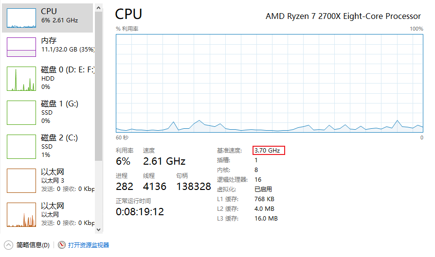
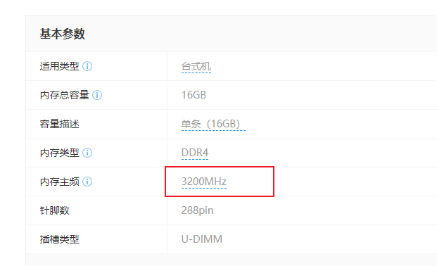

#### 1.1 冯诺伊曼计算机模型
cpu读内存存储，计算完之后，再存到内存存储。读数，存数.

cpu和内存通信是通过I/O总线，I/O是所有硬件都进行通信的，IO总线是有带宽的。而且内存的主频是远远小于CPU的速度。所以要有CPU Cache

寄存器>L1>L2>L3>内存条

cpu计算完之后，是先写到缓存里面来，什么时候写到内存呢？
当缓存不够用了，FIFO，清了写到内存里，把计算完的数据写回到内存，这个是不清楚的。等CPU有空的时候写到内存中。
有什么办法，强制让cpu写到内存中。就是#Lock信号。MESI缓存一致性协议，马上同步回来，就是用缓存一致性协议。

为什么要设计CPU缓存的原因是，cpu的读写速度是一般多少G的HZ，而内存是多少M的HZ，如果没有缓存，那cpu直接去读取内存，那内存是拖慢了cpu的计算速度，每次去读写内存中的数据，相对cpu来说都是浪费10被到百倍的速度。内存中的读写速度太慢了，跟不上cpu的运行速度，先把内存的指令码和数据段先读到cpu里面去运行。

cpu组成：控制单元、运算单元、存储单元

CPU多级缓存，寄存器
L1 cache
L2 cache
L3 cache

多核CPU和多CPU不一样，一个主板有多个槽位，可以放多个CPU。每个CPU会具体给你标明，每个CPU支持多少个线程，支持超线程。

缓存一致性协议

volatile 保证变量的可见性，不保证原子性，防重排序。
在DCL（double-check）双重检查加锁，修改的单例就是用volatile

实例化一个对象可以分为三个步骤：
* 分配内存空间
* 初始化对象
* 将内存空间的地址赋值给对应的引用

但是对指令的重排序，可能将一个未初始化的对象引用暴露出来，导致不可预料的结果。为了防止这个过程的重排序，我们需要将变量设置为volatile类型。

* 分配内存空间
* 将内存空间的地址赋值给对应的引用
* 初始化对象

volatile-可见性实现：基于内存屏障来的。
如果对声明了 volatile 的变量进行写操作，JVM 就会向处理器发送一条 lock 前缀的指令，将这个变量所在缓存行的数据写回到系统内存。 为了保证各个处理器的缓存是一致的，实现了缓存一致性协议(MESI)，每个处理器通过嗅探在总线上传播的数据来检查自己缓存的值是不是过期了，当处理器发现自己缓存行对应的内存地址被修改，就会将当前处理器的缓存行设置成无效状态，当处理器对这个数据进行修改操作的时候，会重新从系统内存中把数据读到处理器缓存里。