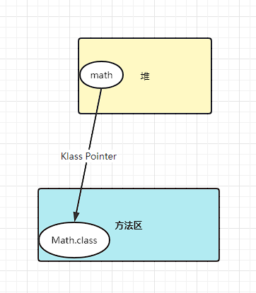
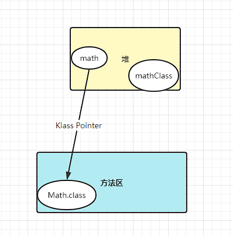

#### 1、JVM对象创建过程详解
```java
Math math = new Math();
```
这么一行代码，jvm执行到new这个指令，会先检测这个类有没有进行加载，没有加载就去加载。继而分配内存

划分内存：指针碰撞，空闲列表
不管是哪种方式，都是有并发的问题。对同一块位置有对内存的争抢。空间只能放一块
##### 解决并发问题的方法
1. CAS+失败重试
1. 本地线程分配缓冲（TLAB）有很多对象同时去分配，把每个线程事先在Eden区分配专属内存。对象就往这个内存分配就好了，JDK1.8默认使用TLAB参数来设定虚拟机是否使用
```java
-XX:+/-UseTLAB
```

初始化：成员变量，new出来之前，赋初始值

设置对象头：一个Math对象，除了成员变量，还有其他的啊
对象=（对象头header+实例数据Instance Data+对齐填充Padding）。
对象头=（Mark Word标记字段+Klass Pointer+数组长度）
正常来说，无锁态：前面的25位是对象的hashcode，4位是分代年龄，最多分代年龄<=15
。
Klass Pointer类型指针（开启压缩占4字节，关闭压缩占8字节的元数据指针）


还有一个是类对象,是在堆里面的
```java
Class<? extends Math> mathClass = math.getClass();
```

我们通过mathClass（理解为镜像）可以拿到Math.class的类元数据信息，JVM用的对象头的类型指针是拿到类元信息。Math.class存储介质是C++对象，整个jvm内部是c和c++实现的。


执行<init>方法

#### 2、对象头与指针压缩详解

