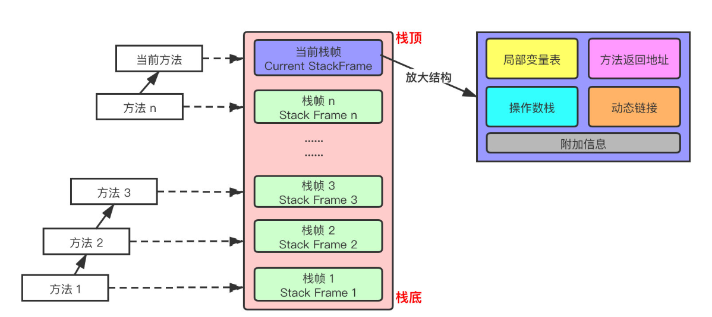
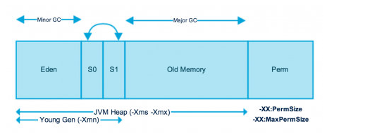

运行时数据区：方法区、堆、栈、程序计数器、本地方法栈

* 线程私有：程序计数器、虚拟机栈、本地方法区
* 线程共享：堆、方法区，堆外内存（java7永久代或JDK8的元空间）

程序计数器：当前线程所执行的字节码的信号指示器，这不会出现OutOfEmemoryError情况的区域

栈：栈中数据都是以（栈帧Stack Frame）格式存在，在这个线程的每个方法都各自对应一个栈帧，入栈出栈，是一个内存区域，维系方法执行过程中的各种数据信息

本地方法栈：Native Method Stack
* java虚拟机栈用于管理java方法的调用，而本地方法栈用于管理本地方法的调用
* 本地方法栈也是线程私有
* 允许线程固定或可动态扩展的内存大小

堆内存：分代理由：优化GC性能
* 新生代（年轻代）：新对象和没达到一定年龄的对象都在新生代
* 老年代（养老区）：被长时间使用的对象，老年代的内存空间应该要比年轻代更大
* 元空间（永久代）：JDK1.8以前占用JVM内存，JDK1.8直接使用物理内存

年轻代（Young Generation）
年轻代是所有新对象创建的地方，填充年轻代时，执行垃圾收集。Minor GC。分为三个部分-Eden，S1，S0（from、to），默认8:1:1
* 大多数新创建的对象都位于Eden内存空间中
* 当Eden空间被对象填充时，执行Minor GC，并将所有幸存者空间移动到一个幸存者空间中
* Minor GC检查幸运者对象，并将它们移动到另一个幸存者空间。所以每次，一个幸存者空间总是空的
* 经过多次GC循环后存活下来的对象被移动到老年带。

老年代（Old Generation）
旧的一代内存包含那些经过许多轮小型GC后仍然存活的对象。通常，垃圾收集是在老年代内存满时执行的。老年代垃圾收集称为主GC（Major GC），通常需要更多的时间。
大对象直接进入老年代（需要大量连续内存空间的对象）。目的避免发生Eden区和Survivor区之间发生大量的内存拷贝。

元空间
Non-Heap（非堆），与Java堆区分开