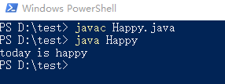
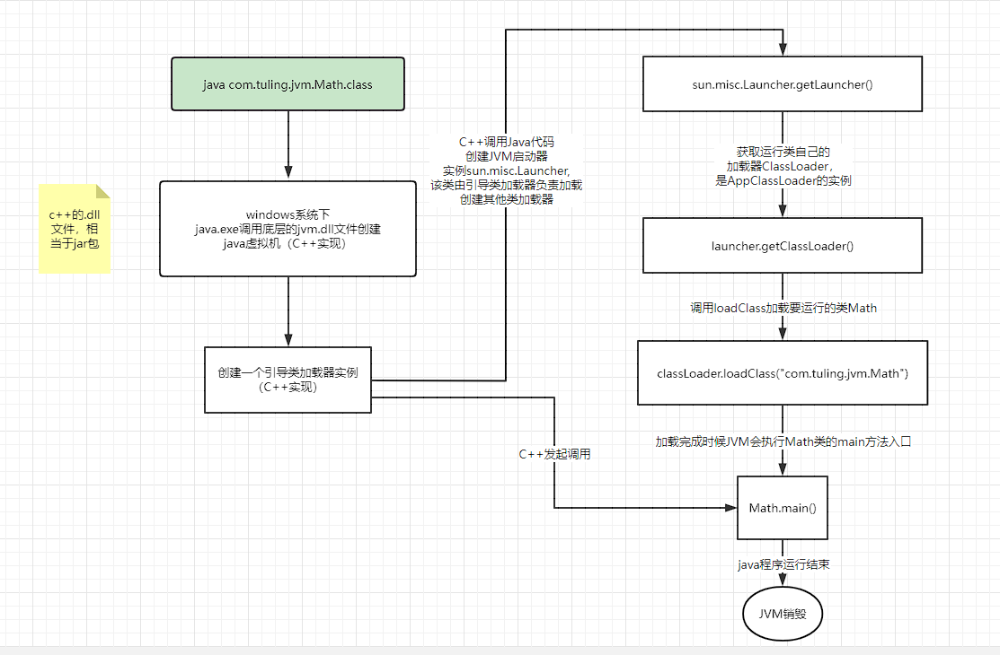
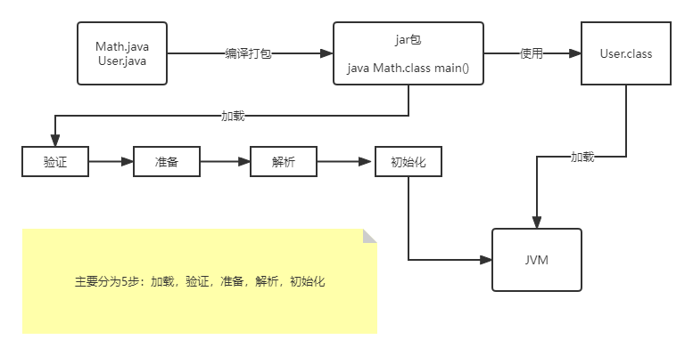
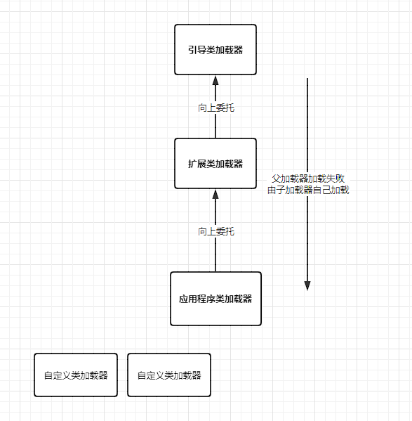
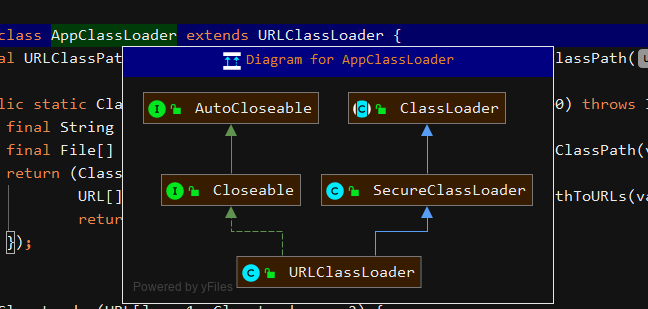
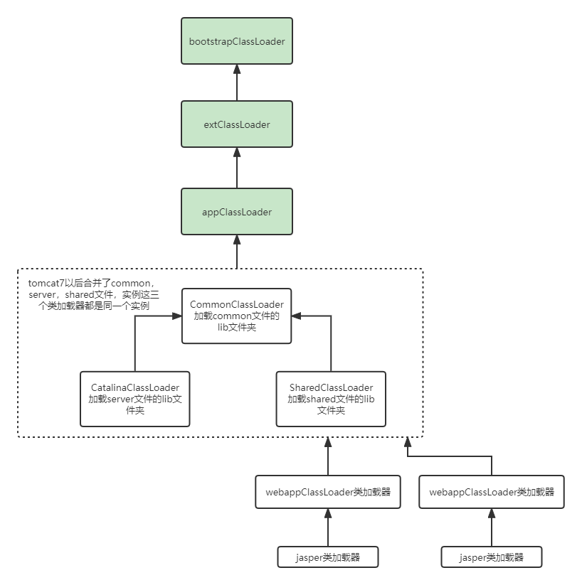
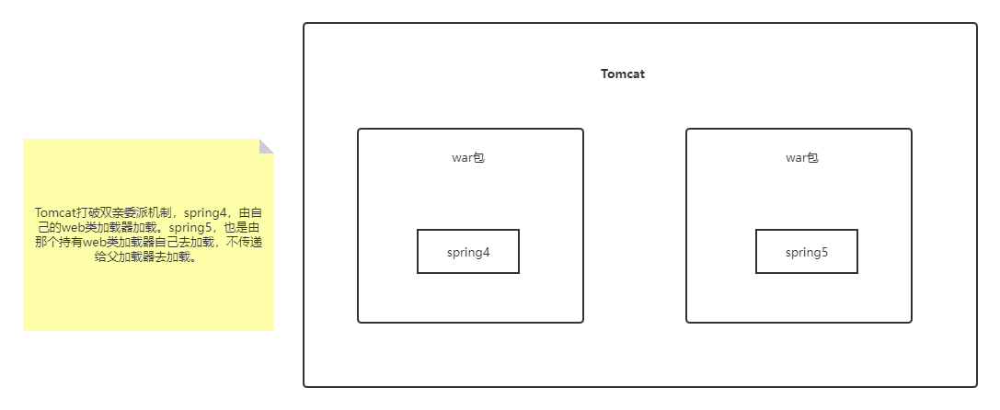

当我们用java命令运行某个类的main函数启动程序时，首先需要通过**类加载器**把主类加载到JVM。
使用方法：
在D盘的test目录下，新建Happy.java文件，先编译成Happy.class文件，再java Happy运行启动
```powershell
javac Happy.java
java Happy
```
shift+鼠标右键出现powershell

```java
public class Math {

    public static int initData = 666;
    public static User user = new User();

    public int compute(){ //一个方法对应一个栈帧内存区域
        int a=1;
        int b=2;
        int c = (a+b)*10;
        return c;
    }

    public static void main(String[] args) {
        Math math = new Math();
        math.compute();
    }
}

```

其中loadClass的类加载过程主要有5步：
**加载 >> 验证 >> 准备 >> 解析 >> 初始化 >>** 使用 >> 卸载
1. 加载：在硬盘上查找并通过IO读入字节码文件，使用到类时才会加载，例如调用类的main()方法，new对象等等，在加载阶段会在内存中生成一个**代表这个类的java.lang.class对象**，作为方法区这个类的各种数据的访问入口
1. 验证：校验字节码文件的正确性
1. 准备：给类的静态变量分配内存，并赋予默认值；**如果是常量的话直接赋指定的值**
1. 解析：将**符号引用**替换为直接引用，该阶段会把一些静态方法（符号引用，比如main()方法）替换为指向数据所存内存的指针或句柄等（直接引用），这是所谓的**静态链接**过程（类加载期间完成），**动态链接**是在程序运行期间完成的将符号引用替换为直接引用。多态，接口有不同的实现。
1. 初始化：对类的静态变量初始化为指定的值，执行静态代码块


类被加载到方法区中后主要包含 **运行时常量池，类型信息，字段信息，方法信息，类加载器的引用，对应class实例的引用**，等信息。
**类加载器的引用**：这个类到类加载器实例的引用
**对应class实例的引用**：类加载器在加载类信息放到方法区(Method Area)中后，会创建一个对应的Class类型的对象实例放到堆（Heap）中，做为开发人员访问方法区中类定义的入口和切入点。（堆，jvm栈，本地方法栈，程序计数器，方法区）

注意：JVM里面的类加载，懒加载，一般是不会去加载它们，直到用到了它们。逐步加载这些类。
jar包或war包里的类不是一次性全部加载的，是使用到时才加载。
```java
public class TestDynamicLoad {

    static{
        System.out.println("*************load TestDymicLoad************************");
    }

    public static void main(String[] args) {
        new A();
        System.out.println("**********************load test******************************");
        B b = null;//B不会加载，除非这里执行new B()
    }
}
class A{
    static {
        System.out.println("load A");
    }

    public A(){
        System.out.println("initial A");
    }
}
class B{
    static {
        System.out.println("load B");
    }

    public B(){
        System.out.println("initial B");
    }
}

```
运行结果如下：
```powershell
*************load TestDymicLoad************************
load A
initial A
**********************load test******************************
```
如果只是定义一个变量b，是不会去加载类，更不会去初始化类B

#### 类加载器和双亲委派机制
上面的类加载过程主要是通过类加载器来实现的，Java里有如下几种类加载器

* 引导类加载器：负责加载支撑JVM运行的位于JRE的lib目录下的核心类库，比如rt.jar、charsets.jar等
* 扩展类加载器：负责加载支撑JVM运行的位于JRE的lib目录下的ext扩展目录中的JAR类包
* 应用程序类加载器：负责加载ClassPath路径下的类包，主要就是加载你自己写的那些类
* 自定义加载器：负责加载用户自定义路径下的类包

```java
public class TestJDKClassLoader {

    public static void main(String[] args) {
        System.out.println(String.class.getClassLoader());
        System.out.println(com.sun.crypto.provider.DESKeyFactory.class.getClassLoader());
        System.out.println(TestJDKClassLoader.class.getClassLoader());

        System.out.println("\n");
        ClassLoader appClassLoader = ClassLoader.getSystemClassLoader();
        ClassLoader extClassLoader = appClassLoader.getParent();
        ClassLoader bootStrapLoader = extClassLoader.getParent();
        System.out.println("the bootStrapLoader: "+bootStrapLoader);
        System.out.println("the extClassLoader: "+extClassLoader);
        System.out.println("the appClassLoader: "+appClassLoader);

        System.out.println("\n");
        System.out.println("bootstrapLoader加载以下文件： ");
        URL[] urls = Launcher.getBootstrapClassPath().getURLs();
        for (int i = 0; i < urls.length; i++) {
            System.out.println(urls[i]);
        }

        System.out.println("\n");
        System.out.println("extClassLoader加载以下文件： ");
        System.out.println(System.getProperty("java.ext.dirs"));

        System.out.println("\n");
        System.out.println("appClassLoader加载以下文件：");
        System.out.println(System.getProperty("java.class.path"));
    }
}
```

运行结果如下：
```powershell
null
sun.misc.Launcher$ExtClassLoader@61bbe9ba
sun.misc.Launcher$AppClassLoader@18b4aac2


the bootStrapLoader: null
the extClassLoader: sun.misc.Launcher$ExtClassLoader@61bbe9ba
the appClassLoader: sun.misc.Launcher$AppClassLoader@18b4aac2

bootstrapLoader加载以下文件： 
file:/C:/Program%20Files/java/jdk1.8.0_144/jre/lib/resources.jar
file:/C:/Program%20Files/java/jdk1.8.0_144/jre/lib/rt.jar
file:/C:/Program%20Files/java/jdk1.8.0_144/jre/lib/sunrsasign.jar
file:/C:/Program%20Files/java/jdk1.8.0_144/jre/lib/jsse.jar
file:/C:/Program%20Files/java/jdk1.8.0_144/jre/lib/jce.jar
file:/C:/Program%20Files/java/jdk1.8.0_144/jre/lib/charsets.jar
file:/C:/Program%20Files/java/jdk1.8.0_144/jre/lib/jfr.jar
file:/C:/Program%20Files/java/jdk1.8.0_144/jre/classes


extClassLoader加载以下文件： 
C:\Program Files\Java\jdk1.8.0_144\jre\lib\ext;C:\WINDOWS\Sun\Java\lib\ext


appClassLoader加载以下文件：
C:\Program Files\java\jdk1.8.0_144\jre\lib\charsets.jar;C:\Program Files\java\jdk1.8.0_144\jre\lib\deploy.jar;C:\Program Files\java\jdk1.8.0_144\jre\lib\ext\access-bridge-64.jar;C:\Program Files\java\jdk1.8.0_144\jre\lib\ext\cldrdata.jar;C:\Program Files\java\jdk1.8.0_144\jre\lib\ext\dnsns.jar;C:\Program Files\java\jdk1.8.0_144\jre\lib\ext\jaccess.jar;C:\Program Files\java\jdk1.8.0_144\jre\lib\ext\jfxrt.jar;C:\Program Files\java\jdk1.8.0_144\jre\lib\ext\localedata.jar;C:\Program Files\java\jdk1.8.0_144\jre\lib\ext\nashorn.jar;C:\Program Files\java\jdk1.8.0_144\jre\lib\ext\sunec.jar;C:\Program Files\java\jdk1.8.0_144\jre\lib\ext\sunjce_provider.jar;C:\Program Files\java\jdk1.8.0_144\jre\lib\ext\sunmscapi.jar;C:\Program Files\java\jdk1.8.0_144\jre\lib\ext\sunpkcs11.jar;C:\Program Files\java\jdk1.8.0_144\jre\lib\ext\zipfs.jar;C:\Program Files\java\jdk1.8.0_144\jre\lib\javaws.jar;C:\Program Files\java\jdk1.8.0_144\jre\lib\jce.jar;C:\Program Files\java\jdk1.8.0_144\jre\lib\jfr.jar;C:\Program Files\java\jdk1.8.0_144\jre\lib\jfxswt.jar;C:\Program Files\java\jdk1.8.0_144\jre\lib\jsse.jar;C:\Program Files\java\jdk1.8.0_144\jre\lib\management-agent.jar;C:\Program Files\java\jdk1.8.0_144\jre\lib\plugin.jar;C:\Program Files\java\jdk1.8.0_144\jre\lib\resources.jar;C:\Program Files\java\jdk1.8.0_144\jre\lib\rt.jar;D:\code\IDEA_workspace\jvm-learn\target\classes;D:\JetBrains\IntelliJ IDEA 2019.2.3\lib\idea_rt.jar

```

类加载器初始化过程：
参见类运行加载全过程图可知其中会创建JVM启动器实例sun.misc.Launcher
sun.misc.Launcher初始化使用了饿汉单例模式设计，保证一个JVM虚拟机内只有一个sun.misc.Launcher实例。
在Launcher构造方法内部，其创建了两个类加载器，分别是sun.misc.Launcher.ExtClassLoader（扩展类加载器）和sun.misc.Launcher.AppClassLoader（应用类加载器）。
JVM默认使用Launcher的getClassLoader()方法返回的类加载器AppClassLoader实例加载我们的应用程序。

Launcher初始化代码
```java
public Launcher() {
    Launcher.ExtClassLoader var1;
    try {
        //返回extClassLoader，在构造的过程中将其父加载器设置为null
        var1 = Launcher.ExtClassLoader.getExtClassLoader();
    } catch (IOException var10) {
        throw new InternalError("Could not create extension class loader", var10);
    }

    try {
        //构造应用类加载器，在构造的过程中将其父加载器设置为ExtClassLoader
        //launcher的loader属性值是AppClassLoader，我们一般都是用这个类加载器来加载我们自己写的应用程序。
        this.loader = Launcher.AppClassLoader.getAppClassLoader(var1);
    } catch (IOException var9) {
        throw new InternalError("Could not create application class loader", var9);
    }

    Thread.currentThread().setContextClassLoader(this.loader);
    String var2 = System.getProperty("java.security.manager");
    if (var2 != null) {
        SecurityManager var3 = null;
        if (!"".equals(var2) && !"default".equals(var2)) {
            try {
                var3 = (SecurityManager)this.loader.loadClass(var2).newInstance();
            } catch (IllegalAccessException var5) {
            } catch (InstantiationException var6) {
            } catch (ClassNotFoundException var7) {
            } catch (ClassCastException var8) {
            }
        } else {
            var3 = new SecurityManager();
        }

        if (var3 == null) {
            throw new InternalError("Could not create SecurityManager: " + var2);
        }

        System.setSecurityManager(var3);
    }

}
public ClassLoader getClassLoader() {
    return this.loader;
}
```


为什么用应用程序类加载器来加载呢，web程序，百分之95%的代码，都是由应用程序类加载器加载的，第一次加载的时候确确实实是多走了一步，但是后面都不用了往上找了，如果直接用bootstrap类加载，那每次都要从上往下找。

加载某个类时，会先委托父加载器寻找目标类，找不到再委托上层父加载器加载，如果所有父加载器路径下都找不到目标类，则在自己的类加载路径中查找并载入目标类。
比如说我们的Math类，最先会找应用程序类加载器加载，应用程序类加载器会先委托扩展类加载器加载，扩展类加载器再委托引导类加载器

**双亲委派机制来说简单就是，先找父亲加载，不行再由儿子加载**

AppClassLoader加载类的双亲委派机制源码，AppClassLoader的loadClass方法最终会调用其父类ClassLoader的loadClass方法，该方法的大体逻辑如下：
1. 首先，检查一下指定命令的类是否已经加载过了，如果加载过了，就不需要加载，直接返回。
2. 如果此类没有加载过，那么，再判断一下，是否有父加载器；如果有父加载器，则由父加载器加载（即调用parent.loadClass(name,false);）或者是调用boostrap类加载器来加载
3. 如果父加载器及bootstrap类加载器都没有找到指定的类，那么调用当前类加载器的findClass方法来完成类加载。

appClassLoader的父类继承关系



从我已加载的类集合里面，看下是不是加载过了，最终是调了C++代码native。

ClassLoader的loadClass代码
```java
protected Class<?> loadClass(String name, boolean resolve)
        throws ClassNotFoundException
    {
        synchronized (getClassLoadingLock(name)) {
            // First, check if the class has already been loaded
            //在已加载的集合里面，查找是不是之前已经加载过了，里面是一个native方法
            Class<?> c = findLoadedClass(name);
            if (c == null) {
                long t0 = System.nanoTime();
                try {
                    //不为null就是找，extClassLoader，extClassLoader去loadClass，就是找BootsrapClassLoader引导类加载器去加载。
                    if (parent != null) {
                        c = parent.loadClass(name, false);
                    //为null，bootstrapLoader
                    } else {
                        c = findBootstrapClassOrNull(name);
                    }
                } catch (ClassNotFoundException e) {
                    // ClassNotFoundException thrown if class not found
                    // from the non-null parent class loader
                }
                //如果搞了一圈还是null的，还是由自己来加载这个类
                if (c == null) {
                    // If still not found, then invoke findClass in order
                    // to find the class.
                    long t1 = System.nanoTime();
                    //都会调用URLClassLoader的findClass方法在加载器的类路径里查找并加载该类
                    c = findClass(name);

                    // this is the defining class loader; record the stats
                    sun.misc.PerfCounter.getParentDelegationTime().addTime(t1 - t0);
                    sun.misc.PerfCounter.getFindClassTime().addElapsedTimeFrom(t1);
                    sun.misc.PerfCounter.getFindClasses().increment();
                }
            }
            if (resolve) {
                resolveClass(c);
            }
            return c;
        }
    }
```

**为什么要设计双亲委派机制？**
* 沙箱安全机制：自己写的java.lang.String.class类不会被加载，这样便可以防止核心API库被随意篡改
* 避免类的重复加载：当父亲已经加载了该类时，就没有必要子ClassLoader再加载一次，保证被加载类的唯一性

自定义的String.class,和java的String包名一模一样
```java
package java.lang;

public class String {


    public static void main(String[] args) {
        System.out.println("My String class");
    }
}
```
运行结果如下：
```java
错误: 在类 java.lang.String 中找不到 main 方法, 请将 main 方法定义为:
   public static void main(String[] args)
否则 JavaFX 应用程序类必须扩展javafx.application.Application
```
java.lang.String.class被委托到引导类加载器，在rt.jar包里，全路径同名的类，找到了，加载成功，加载的jdk的类，里面没有main方法，找不到，就报错了。

全盘委托加载机制：这个Math会加载到其他的类，也会用AppClassLoader
当一个ClassLoader装载一个类时，除非显示的使用另外一个ClassLoader，该类所依赖及引用的类也由这个ClassLoader载入。

自定义类加载器示例：
自定义类加载器只需要实现loadClass和findClass，主要是**重写findClass方法**

自定义类加载器
```java
public class MyClassLoaderTest {

    static class MyClassLoader extends ClassLoader{
        private String classPath;

        public MyClassLoader(String classPath) {
            this.classPath = classPath;
        }

        private byte[] loadByte(String name)throws Exception{
            name = name.replaceAll("\\.","/");
            FileInputStream fileInputStream = new FileInputStream(classPath+"/"+name+".class");
            int len = fileInputStream.available();
            byte[] data = new byte[len];
            fileInputStream.read(data);
            fileInputStream.close();
            return data;
        }


        @Override
        public Class<?> loadClass(String name,boolean resolve) throws ClassNotFoundException {
            synchronized (getClassLoadingLock(name)){
                Class<?> c = findLoadedClass(name);
                if (c==null){
                    long t1 = System.nanoTime();
                    if (!name.startsWith("com.liugang.jvm")){
                        this.getParent().loadClass(name);
                    }else{
                        c = findClass(name);
                    }

                    sun.misc.PerfCounter.getFindClassTime().addElapsedTimeFrom(t1);
                    sun.misc.PerfCounter.getFindClasses().increment();
                }
                if (resolve){
                    resolveClass(c);
                }
                return c;
            }
        }

        @Override
        protected Class<?> findClass(String name) throws ClassNotFoundException {
            byte[] data = new byte[0];
            try {
                data = loadByte(name);
                return defineClass(name,data,0,data.length);
            } catch (Exception e) {
                e.printStackTrace();
                throw new ClassNotFoundException();
            }
        }
    }

    public static void main(String[] args) throws ClassNotFoundException, InstantiationException, IllegalAccessException, NoSuchMethodException, InvocationTargetException {
        MyClassLoader classLoader = new MyClassLoader("D:/test");
        Class clazz = classLoader.loadClass("java.lang.String");
        Object obj = clazz.newInstance();
        Method method = clazz.getDeclaredMethod("sout",null);
        method.invoke(obj,null);
        System.out.println(clazz.getClassLoader().getClass().getName());
    }
}

```
刚才在mian函数执行，一下内容，结果如下
```java
MyClassLoader classLoader = new MyClassLoader("D:/test");
Class clazz = classLoader.loadClass("com.liugang.jvm.User1");
Object obj = clazz.newInstance();
Method method = clazz.getDeclaredMethod("sout",null);
method.invoke(obj,null);
System.out.println(clazz.getClassLoader().getClass().getName());  
*****************************结果如下
Exception in thread "main" java.lang.NoClassDefFoundError: java/lang/Object
	at java.lang.ClassLoader.defineClass1(Native Method)
	at java.lang.ClassLoader.defineClass(ClassLoader.java:756)
	at java.lang.ClassLoader.defineClass(ClassLoader.java:635)
	at com.liugang.jvm.MyClassLoaderTest$MyClassLoader.findClass(MyClassLoaderTest.java:58)
	at com.liugang.jvm.MyClassLoaderTest$MyClassLoader.loadClass(MyClassLoaderTest.java:39)
	at java.lang.ClassLoader.loadClass(ClassLoader.java:351)
	at com.liugang.jvm.MyClassLoaderTest.main(MyClassLoaderTest.java:74)
```
1、怎么编译Object.java?,让自定义加载器去加载User1.class不报错
找到Object类，在rt.jar包里面，解压出来，然后放到自定义类加载器的目标文件夹下
这么核心的类，怎么会被你加载呢，除非重写JVM，Hotspot源码。

Tomcat双亲委派机制

* commonLoader：Tomcat最基本的类加载器，加载路径中的class可以被Tomcat容器本身以及各个Webapp访问；
* catalinaLoader：Tomcat容器中私有的类加载器，加载路径中的class对于Webapp不可见
* sharedLoader：各个Webapp共享的类加载器，加载路径中的class对于所有Webapp可见，但是对于Tomcat容器不可见；
* WebappClassLoader：各个Webapp私有的类加载器，加载路径中的class只对当前Webapp可见，比如加载war包里相关的类，每个war包应用都有自己的WebappClassLoader，实现相互隔离，比如不同war包应用引入了不同的spring版本，这样实现就能加载各自的spring版本；

从图中的委派关系中可以看出：
CommonClassLoader能加载的类都可以被CatalinaClassLoader和SharedClassLoader使用，从而实现了公有类库的共用，而catalinaClassLoader和SharedClassLoader自己能加载的类则与对方相互隔离。
WebAppClassLoader可以使用SharedClassLoader加载到的类，但各个WebAppClassLoader实例之间相互隔离。
而JasperLoader的加载范围仅仅是这个JSP文件所编译出来的那个.class文件，它出现的目的就是了为了被丢弃；当Web容器检测到JSP文件被修改时，会替换目前的JasperLoader实例,
并通过再建立一个新的Jsp类加载器来实现JSP文件的热加载功能。




自己搞不定，百度搞，谷歌搞，再去问别人搞。

注意：同一个JVM内，两个相同包名和类名的类对象可以共存，因为它们的类加载器可以不一样，所以看两个类对象是否是同一个，除了看类的包名和类名是否都相同之外，还需要它们的类加载器也是同一个才能认为它们是同一个。
