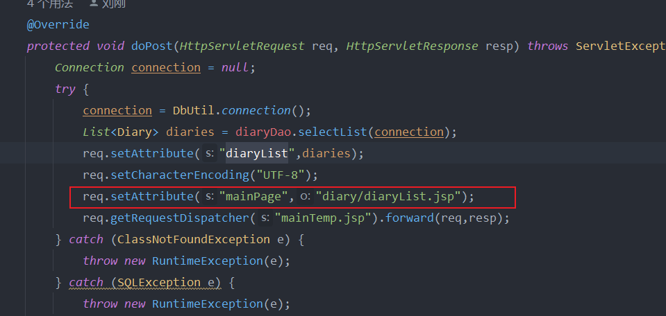

#### 依赖引入

```xml
<dependency>
    <groupId>javax.servlet.jsp.jstl</groupId>
    <artifactId>javax.servlet.jsp.jstl-api</artifactId>
    <version>1.2.2</version>
</dependency>
<dependency>
    <groupId>taglibs</groupId>
    <artifactId>standard</artifactId>
    <version>1.1.2</version>
</dependency>
```

#### 内置其他jsp
在jsp界面，依赖其他jsp

<jsp:include page="${mainPage}"></jsp:include>

${mainPage}相当于从servlet设置的一个属性key。value是jsp的路径



#### 在jsp中循环变量

引入标签依赖 

<%@ taglib uri="http://java.sun.com/jsp/jstl/core" prefix="c"%>

然后在jsp界面

```html
<c:forEach var="diary" items="${diaryList}">
    <li>
        <fmt:formatDate value="${diary.releaseDate}" type="date" pattern="yyyy-MM-dd"/>
        <span>&nbsp;<a href="#">${diary.title}</a></span>
    </li>
</c:forEach>
```

${diaryList} 表示 传来的list的key。

diary 表示单个对象

<c:forEach>对应java的for循环，里面才是真正的html元素

#### jsp格式化时间

引入标签依赖

<%@ taglib prefix="fmt" uri="http://java.sun.com/jsp/jstl/fmt" %>

<fmt:formatDate value="${diary.releaseDate}" type="date" pattern="yyyy-MM-dd"/>

pattern 表示 展示时间的格式，type 表示 数据的类型
