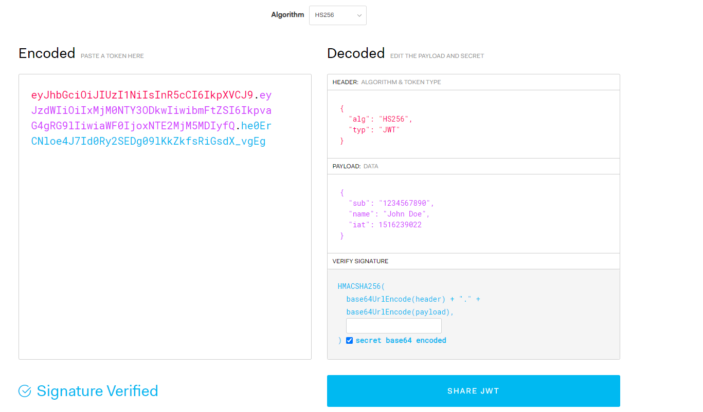

jwt：json web token  

应用场景：信息交换、授权  

结构：
* 标题
* 有效载荷
* 签名

xxxxxxx.yyyyyy.zzzzzzzzz

##### 标题
标头通常由两部分组成：令牌的类型，即JWT，以及正在使用的签名算法，例如HMAC SHA256或RSA  
```java
{
    "alg":"HS256",
    "typ":"JWT"
}
```
这个JSON被Base64Url编码形成JWT的第一部分  

##### 有效载荷
包含声明。声明是关于实体（通常是用户）和附加数据的陈述。索赔分为三种类型：注册索赔、公开索赔和私人索赔  
* 注册声明：一组预定义的声明，不是强制性的，例如iss（发行人）、exp（到期时间）、sub（主题）、aud（受众）等  
    声明名称只有三个字符，主要JWT是紧凑的。

* 公开声明：随意定义
* 私人声明：既不是注册声明也不是公共声明。  
```java
{
    "sub": "1234567890",
    "name": "John Doe",
    "admin": true
}
```
这个JSON被Base64Url编码形成JWT的第二部分  
##### 签名
要创建签名部分，您必须获取编码的标头、编码的有效负载、秘密、标头中指定的算法，并对其进行签名。  
例如，如果您想使用 HMAC SHA256 算法，签名将通过以下方式创建：  

```java
HMACSHA256(
  base64UrlEncode(header) + "." +
  base64UrlEncode(payload),
  secret)
```


#### JSON Web 令牌如何工作？
在身份验证中，当用户使用其凭据成功登录时，将返回一个 JSON Web Token。由于令牌是凭据，因此必须非常小心以防止出现安全问题。通常，您不应将令牌保留超过所需的时间。  

每当用户想要访问受保护的路由或资源时，用户代理应该发送 JWT，通常在Authorization标头中使用Bearer模式。标头的内容应如下所示：  
```java
Authorization: Bearer <token>
```
https://jwt.io/#debugger
