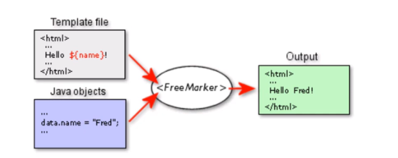

模板引擎，基于模板和要改变的数据（HTML，电子邮件，配置文件，源代码）。Java类库

Freemarker不是web应用框架，而适合作为Web应用框架的一个应用

https://www.bilibili.com/video/BV1do4y1m7Pp/?spm_id_from=333.788.recommend_more_video.0&vd_source=bfe249ea8880533927ff8d5166add96d

