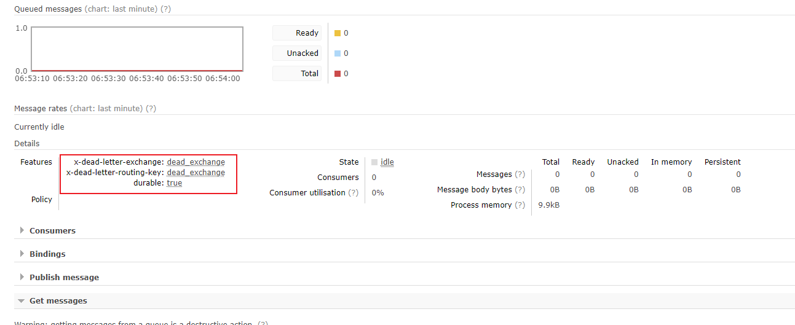

死信，是Rabbitmq的一种消息机制，出现以下情况：
1、消息被否定确认，使用chnanel.basicNack或channel.basicReject,并且requeue的属性被设置为false。
2、消息在队列的存活时间超过设置的生存时间（TTL）时间。
3、消息队列的消息数量已经超过最大队列长度。

配置了死信队列，那消息会被丢入进去，没有配置，消息将会被丢弃。

死信队列也只是一个普通的交换机，专门用来处理死信的交换机。

