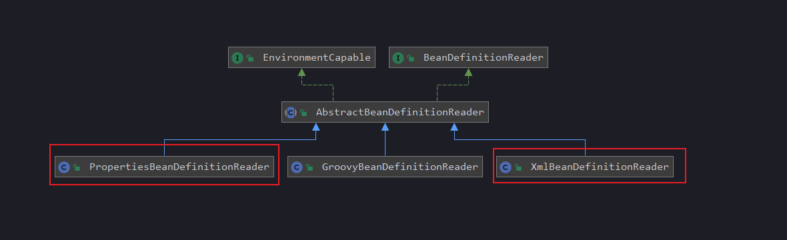

#### 1.1 放眼望去，尽可能获取有用信息 

如上图所示，Spring源码中提供**PropertiesBeanDefinitionReader**类对，properties文件进行读取

```java
/**
 * Bean definition reader for a simple properties format.
 * 这个BeanDefinition阅读器，可以读一下简单格式的properties
 *
 * <p>Provides bean definition registration methods for Map/Properties and
 * ResourceBundle. Typically applied to a DefaultListableBeanFactory.
```
bean definition的核心数据有哪些？

beanClassName，abstract，lazy-init，scope，parent等。

如下所示，可以参考一下，对properties文件的要求

```properties
//定义一个抽象bean，名称为employee，表示为员工，类型为Employee，两个属性：组名：Insurance，usesDialUp：是否配电话
employee.(class)=MyClass       // bean is of class MyClass
employee.(abstract)=true       // this bean can't be instantiated directly
employee.group=Insurance       // real property
employee.usesDialUp=false      // real property (potentially overridden)

//定义个非抽象bean，parent为抽象的employee，lazy-init，manager经理字段：引用techie，department属性为Sales
salesrep.(parent)=employee     // derives from "employee" bean definition
salesrep.(lazy-init)=true      // lazily initialize this singleton bean
salesrep.manager(ref)=techie     // reference to another bean
salesrep.department=Sales      // real property

//定义一个非抽象bean，parent为employee，scope是多例，manager经理引用：jeff，department属性是Engineering，usesDialUp为true
techie.(parent)=employee       // derives from "employee" bean definition
techie.(scope)=prototype       // bean is a prototype (not a shared instance)
techie.manager(ref)=jeff       // reference to another bean
techie.department=Engineering  // real property
techie.usesDialUp=true         // real property (overriding parent value)

//这个是通过构造器注入，0是第一个参数，1是第二个参数
ceo.$0(ref)=secretary          // inject 'secretary' bean as 0th constructor arg
ceo.$1=1000000  
```

看看**BeanDefinitionReader**都干了啥

```java
public interface BeanDefinitionReader {

    //获取DefaultListableBeanFactory
    BeanDefinitionRegistry getRegistry();
    
    //获取资源加载器
    @Nullable
    ResourceLoader getResourceLoader();
    
    //获取类加载器
    @Nullable
    ClassLoader getBeanClassLoader();
    
    //获取beanName生成器
    BeanNameGenerator getBeanNameGenerator();
    
    //重载
    int loadBeanDefinitions(Resource resource) throws BeanDefinitionStoreException;
    //重载
    int loadBeanDefinitions(Resource... resources) throws BeanDefinitionStoreException;
    
    //重载
    int loadBeanDefinitions(String location) throws BeanDefinitionStoreException;
    
    //重载
    int loadBeanDefinitions(String... locations) throws BeanDefinitionStoreException;

}
```

BeanDefinitionReader大概作用：使用指定的classLoader，从指定的resource，去加载bean definition。

#### 1.2 加载bean definition

看看ProperiesBeanDefinitionReader怎么构造的

```java
//调用父类，传入了bean definition注册器
public PropertiesBeanDefinitionReader(BeanDefinitionRegistry registry) {
	super(registry);
}

//构造默认的资源加载器、environment
protected AbstractBeanDefinitionReader(BeanDefinitionRegistry registry) {
Assert.notNull(registry, "BeanDefinitionRegistry must not be null");
this.registry = registry;

// Determine ResourceLoader to use.
if (this.registry instanceof ResourceLoader) {
	this.resourceLoader = (ResourceLoader) this.registry;
}
else {
	this.resourceLoader = new PathMatchingResourcePatternResolver();
}

// Inherit Environment if possible
if (this.registry instanceof EnvironmentCapable) {
	this.environment = ((EnvironmentCapable) this.registry).getEnvironment();
}
else {
	this.environment = new StandardEnvironment();
}
}
```
再看主要的loadBeanDefinition方法，是怎么实现的
```java
public int loadBeanDefinitions(Resource resource) throws BeanDefinitionStoreException {
	return loadBeanDefinitions(new EncodedResource(resource), null);
}
```
继续深入
```java
public int loadBeanDefinitions(EncodedResource encodedResource, @Nullable String prefix)
			throws BeanDefinitionStoreException {

    if (logger.isTraceEnabled()) {
        logger.trace("Loading properties bean definitions from " + encodedResource);
    }
    //读取properties文件内容到props变量
    Properties props = new Properties();
    try {
        try (InputStream is = encodedResource.getResource().getInputStream()) {
            if (encodedResource.getEncoding() != null) {
                getPropertiesPersister().load(props, new InputStreamReader(is, encodedResource.getEncoding()));
            }
            else {
               getPropertiesPersister().load(props, is);
            }
        }
        //注册bean definition
        int count = registerBeanDefinitions(props, prefix, encodedResource.getResource().getDescription());
        if (logger.isDebugEnabled()) {
            logger.debug("Loaded " + count + " bean definitions from " + encodedResource);
        }
        return count;
    }
    catch (IOException ex) {
        throw new BeanDefinitionStoreException("Could not parse properties from " + encodedResource.getResource(), ex);
    }
}
```
继续深入注册 registerBeanDefinitions 

```java
protected void registerBeanDefinition(String beanName, Map<?, ?> map, String prefix, String resourceDescription)
			throws BeansException {

    public static final String CLASS_KEY = "(class)";
    public static final String PARENT_KEY = "(parent)";
    public static final String SCOPE_KEY = "(scope)";
    public static final String SINGLETON_KEY = "(singleton)";
    public static final String ABSTRACT_KEY = "(abstract)";
    public static final String LAZY_INIT_KEY = "(lazy-init)";
    public static final String REF_SUFFIX = "(ref)";    

    String className = null;
    String parent = null;
    String scope = BeanDefinition.SCOPE_SINGLETON;
    boolean isAbstract = false;
    boolean lazyInit = false;

    ConstructorArgumentValues cas = new ConstructorArgumentValues();
    MutablePropertyValues pvs = new MutablePropertyValues();
    
    String prefixWithSep = prefix + SEPARATOR;
    int beginIndex = prefixWithSep.length();
    
    for (Map.Entry<?, ?> entry : map.entrySet()) {
    	String key = StringUtils.trimWhitespace((String) entry.getKey());
    	if (key.startsWith(prefixWithSep)) {
    		String property = key.substring(beginIndex);
    		//bean的className，贼核心属性
    		if (CLASS_KEY.equals(property)) {
    			className = StringUtils.trimWhitespace((String) entry.getValue());
    		}
    		//beanDefinition的parent属性，和xml里面的bean标签配置parentName一样的功能
    		else if (PARENT_KEY.equals(property)) {
    			parent = StringUtils.trimWhitespace((String) entry.getValue());
    		}
    		//abstract 是否是抽象的bean definition
    		else if (ABSTRACT_KEY.equals(property)) {
    			String val = StringUtils.trimWhitespace((String) entry.getValue());
    			isAbstract = TRUE_VALUE.equals(val);
    		}
    		//scope
    		else if (SCOPE_KEY.equals(property)) {
    			// Spring 2.0 style
    			scope = StringUtils.trimWhitespace((String) entry.getValue());
    		}
    		else if (SINGLETON_KEY.equals(property)) {
    			// Spring 1.2 style
    			String val = StringUtils.trimWhitespace((String) entry.getValue());
    			scope = (!StringUtils.hasLength(val) || TRUE_VALUE.equals(val) ?
    					BeanDefinition.SCOPE_SINGLETON : BeanDefinition.SCOPE_PROTOTYPE);
    		}
    		else if (LAZY_INIT_KEY.equals(property)) {
    			String val = StringUtils.trimWhitespace((String) entry.getValue());
    			lazyInit = TRUE_VALUE.equals(val);
    		}
    		//通过构造器注入其他bean
    		else if (property.startsWith(CONSTRUCTOR_ARG_PREFIX)) {
    			if (property.endsWith(REF_SUFFIX)) {
    				int index = Integer.parseInt(property.substring(1, property.length() - REF_SUFFIX.length()));
    				cas.addIndexedArgumentValue(index, new RuntimeBeanReference(entry.getValue().toString()));
    			}
    			else {
    				int index = Integer.parseInt(property.substring(1));
    				cas.addIndexedArgumentValue(index, readValue(entry));
    			}
    		}
    		//这里引用其他bean，(ref)
    		else if (property.endsWith(REF_SUFFIX)) {
    			// This isn't a real property, but a reference to another prototype
    			// Extract property name: property is of form dog(ref)
    			property = property.substring(0, property.length() - REF_SUFFIX.length());
    			String ref = StringUtils.trimWhitespace((String) entry.getValue());
    
    			// It doesn't matter if the referenced bean hasn't yet been registered:
    			// this will ensure that the reference is resolved at runtime.
    			Object val = new RuntimeBeanReference(ref);
    			pvs.add(property, val);
    		}
    		else {
    			// It's a normal bean property.
    			pvs.add(property, readValue(entry));
    		}
    	}
    }

    if (logger.isTraceEnabled()) {
    	logger.trace("Registering bean definition for bean name '" + beanName + "' with " + pvs);
    }
    
    // Just use default parent if we're not dealing with the parent itself,
    // and if there's no class name specified. The latter has to happen for
    // backwards compatibility reasons.
    if (parent == null && className == null && !beanName.equals(this.defaultParentBean)) {
    	parent = this.defaultParentBean;
    }
    
    try {
    	//熟悉的套路，构造一个bean definition
    	AbstractBeanDefinition bd = BeanDefinitionReaderUtils.createBeanDefinition(
    			parent, className, getBeanClassLoader());
    	bd.setScope(scope);
    	bd.setAbstract(isAbstract);
    	bd.setLazyInit(lazyInit);
    	//通过构造器注入
    	bd.setConstructorArgumentValues(cas);
    	//通过属性注入
    	bd.setPropertyValues(pvs);
    	//注入beanDefinition map注册表
    	getRegistry().registerBeanDefinition(beanName, bd);
    }
    catch (ClassNotFoundException ex) {
    	throw new CannotLoadBeanClassException(resourceDescription, beanName, className, ex);
    }
    catch (LinkageError err) {
    	throw new CannotLoadBeanClassException(resourceDescription, beanName, className, err);
    }
}
```

定义ApplicationContext代码
```java
public class CLassPathPropertyFileApplicationContext extends AbstractRefreshableConfigApplicationContext {
    
    @Override
    protected void loadBeanDefinitions(DefaultListableBeanFactory beanFactory) throws BeansException, IOException {
        //构造一个propertiesBeanDefinitionReader
        PropertiesBeanDefinitionReader beanDefinitionReader = new PropertiesBeanDefinitionReader(beanFactory);

        beanDefinitionReader.setEnvironment(this.getEnvironment());
        beanDefinitionReader.setResourceLoader(this);

        loadBeanDefinitions(beanDefinitionReader);
    }

    private void loadBeanDefinitions(PropertiesBeanDefinitionReader beanDefinitionReader) {
        String[] configResources = getConfigLocations();
        if (configResources!=null){
            beanDefinitionReader.loadBeanDefinitions(configResources);
        }
    }

    public CLassPathPropertyFileApplicationContext(String[] configuratoins) {
        this(configuratoins,true,null);
    }

    public CLassPathPropertyFileApplicationContext(ApplicationContext parent) {
        super(parent);
    }

    public CLassPathPropertyFileApplicationContext(String configuratoin) {
        this(new String[]{configuratoin},true,null);
    }

    public CLassPathPropertyFileApplicationContext(String[] configuratoins,boolean refresh,ApplicationContext context) {
        super(context);
        setConfigLocations(configuratoins);
        if (refresh){
            refresh();
        }
    }
    
}
```

测试代码如下：

```java
public static void main(String[] args) {
    CLassPathPropertyFileApplicationContext context = new CLassPathPropertyFileApplicationContext("spring.properties");
    Map<String,Employee> beansOfType = context.getBeansOfType(Employee.class);
    for (Map.Entry<String,Employee> entry: beansOfType.entrySet()){
    	log.info("bean name:{},bean:{}",entry.getKey(),entry.getValue());
    }
    Techie techie = (Techie) context.getBean("techie");
    log.info(String.valueOf(techie));
}
```