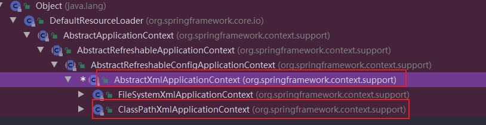
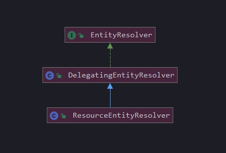

spring启动时，是怎么去读取xml文件的，bean的解析部分可能涉及不到。
#### 1.1 整体流程

1. 给**ClassPathXmlApplicationContext**设置xml文件的路径
1. refresh内部的beanFactory，这时候beanFactory还没有创建，会先创建**DefaultListableBeanFactory**
1. ClassPathXmlApplicationContext会调用其loadBeanDefinitions，将新创建的beanFactory作为参数传入进去
1. ClassPathXmlApplicationContext内部会持有一个XmlBeanDefinitionReader，且XmlBeanDefinitionReader内部是持有之前创建的DefaultListableBeanFactory，XmlBeanDefinitionReader负责读取xml，将bean definition解析出来，丢给DefaultListableBeanFactory，此时，XmlBeanDefinitionReader的任务就完成了。
1. 上面第四步完成后，DefaultListableBeanFactory里面其实一个业务Bean都没有，只有一堆的bean definition‘，后面ClassPathXmlApplicationContext直接去实例化那些需要在启动过程中实例的bean.

主要解析的第四部，XmlBeanDefinitionReader解析xml的过程。

入口代码
```java
public static void main(String[] args) {
        ClassPathXmlApplicationContext context = new ClassPathXmlApplicationContext("classpath:readJson.xml");
    }
```
接着调用ClassPathXmlApplicationContext的内部函数
```java
public ClassPathXmlApplicationContext(
			String[] configLocations, boolean refresh, @Nullable ApplicationContext parent)
			throws BeansException {

    super(parent);
    setConfigLocations(configLocations);
    if (refresh) {
        refresh();
    }
}
```
接着看refresh()方法
```java
@Override
	public void refresh() throws BeansException, IllegalStateException {
		synchronized (this.startupShutdownMonitor) {
    StartupStep contextRefresh = this.applicationStartup.start("spring.context.refresh");
    
    // Prepare this context for refreshing.
    prepareRefresh();
    
    // Tell the subclass to refresh the internal bean factory.
    ConfigurableListableBeanFactory beanFactory = obtainFreshBeanFactory();

    ...........
```
继续深入obtainFreshBeanFactory()创建beanFactory
```java
protected ConfigurableListableBeanFactory obtainFreshBeanFactory() {
    refreshBeanFactory();
    return getBeanFactory();
}
```
继续看refreshBeanFactory()方法
```java
org.springframework.context.support.AbstractRefreshableApplicationContext

protected final void refreshBeanFactory() throws BeansException {
    if (hasBeanFactory()) {
        destroyBeans();
        closeBeanFactory();
    }
    try {
        //创建DefaultListableBeanFactory
        DefaultListableBeanFactory beanFactory = createBeanFactory();
        beanFactory.setSerializationId(getId());
        customizeBeanFactory(beanFactory);
        //加载
        loadBeanDefinitions(beanFactory);
        this.beanFactory = beanFactory;
    }
    catch (IOException ex) {
        throw new ApplicationContextException("I/O error parsing bean definition source for " + getDisplayName(), ex);
    }
}
```
加载是调用了AbstractRefreshableApplicationContext的抽象方法
```java
protected abstract void loadBeanDefinitions(DefaultListableBeanFactory beanFactory)
throws BeansException, IOException;
```
在ClassPathXmlApplicationContext的父类里面实现了此方法
**org.springframework.context.support.AbstractXmlApplicationContext**

```java
@Override
	protected void loadBeanDefinitions(DefaultListableBeanFactory beanFactory) throws BeansException, IOException {
    //创建一个从xml读取beanDefinition的读取器
    XmlBeanDefinitionReader beanDefinitionReader = new XmlBeanDefinitionReader(beanFactory);
    
    // Configure the bean definition reader with this context's
    // resource loading environment.
    //配置环境
    beanDefinitionReader.setEnvironment(this.getEnvironment());
    //配置资源loader，一般就是classpathx下去获取xml
    beanDefinitionReader.setResourceLoader(this);
    //设置xml的解析器
    beanDefinitionReader.setEntityResolver(new ResourceEntityResolver(this));
    
    // Allow a subclass to provide custom initialization of the reader,
    // then proceed with actually loading the bean definitions.
    initBeanDefinitionReader(beanDefinitionReader);
    //核心方法，使用beanDefinitionReader去解析xml，并将解析后的bean definition放到beanFactory
    loadBeanDefinitions(beanDefinitionReader);
}
```
#### 1.2 xml中的xsd、dtd解析器
**beanDefinitionReader.setEntityResolver(new ResourceEntityResolver(this));**

这个类实现的接口就是jdk里面的rt.jar里面的org.xml.sax.EntityResolver，这个接口，主要负责xml里面，外部实体的解析：
```java
public interface EntityResolver {

    public abstract InputSource resolveEntity (String publicId,
                                               String systemId)
        throws SAXException, IOException;

}
```
查看它的实现类：
```java
public class DelegatingEntityResolver implements EntityResolver {

    /** Suffix for DTD files. */
    public static final String DTD_SUFFIX = ".dtd";
    
    /** Suffix for schema definition files. */
    public static final String XSD_SUFFIX = ".xsd";
    
    
    private final EntityResolver dtdResolver;
    
    private final EntityResolver schemaResolver;
    
    public DelegatingEntityResolver(@Nullable ClassLoader classLoader) {
        this.dtdResolver = new BeansDtdResolver();
        this.schemaResolver = new PluggableSchemaResolver(classLoader);
    }

    
    //这个应该就是对xml文件里面的，开头部分的xsd进行解析
    @Override
    @Nullable
    public InputSource resolveEntity(@Nullable String publicId, @Nullable String systemId)
            throws SAXException, IOException {
    
        if (systemId != null) {
            if (systemId.endsWith(DTD_SUFFIX)) {
                return this.dtdResolver.resolveEntity(publicId, systemId);
            }
            else if (systemId.endsWith(XSD_SUFFIX)) {
                return this.schemaResolver.resolveEntity(publicId, systemId);
            }
        }
    
        // Fall back to the parser's default behavior.
        return null;
    }

}
```
例如，如下的xml的代码
```xml
<beans xmlns="http://www.springframework.org/schema/beans"
       xmlns:xsi="http://www.w3.org/2001/XMLSchema-instance"
       xsi:schemaLocation="http://www.springframework.org/schema/beans
       http://www.springframework.org/schema/beans/spring-beans.xsd">
```
上面的代码，应该就是获取和解析上面这里的xsd，方便进行语法校验的。xml也不能乱写，比如，根元素，有且 只能有一个，下面才能有0到多个之类的元素。要是写了多个，也不符合规范。


继续深入了解倒数第二行的loadBeanDefinitions()方法,
获取资源路径，把资源路径
```java
protected void loadBeanDefinitions(XmlBeanDefinitionReader reader) throws BeansException, IOException {
    Resource[] configResources = getConfigResources();
    if (configResources != null) {
        reader.loadBeanDefinitions(configResources);
    }
    String[] configLocations = getConfigLocations();
    //获取资源位置，传给XmlBeanDefinitionReader
    if (configLocations != null) {
        reader.loadBeanDefinitions(configLocations);
    }
}
```
继续看倒数第三行的代码
```java
public int loadBeanDefinitions(String location, @Nullable Set<Resource> actualResources) throws BeanDefinitionStoreException {
    ResourceLoader resourceLoader = getResourceLoader();
    if (resourceLoader == null) {
        throw new BeanDefinitionStoreException(
                "Cannot load bean definitions from location [" + location + "]: no ResourceLoader available");
    }
    
    if (resourceLoader instanceof ResourcePatternResolver) {
        // Resource pattern matching available.
        try {
            Resource[] resources = ((ResourcePatternResolver) resourceLoader).getResources(location);
            //从资源数组里load bean definition
            int count = loadBeanDefinitions(resources);
    、、、、、
			
```
#### 1.3 XmlBeanDefinitionReader类图

类似于模板设计模式，一些通用的逻辑和流程，放在AbstractBeanDefinitionReader，具体的解析，都是放在子类实现，XmlBeanDefinitionReader，PropertiesBeanDefinitionReader。

这里是实现了一个接口，BeanDefinitionReader：
```java
public interface BeanDefinitionReader {

    //读取到beanDefinition后，需要存到这个里面去，不提供这个，我读了往哪里放
    BeanDefinitionRegistry getRegistry();
    //资源加载器，加载xml之类，作为一个接口，资源可以来自于任何地方
    @Nullable
    ResourceLoader getResourceLoader();
    //获取classloader
    @Nullable
    ClassLoader getBeanClassLoader();
    //beanName 生成器
    BeanNameGenerator getBeanNameGenerator();
    
    //重载方法
    int loadBeanDefinitions(Resource resource) throws BeanDefinitionStoreException;
    
    int loadBeanDefinitions(Resource... resources) throws BeanDefinitionStoreException;
    
    
    int loadBeanDefinitions(String location) throws BeanDefinitionStoreException;
    
    
    int loadBeanDefinitions(String... locations) throws BeanDefinitionStoreException;

}

```
> AbstractBeanDefinitionReader
实现了大部分的方法，除了下面这个：
```java
int loadBeanDefinitions(Resource resource) throws BeanDefinitionStoreException;
```
抽象类，不负责干活，为了能够从不同的resource读取，这个也应该交给子类。
比如，这里的XmlBeanDefinitionReader，是从xml读取，还有之前的PropertiesBeanDefinitionReader是从properties文件读取。也可以从json文件读取。

#### 1.3 读取xml文件为InputSource
XmlBeanDefinitionReader
```java
public int loadBeanDefinitions(EncodedResource encodedResource) throws BeanDefinitionStoreException {
    //读取xml文件为文件流
    try (InputStream inputStream = encodedResource.getResource().getInputStream()) {
        //读取xml文件资源
        InputSource inputSource = new InputSource(inputStream);
        if (encodedResource.getEncoding() != null) {
            inputSource.setEncoding(encodedResource.getEncoding());
        }
        //do 才是真正的干活的
        return doLoadBeanDefinitions(inputSource, encodedResource.getResource());
    }
```
InputSource，这个类的全路径为：org.xml.sax.InputSource,是jdk里面的类。
有一个词叫，sax事件解析模型

继续看doLoadBeanDefinitions()
```java
protected int doLoadBeanDefinitions(InputSource inputSource, Resource resource)
			throws BeanDefinitionStoreException {
    
    try {
        //Document也是jdk的类
        Document doc = doLoadDocument(inputSource, resource);
        //又是在嵌套
        int count = registerBeanDefinitions(doc, resource);
        if (logger.isDebugEnabled()) {
            logger.debug("Loaded " + count + " bean definitions from " + resource);
        }
        return count;
    }
```

继续看registerBeanDefinitions()
```java
public int registerBeanDefinitions(Document doc, Resource resource) throws BeanDefinitionStoreException {
    BeanDefinitionDocumentReader documentReader = createBeanDefinitionDocumentReader();
    int countBefore = getRegistry().getBeanDefinitionCount();
    documentReader.registerBeanDefinitions(doc, createReaderContext(resource));
    return getRegistry().getBeanDefinitionCount() - countBefore;
}
```
##### 1.5 BeanDefinitionDocumentReader
看的出来，XmlBeanDefinitionReader，又new了一个BeanDefinitionDocumentReader，把具体的解析工作交给了它。
```java
public interface BeanDefinitionDocumentReader {

    void registerBeanDefinitions(Document doc, XmlReaderContext readerContext)
            throws BeanDefinitionStoreException;

}

```
> void registerBeanDefinitions(Document doc, XmlReaderContext readerContext)

有两个参数，Document就是xml文件，XmlReaderContext

#### 1.6 XmlReaderContext
顾名思义，类似于上下文，把需要的都放到里面，大杂烩，铁锅乱炖。
```java
public class XmlReaderContext extends ReaderContext {
    //之前的核心类
    private final XmlBeanDefinitionReader reader;
    //org.springframework.beans.factory.xml.NamespaceHandlerResolver 核心类
    private final NamespaceHandlerResolver namespaceHandlerResolver;

}
public class ReaderContext {
    //xml资源本身
    private final Resource resource;
    //中间报错问题
    private final ProblemReporter problemReporter;
    //event/listener机制把
    private final ReaderEventListener eventListener;
    
    private final SourceExtractor sourceExtractor;
}
```
还是看刚才的registerBeanDefinitions()
```java
public int registerBeanDefinitions(Document doc, Resource resource) throws BeanDefinitionStoreException {
    BeanDefinitionDocumentReader documentReader = createBeanDefinitionDocumentReader();
    int countBefore = getRegistry().getBeanDefinitionCount();
    documentReader.registerBeanDefinitions(doc, createReaderContext(resource));
    return getRegistry().getBeanDefinitionCount() - countBefore;
}
```
```java
public NamespaceHandlerResolver getNamespaceHandlerResolver() {
    if (this.namespaceHandlerResolver == null) {
        //创建一个namespaceHandlerResolver
        this.namespaceHandlerResolver = createDefaultNamespaceHandlerResolver();
    }
    return this.namespaceHandlerResolver;
}

public XmlReaderContext createReaderContext(Resource resource) {

    return new XmlReaderContext(resource, this.problemReporter, this.eventListener,
            this.sourceExtractor, this, getNamespaceHandlerResolver());
}
```

#### 1.7 NamespaceHandlerResolver
```java
public interface NamespaceHandlerResolver {

    //解析xml时，我们可能有<bean>，这个是默认命名空间，其namespace就是<beans>
    //如果是context:component-scan,这里的namespace，就是context
    @Nullable
    NamespaceHandler resolve(String namespaceUri);
    
}

```

这个类的用途，就是根据的namespace，找到对应的handler
下面这个文件就在spring-beans的resources文件夹里面META-INF/spring.handlers
```xml
http\://www.springframework.org/schema/c=org.springframework.beans.factory.xml.SimpleConstructorNamespaceHandler
http\://www.springframework.org/schema/p=org.springframework.beans.factory.xml.SimplePropertyNamespaceHandler
http\://www.springframework.org/schema/util=org.springframework.beans.factory.xml.UtilNamespaceHandler
```

继续看BeanDefinitionDocumentReader的实现类**DefaultBeanDefinitionDocumentReader**解析逻辑
```java
protected void doRegisterBeanDefinitions(Element root) {
    private BeanDefinitionParserDelegate delegate;
		
    BeanDefinitionParserDelegate parent = this.delegate;
    this.delegate = createDelegate(getReaderContext(), root, parent);
    
    if (this.delegate.isDefaultNamespace(root)) {
        String profileSpec = root.getAttribute(PROFILE_ATTRIBUTE);
        if (StringUtils.hasText(profileSpec)) {
            String[] specifiedProfiles = StringUtils.tokenizeToStringArray(
                    profileSpec, BeanDefinitionParserDelegate.MULTI_VALUE_ATTRIBUTE_DELIMITERS);
            // We cannot use Profiles.of(...) since profile expressions are not supported
            // in XML config. See SPR-12458 for details.
            if (!getReaderContext().getEnvironment().acceptsProfiles(specifiedProfiles)) {
                if (logger.isDebugEnabled()) {
                    logger.debug("Skipped XML bean definition file due to specified profiles [" + profileSpec +
                            "] not matching: " + getReaderContext().getResource());
                }
                return;
            }
        }
    }
    
    preProcessXml(root);
    parseBeanDefinitions(root, this.delegate);
    postProcessXml(root);
    
    this.delegate = parent;
}
```
#### 1.7 BeanDefinitionParserDelegate
这个类主要是做解析工作的。
```java
public class BeanDefinitionParserDelegate {

    public static final String BEANS_NAMESPACE_URI = "http://www.springframework.org/schema/beans";
    
    public static final String MULTI_VALUE_ATTRIBUTE_DELIMITERS = ",; ";
    
    /**
        * Value of a T/F attribute that represents true.
        * Anything else represents false.
        */
    public static final String TRUE_VALUE = "true";
    
    public static final String FALSE_VALUE = "false";
    
    public static final String DEFAULT_VALUE = "default";
    
    public static final String DESCRIPTION_ELEMENT = "description";
    
    public static final String AUTOWIRE_NO_VALUE = "no";
    
    public static final String AUTOWIRE_BY_NAME_VALUE = "byName";
    
    public static final String AUTOWIRE_BY_TYPE_VALUE = "byType";
    
    public static final String AUTOWIRE_CONSTRUCTOR_VALUE = "constructor";
    
    public static final String AUTOWIRE_AUTODETECT_VALUE = "autodetect";
    
    public static final String NAME_ATTRIBUTE = "name";
    
    public static final String BEAN_ELEMENT = "bean";
    
    public static final String META_ELEMENT = "meta";
    
    public static final String ID_ATTRIBUTE = "id";
    
    public static final String PARENT_ATTRIBUTE = "parent";
    
    public static final String CLASS_ATTRIBUTE = "class";
    
    public static final String ABSTRACT_ATTRIBUTE = "abstract";
    
    public static final String SCOPE_ATTRIBUTE = "scope";
    
    private static final String SINGLETON_ATTRIBUTE = "singleton";
    
    public static final String LAZY_INIT_ATTRIBUTE = "lazy-init";
    
    public static final String AUTOWIRE_ATTRIBUTE = "autowire";
    
    public static final String AUTOWIRE_CANDIDATE_ATTRIBUTE = "autowire-candidate";
    
    public static final String PRIMARY_ATTRIBUTE = "primary";
    
    public static final String DEPENDS_ON_ATTRIBUTE = "depends-on";
    
    public static final String INIT_METHOD_ATTRIBUTE = "init-method";
    
    public static final String DESTROY_METHOD_ATTRIBUTE = "destroy-method";
    
    public static final String FACTORY_METHOD_ATTRIBUTE = "factory-method";
    
    public static final String FACTORY_BEAN_ATTRIBUTE = "factory-bean";
    
    public static final String CONSTRUCTOR_ARG_ELEMENT = "constructor-arg";
    
    public static final String INDEX_ATTRIBUTE = "index";
    
    public static final String TYPE_ATTRIBUTE = "type";
    
    public static final String VALUE_TYPE_ATTRIBUTE = "value-type";
    
    public static final String KEY_TYPE_ATTRIBUTE = "key-type";
    
    public static final String PROPERTY_ELEMENT = "property";
    
    public static final String REF_ATTRIBUTE = "ref";
    
    public static final String VALUE_ATTRIBUTE = "value";
    
    public static final String LOOKUP_METHOD_ELEMENT = "lookup-method";
    
    public static final String REPLACED_METHOD_ELEMENT = "replaced-method";
    
    public static final String REPLACER_ATTRIBUTE = "replacer";
    
    public static final String ARG_TYPE_ELEMENT = "arg-type";
    
    public static final String ARG_TYPE_MATCH_ATTRIBUTE = "match";
    
    public static final String REF_ELEMENT = "ref";
    
    public static final String IDREF_ELEMENT = "idref";
    
    public static final String BEAN_REF_ATTRIBUTE = "bean";
    
    public static final String PARENT_REF_ATTRIBUTE = "parent";
    
    public static final String VALUE_ELEMENT = "value";
    
    public static final String NULL_ELEMENT = "null";
    
    public static final String ARRAY_ELEMENT = "array";

```
这里面都是一些xml里面的元素名称。

回过头来，继续看主线逻辑，判断是不是默认的命名空间。
```java
protected void doRegisterBeanDefinitions(Element root) {
		
    BeanDefinitionParserDelegate parent = this.delegate;
    this.delegate = createDelegate(getReaderContext(), root, parent);
    //判断是不是默认的命名空间
    if (this.delegate.isDefaultNamespace(root)) {
        String profileSpec = root.getAttribute(PROFILE_ATTRIBUTE);
        if (StringUtils.hasText(profileSpec)) {
            String[] specifiedProfiles = StringUtils.tokenizeToStringArray(
                    profileSpec, BeanDefinitionParserDelegate.MULTI_VALUE_ATTRIBUTE_DELIMITERS);
            // We cannot use Profiles.of(...) since profile expressions are not supported
            // in XML config. See SPR-12458 for details.
            if (!getReaderContext().getEnvironment().acceptsProfiles(specifiedProfiles)) {
                if (logger.isDebugEnabled()) {
                    logger.debug("Skipped XML bean definition file due to specified profiles [" + profileSpec +
                            "] not matching: " + getReaderContext().getResource());
                }
                return;
            }
        }
    }
    
    preProcessXml(root);
    parseBeanDefinitions(root, this.delegate);
    postProcessXml(root);
    
    this.delegate = parent;
	}
```

```java
public boolean isDefaultNamespace(@Nullable String namespaceUri) {
    return !StringUtils.hasLength(namespaceUri) || BEANS_NAMESPACE_URI.equals(namespaceUri);
}
public static final String BEANS_NAMESPACE_URI = "http://www.springframework.org/schema/beans";
```
```java
protected void parseBeanDefinitions(Element root, BeanDefinitionParserDelegate delegate) {
    if (delegate.isDefaultNamespace(root)) {
        NodeList nl = root.getChildNodes();
        for (int i = 0; i < nl.getLength(); i++) {
            Node node = nl.item(i);
            if (node instanceof Element) {
                Element ele = (Element) node;
                if (delegate.isDefaultNamespace(ele)) {
                    parseDefaultElement(ele, delegate);
                }
                else {
                    delegate.parseCustomElement(ele);
                }
            }
        }
    }
    else {
        delegate.parseCustomElement(root);
    }
}
```
默认空间的逻辑parseDefaultElement(),就四个元素import、alias、bean、beans
```java
private void parseDefaultElement(Element ele, BeanDefinitionParserDelegate delegate) {
    if (delegate.nodeNameEquals(ele, IMPORT_ELEMENT)) {
        importBeanDefinitionResource(ele);
    }
    else if (delegate.nodeNameEquals(ele, ALIAS_ELEMENT)) {
        processAliasRegistration(ele);
    }
    else if (delegate.nodeNameEquals(ele, BEAN_ELEMENT)) {
        processBeanDefinition(ele, delegate);
    }
    else if (delegate.nodeNameEquals(ele, NESTED_BEANS_ELEMENT)) {
        // recurse
        doRegisterBeanDefinitions(ele);
    }
}
```
非默认的处理器，主要是aop、context等非默认的namespace
主要是几个核心类
XmlBeanDefinitionReader
BeanDefinitionDocumentReader
XmlReaderContext
namespaceHandlerResolver
BeanDefinitionParserDelegate