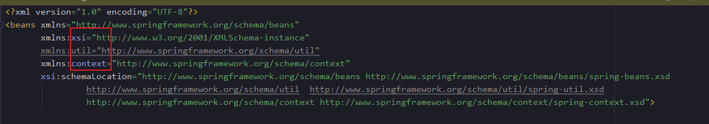
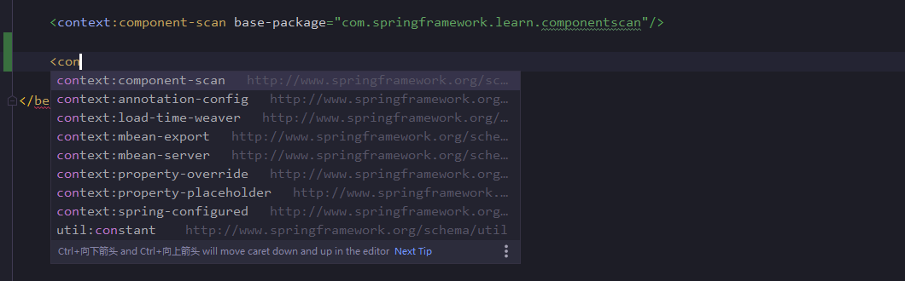
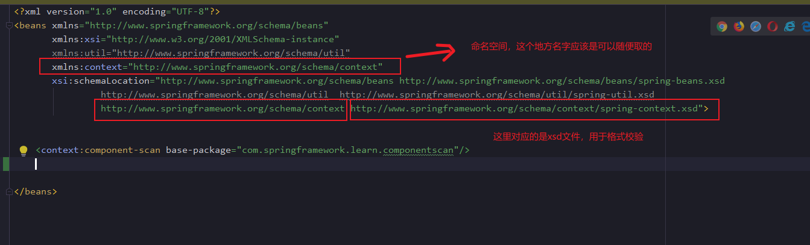
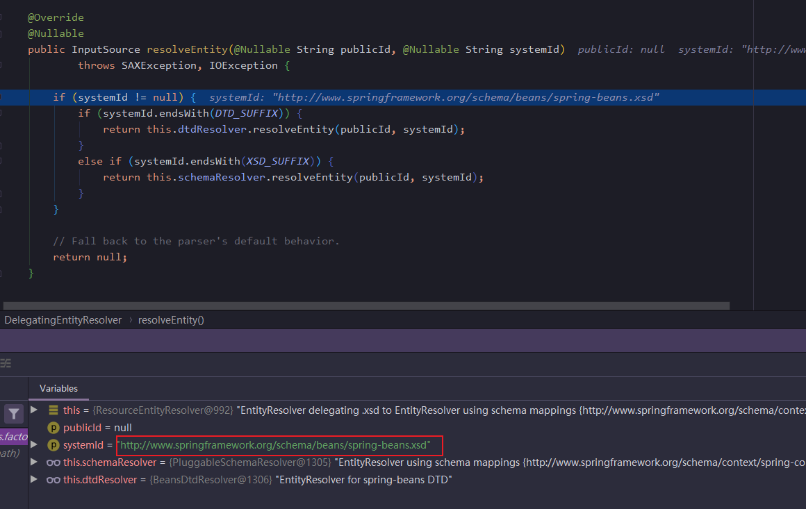
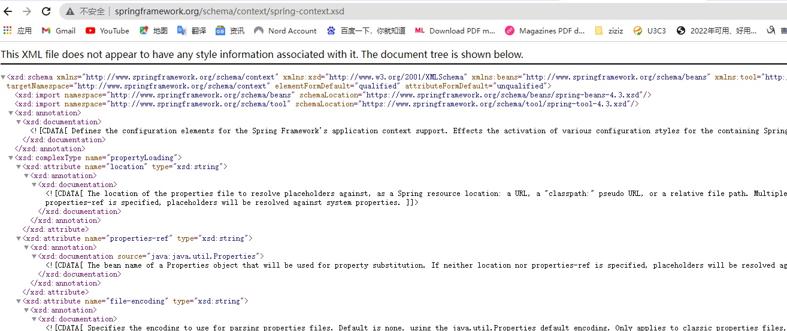
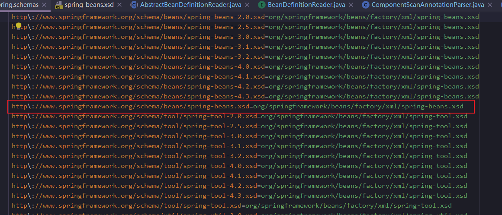

xml对应的namespace的element表格。

|  namespace	   | element  |
|  ----  | ----  |
| util  | constant、property-path、list、set、map、properties |
| context  | property-placeholder、property-override、annotation-config、component-scan、load-time-weaver、spring-configured、mbean-export、mbean-server |
| context  | property-placeholder、property-override、annotation-config、component-scan、load-time-weaver、spring-configured、mbean-export、mbean-server |
| beans  | import、bean、alias |
| task  | annotation-driven、scheduler、scheduled-tasks、executor |
| cache  | advice、annotation-driven |
| aop  | config、scoped-proxy、aspectj-autoproxy |

#### 1.1 spring中所采用的xml解析方式
今天想办法从spring源码里，把它用来解析xml的主干代码提取了一下，基本就是下面这样的，针对如下xml文件，我们打算遍历一遍：
```java
test-xml-read.xml:
<?xml version="1.0" encoding="UTF-8"?>
<f:table xmlns:f="http://www.w3school.com.cn/furniture"
		 xmlns:t="http://www.w3school.com.cn/t">
    <f:name>African Coffee Table</f:name>
    <f:width>80</f:width>
    <f:length>120</f:length>
    
    <t:abc></t:abc>
</f:table>
```
那么，spring里的代码骨架如下：
```java
@Slf4j
public class XmlSimpleUse {

    public static void main(String[] args) throws IOException, ParserConfigurationException, SAXException {
    //读取xml文件
    URL url = Thread.currentThread().getContextClassLoader().getResource("test-xml-read.xml");
    InputStream inputStream = url.openStream();
    //再把流转变为InputSource，在后续xml解析使用
    InputSource inputSource = new InputSource(inputStream);
    DocumentBuilderFactory factory = createDocumentBuilderFactory();
    DocumentBuilder documentBuilder = factory.newDocumentBuilder();
    //可选，设置实体解析器，其实就是：你可以自定义去哪里加载xsd/dtd文件
    documentBuilder.setEntityResolver(new EntityResolver() {
        @Override
        public InputSource resolveEntity(String publicId, String systemId) throws SAXException, IOException {
            return null;
        }
    });
    documentBuilder.setErrorHandler(null);
    //解析xml文件，获取document，代表了整个文件
    Document document = documentBuilder.parse(inputSource);
    //获取根元素
    Element root = document.getDocumentElement();
    log.info("root is {}",root);
    
    //获取根元素下的每个child元素
    NodeList nodeList = root.getChildNodes();
    for (int i = 0; i < nodeList.getLength(); i++) {
        Node node = nodeList.item(i);
        if (node instanceof Element){
            Element element = (Element) node;
            log.info("element {}",element);
        }
    }
    
    }
    
    private static DocumentBuilderFactory createDocumentBuilderFactory() {
    DocumentBuilderFactory factory = DocumentBuilderFactory.newInstance();
    factory.setValidating(true);
    factory.setNamespaceAware(true);
    return factory;
    }
}

```
输出如下：
```java
[main] INFO com.springframework.learn.readxml.XmlSimpleUse - root is [f:table: null]
[main] INFO com.springframework.learn.readxml.XmlSimpleUse - element [f:name: null]
[main] INFO com.springframework.learn.readxml.XmlSimpleUse - element [f:width: null]
[main] INFO com.springframework.learn.readxml.XmlSimpleUse - element [f:length: null]
[main] INFO com.springframework.learn.readxml.XmlSimpleUse - element [t:abc: null]
```
上面的demo代码，没有依赖任何的spring类，基本还原了spring解析xml的大体过程，在spring中多出来的细节部分。自定义EntityResolver

#### 1.2 自定义EntityResolver
documentBuilder.setEntityResolver，上面我们是默认实现的。
看过我们前面的xml，有一定了解的同学可能知道，前面定义了两个namespace，
```java
xmlns:namespace-prefix="namespaceURI"
```
所以，我们这边的两个namespace，前缀主要是f、t 内容分别是：
```xml
http://www.w3school.com.cn/furniture
http://www.w3school.com.cn/t
```

一般xml文件是有格式要求的，比如spring里，比如这个命名空间下，可以定义什么元素，这都是定死了的：


那个这个约束是在哪里呢？在namespaceURI对应的dtd,xsd文件中


像上面截图这样，就是：
```xml
//这一句定义一个命名空间
xmlns:context="http://www.springframework.org/schema/context"
       xsi:schemaLocation="http://www.springframework.org/schema/beans http://www.springframework.org/schema/beans/spring-beans.xsd
                http://www.springframework.org/schema/util  http://www.springframework.org/schema/util/spring-util.xsd
                //下面这个就是key，value，key就是http://www.springframework.org/schema/context
                //value就是xsd文件
                http://www.springframework.org/schema/context http://www.springframework.org/schema/context/spring-context.xsd">
```
有了上面的基础知识，再来说这个接口
```java
public interface EntityResolver {
    //这个systemId，
    public abstract InputSource resolveEntity (String publicId,
                                                String systemId)
        throws SAXException, IOException;

}
```
这个接口，就是让我们自定义一个方法，来解析外部xml实体，一般传入的参数如下：

publicId为null，systemId为xsd的uri，这个uri一般可以通过网络获取

但是，spring自定义了自己的entityResovler，实现类为：**org.springframework.beans.factory.xml.ResourceEntityResolver**。

这个类，会在本地寻找对应的xsd文件，主要逻辑就是去查找classpath下的META-INF/spring.schemas

spring为啥要自定义EntityResovler呢，spring为啥要在本地找呢？原因：
如果不自定义，jdk的dom解析类，就会直接使用http://www.springframework.org/schema/context/spring-context.xsd这个东西，去作为URL，建立socket网络连接来获取，而部分环境，生产环境，基本都是外网隔离的，你这时候是没法下载xsd文件。岂不是没法校验xml文件的语法，所以要在classpath下查找。