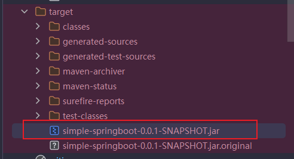
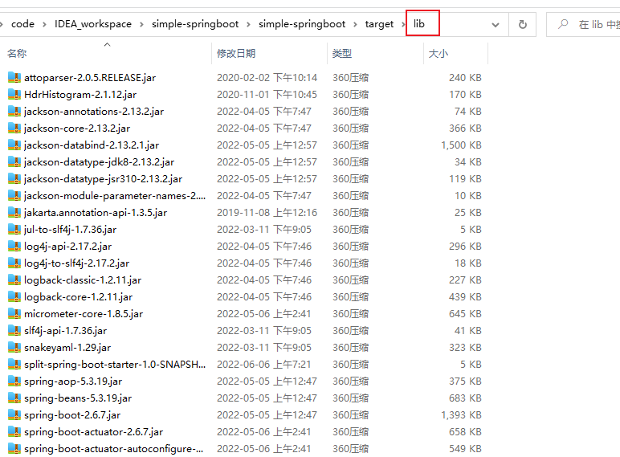
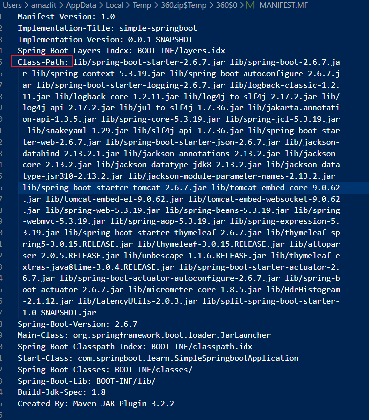

今天跟同事阿秋聊了下leaf项目的fastjson升级，需要改.mf里面文件里面的依赖，再去替换fastjson的jar包，再去重启服务。所以对吧，想探索下springboot的打包方式。

#### default 默认方式
默认使用springboot插件打包是一个大的jar包  
那么这样去升级的话呢，就需要质量控制室去根据git仓库去打包去出包。


第三方包都是放在/BOOT-INF/lib里面。
MANIFEST.MF 文件定义了Main-class和第三方依赖。
```java
Manifest-Version: 1.0
Spring-Boot-Classpath-Index: BOOT-INF/classpath.idx
Implementation-Title: simple-springboot
Implementation-Version: 0.0.1-SNAPSHOT
Spring-Boot-Layers-Index: BOOT-INF/layers.idx
Start-Class: com.springboot.learn.SimpleSpringbootApplication
Spring-Boot-Classes: BOOT-INF/classes/
Spring-Boot-Lib: BOOT-INF/lib/
Build-Jdk-Spec: 1.8
Spring-Boot-Version: 2.6.7
Created-By: Maven JAR Plugin 3.2.2
Main-Class: org.springframework.boot.loader.JarLauncher
```
升级的话，只需要替换/BOOT-INF/lib里面的包就ok了。 
缺点，包太大了，上传费劲

#### 源码分离
```java
<!-- jar包名 -->
        <finalName>testSpringboot</finalName>
        <plugins>
            <!-- 指定启动类，将依赖打成外部jar包 -->
            <plugin>
                <groupId>org.apache.maven.plugins</groupId>
                <artifactId>maven-jar-plugin</artifactId>
                <configuration>
                    <archive>
                        <!-- 添加classpath缺少的内容-->
                        <!--                        <manifestEntries>-->
                        <!--                            <Class-Path>lib/dy-common-base-1.0.0-SNAPSHOT.jar</Class-Path>-->
                        <!--                        </manifestEntries>-->
                        <!-- 生成的jar中，不要包含pom.xml和pom.properties这两个文件 -->
                        <addMavenDescriptor>false</addMavenDescriptor>
                        <manifest>
                            <!-- 是否要把第三方jar加入到类构建路径 -->
                            <addClasspath>true</addClasspath>
                            <!-- 外部依赖jar包的最终位置 -->
                            <classpathPrefix>lib/</classpathPrefix>
                            <!-- 项目启动类 -->
                            <mainClass>com.springboot.learn.SimpleSpringbootApplication</mainClass>
                            <!-- 如果不加这一句则依赖的SNAPSHOT的jar包就会表现为MANIFEST.MF中的
                            Class-Path: lib/dy-user-1.0-20160512.093945-1.jar
                            但是打包到../lib/dy-user-1.0-SNAPSHOT.jar下面包,这样就会出现找不到类的情况 -->
                            <useUniqueVersions>false</useUniqueVersions>
                        </manifest>
                    </archive>
                </configuration>
            </plugin>
            <!--设置 SpringBoot 打包插件不包含任何 Jar 依赖包-->
            <plugin>
                <groupId>org.springframework.boot</groupId>
                <artifactId>spring-boot-maven-plugin</artifactId>
                <configuration>
                    <includes>
                        <include>
                            <groupId>nothing</groupId>
                            <artifactId>nothing</artifactId>
                        </include>
                    </includes>
                </configuration>
            </plugin>
            <!--拷贝依赖到jar外面的lib目录-->
            <plugin>
                <groupId>org.apache.maven.plugins</groupId>
                <artifactId>maven-dependency-plugin</artifactId>
                <executions>
                    <execution>
                        <id>copy-lib</id>
                        <phase>package</phase>
                        <goals>
                            <goal>copy-dependencies</goal>
                        </goals>
                        <configuration>
                            <outputDirectory>${project.build.directory}/lib</outputDirectory>
                            <excludeTransitive>false</excludeTransitive>
                            <stripVersion>false</stripVersion>
                            <includeScope>compile</includeScope>
                        </configuration>
                    </execution>
                </executions>
            </plugin>
        </plugins>
```
可以看到第三方jar包都打到lib文件夹下了

另外一种就是之前说的，还要改之前的Class-Path:里面的lib/***.jar包
