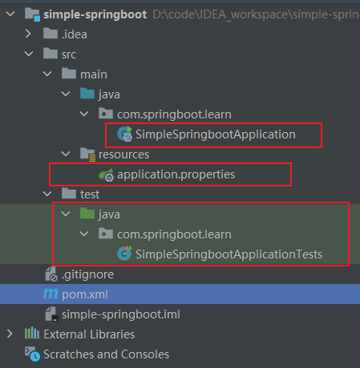
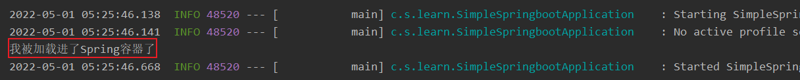

简介：这篇简单分析一下springboot项目的结构。
源码地址：

前言：准备工作，使用idea新建springboot的maven项目。
结构如下：

共有4个文件（pom依赖[pom.xml]，源码包的启动类[SimpleSpringbootApplication.java]，资源包的配置文件[application.properties]，测试包的测试类[SimpleSpringbootApplicationTests.java]）

点击SimpleSpringbootApplication.java运行主函数，运行结果如下：
```java
  .   ____          _            __ _ _
 /\\ / ___'_ __ _ _(_)_ __  __ _ \ \ \ \
( ( )\___ | '_ | '_| | '_ \/ _` | \ \ \ \
 \\/  ___)| |_)| | | | | || (_| |  ) ) ) )
  '  |____| .__|_| |_|_| |_\__, | / / / /
 =========|_|==============|___/=/_/_/_/
 :: Spring Boot ::                (v2.6.7)

2022-05-01 05:17:47.193  INFO 9184 --- [           main] c.s.learn.SimpleSpringbootApplication    : Starting SimpleSpringbootApplication using Java 1.8.0_144 on DESKTOP-9A9232T with PID 9184 (D:\code\IDEA_workspace\simple-springboot\simple-springboot\target\classes started by amazfit in D:\code\IDEA_workspace\simple-springboot\simple-springboot)
2022-05-01 05:17:47.196  INFO 9184 --- [           main] c.s.learn.SimpleSpringbootApplication    : No active profile set, falling back to 1 default profile: "default"
2022-05-01 05:17:47.658  INFO 9184 --- [           main] c.s.learn.SimpleSpringbootApplication    : Started SimpleSpringbootApplication in 0.866 seconds (JVM running for 2.943)

Process finished with exit code 0
```
结论：点击运行，启动jvm，mian线程执行完毕，随即销毁jvm。
Springboot是依托于Spring容器，按常理推断是，启动jvm之后，启动了一个spring容器，加载了一些必要的bean对象，再去加载用户自定义的bean，再去销毁spring容器，再去销毁jvm。

为此，我加了Weather天气类，正好外面在下小雨。此类位置跟启动类放在一起
```java
@Component
public class Weather {

    ........
    //只要加载进去，它一定会被打印的。
    public Weather() {
        System.out.println("我被加载进了Spring容器了");
    }
}

```
再去启动主函数，结果正如猜想一般，打印了，扫描到spring的ioc容器里面去了。


**很多小伙伴，肯定有疑问，这个怎么和平常用的springboot不一样呢，怎么进程直接结果了对吧？！**
Process finished with exit code 0
平时springboot项目启动，都是有监听请求的呢！

根据我的观察，应该是没有依赖starter-web，这时项目中是没有tomcat容器。springboot不是一直号称内嵌tomcat容器对吧。

那我现在往pom.xml文件中，添加web-starter依赖，再启动试试
```java
..........
..........

2022-05-01 05:38:06.318  INFO 4780 --- [           main] o.a.c.c.C.[Tomcat].[localhost].[/]       : Initializing Spring embedded WebApplicationContext
2022-05-01 05:38:06.318  INFO 4780 --- [           main] w.s.c.ServletWebServerApplicationContext : Root WebApplicationContext: initialization completed in 967 ms
我被加载进了Spring容器了
2022-05-01 05:38:06.628  INFO 4780 --- [           main] o.s.b.w.embedded.tomcat.TomcatWebServer  : Tomcat started on port(s): 8080 (http) with context path ''
2022-05-01 05:38:06.637  INFO 4780 --- [           main] c.s.learn.SimpleSpringbootApplication    : Started SimpleSpringbootApplication in 1.768 seconds (JVM running for 3.091)

```
结论：不依赖web-starter，启动主函数，它的作用跟ClassPathXmlApplicationContext,没有任何区域。
都是随着mian线程的执行结束，而spring容器销毁。
代码如下：
```java
@Test
    public void testRun(){
        ClassPathXmlApplicationContext context = new ClassPathXmlApplicationContext("beanDefinition.xml");
    }
```

#### 2 看看pom文件
大概有三个关键的地方
```java
1 在parent中规定整个springboot依赖版本
<parent>
    <groupId>org.springframework.boot</groupId>
    <artifactId>spring-boot-starter-parent</artifactId>
    <version>2.6.7</version>
    <relativePath/> <!-- lookup parent from repository -->
</parent>

2 springboot最基础的组件，其他的starter都要依赖于它，可以叫他基础层吗，其他的都是应用层
<dependency>
    <groupId>org.springframework.boot</groupId>
    <artifactId>spring-boot-starter</artifactId>
</dependency>

3 springboot的maven插件，直接package成一个jar包，只需要有jre的环境就可以运行了。
<plugin>
    <groupId>org.springframework.boot</groupId>
    <artifactId>spring-boot-maven-plugin</artifactId>
</plugin>
```