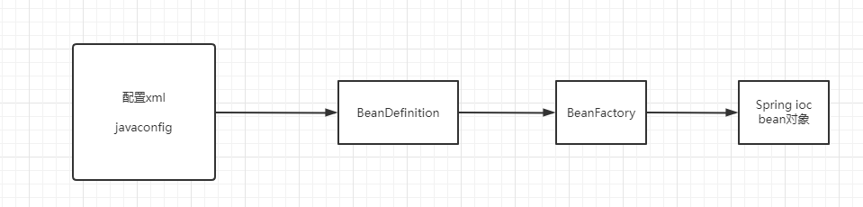

1. 从Spring的IOC到SpringBoot的自动配置原理
1. DeferredImportSelector对Bean加载顺序的影响
1. SpringBoot自动装配源码阅读
1. 如何在自动配置类上进行定制扩展
1. 实现自定义Starter完成自动配置

SpringBoot？是一个脚手架

管理还是spring去管理，springboot是帮我们配置好了bean，管理还是spring的ioc进行管理的。

以前配置集成框架的bean，通过xml还是java config也好。还是得经过spring，当我们配置好了，在xml里面
<bean>,还是放到spring的ioc里面，spring的加载过程，还是分为两大块。

1. 定义的这些bean，读取成BeanDefinition，它再通过BeanFactory创建为最终的Bean对象。
1. 批量导入bean的话，用@Import就够了（应用层面）

Import用法，大致分为三种
@Import(类)
@Import(ImportSelector) 可以一次性导入很多bean，有一个弊端（没有扩展性），我提供一个默认的SqlSessionFactory，如果你没有配置就使用了默认的，但是你配置的，我就使用你配置的了，ImportSelector没有顺序性，做不到。但是它的子类是可以做到的。DeferedImportSelector可以做到（控制加载顺序），因为这个类是最后解析的。这个类还有一个分组的概念
@Import(ImportBeanDefinitionRegister)

为什么用@import注解，因为批量啊，通过import导入的，springboot里面的bean，不在@componentscan扫描的范围里面。

使用注解注入，bean的优先级
@Component，@Configuration，@Bean，@ConditionOnBean，@Import，@DeferedImportSelector

？注解@ConditionOnBean(SqlsessionFactory.class)