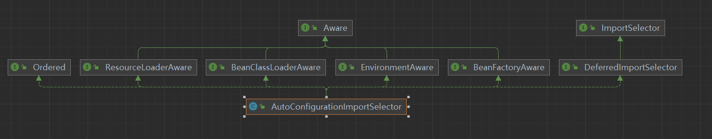

1. 从Spring的IOC到SpringBoot的自动配置原理
1. DeferredImportSelector对Bean加载顺序的影响
1. SpringBoot自动装配源码阅读
1. 如何在自动配置类上进行定制扩展
1. 实现自定义Starter完成自动配置

SpringBoot？是一个脚手架

管理还是spring去管理，springboot是帮我们配置好了bean，管理还是spring的ioc进行管理的。

以前配置集成框架的bean，通过xml还是java config也好。还是得经过spring，当我们配置好了，在xml里面
<bean>,还是放到spring的ioc里面，spring的加载过程，还是分为两大块。

1. 定义的这些bean，读取成BeanDefinition，它再通过BeanFactory创建为最终的Bean对象。
1. 批量导入bean的话，用@Import就够了（应用层面）


Import用法，大致分为三种
@Import(类)
@Import(ImportSelector) 可以一次性导入很多bean，有一个弊端（没有扩展性），我提供一个默认的SqlSessionFactory，如果你没有配置就使用了默认的，但是你配置的，我就使用你配置的了，ImportSelector没有顺序性，做不到。但是它的子类是可以做到的。DeferedImportSelector可以做到（控制加载顺序），因为这个类是最后解析的。这个类还有一个分组的概念
@Import(ImportBeanDefinitionRegister)

为什么用@import注解，因为批量啊，通过import导入的，springboot里面的bean，不在@componentscan扫描的范围里面。

使用注解注入，bean的优先级
@Component，@Configuration，@Bean，@ConditionOnBean，@Import，@DeferedImportSelector

？注解@ConditionOnBean(SqlsessionFactory.class)


1、启动里面的main方法就可以了！！！
```java
@SpringBootApplication
public class SimpleSpringbootApplication {

    public static void main(String[] args) {
        SpringApplication.run(SimpleSpringbootApplication.class, args);
    }

}
```

@SpringBootApplication里面的注解
```java
@Target(ElementType.TYPE)
@Retention(RetentionPolicy.RUNTIME)
@Documented
@Inherited
@SpringBootConfiguration   就是@Configuration
@EnableAutoConfiguration  
@ComponentScan(excludeFilters = { @Filter(type = FilterType.CUSTOM, classes = TypeExcludeFilter.class),   默认会扫描当前类所在的包
		@Filter(type = FilterType.CUSTOM, classes = AutoConfigurationExcludeFilter.class) })
public @interface SpringBootApplication {
```

@EnableAutoConfiguration 开启自动装配功能
```java
@Target(ElementType.TYPE)
@Retention(RetentionPolicy.RUNTIME)
@Documented
@Inherited
@AutoConfigurationPackage   把当前配置类所在包保存在BasePackages的Bean中。供Spring内部使用
@Import(AutoConfigurationImportSelector.class)
public @interface EnableAutoConfiguration {
```

再看看这个注解里面的代码  @AutoConfigurationPackage
```java
@Target(ElementType.TYPE)
@Retention(RetentionPolicy.RUNTIME)
@Documented
@Inherited
@Import(AutoConfigurationPackages.Registrar.class)
public @interface AutoConfigurationPackage {

	/**
	 * Base packages that should be registered with {@link AutoConfigurationPackages}.
	 * <p>
	 * Use {@link #basePackageClasses} for a type-safe alternative to String-based package
	 * names.
	 * @return the back package names
	 * @since 2.3.0
	 */
	String[] basePackages() default {};

	/**
	 * Type-safe alternative to {@link #basePackages} for specifying the packages to be
	 * registered with {@link AutoConfigurationPackages}.
	 * <p>
	 * Consider creating a special no-op marker class or interface in each package that
	 * serves no purpose other than being referenced by this attribute.
	 * @return the base package classes
	 * @since 2.3.0
	 */
	Class<?>[] basePackageClasses() default {};

}
```
看起来就是注册一个保存当前配置类所在包的一个Bean  

在自动配置注解里面EnableAutoConfiguration，使用import导入了一个类
@Import(AutoConfigurationImportSelector.class)

  

spring内部在解析@Import注解时，会调用getAutoConfigurationEntry方法。扫描具有
META-INF/spring.factories文件的jar包。

org.springframework.boot.autoconfigure.AutoConfigurationImportSelector#getAutoConfigurationEntry
```java
/**
    * Return the {@link AutoConfigurationEntry} based on the {@link AnnotationMetadata}
    * of the importing {@link Configuration @Configuration} class.
    * @param annotationMetadata the annotation metadata of the configuration class
    * @return the auto-configurations that should be imported
    */
protected AutoConfigurationEntry getAutoConfigurationEntry(AnnotationMetadata annotationMetadata) {
    if (!isEnabled(annotationMetadata)) {
        return EMPTY_ENTRY;
    }
    AnnotationAttributes attributes = getAttributes(annotationMetadata);
    //从META-INF/spring.factories中获取候选的自动配置类
    List<String> configurations = getCandidateConfigurations(annotationMetadata, attributes);
    //排重
    configurations = removeDuplicates(configurations);
    //根据EnableAutoConfiguration注解中的属性，获取不需要自动装配的类名单
    Set<String> exclusions = getExclusions(annotationMetadata, attributes);
    // 根据:@EnableAutoConfiguration.exclude
    // @EnableAutoConfiguration.excludeName
    // spring.autoconfigure.exclude 进行排除
    checkExcludedClasses(configurations, exclusions);
    // exclusions 也排除
    configurations.removeAll(exclusions);
    // 通过读取spring.factories 中的OnBeanCondition\OnClassCondition\OnWebApplicationCondition进行过滤
    configurations = getConfigurationClassFilter().filter(configurations);
    // 这个方法是调用实现了AutoConfigurationImportListener 的bean.. 分别把候选的配置名单，和排除的配置名单传 进去做扩展
    fireAutoConfigurationImportEvents(configurations, exclusions);
    return new AutoConfigurationEntry(configurations, exclusions);
}
```

任何一个springboot应用，都会引入spring-boot-autoconfigure，而spring.factories文件就在该包下面。spring.factories文件是key=value形式，多个value时使用,隔开，改文件中定义了初始化，监听器等信息
```java
# Logging Systems
org.springframework.boot.logging.LoggingSystemFactory=\
org.springframework.boot.logging.logback.LogbackLoggingSystem.Factory,\
org.springframework.boot.logging.log4j2.Log4J2LoggingSystem.Factory,\
org.springframework.boot.logging.java.JavaLoggingSystem.Factory

# PropertySource Loaders
org.springframework.boot.env.PropertySourceLoader=\
org.springframework.boot.env.PropertiesPropertySourceLoader,\
org.springframework.boot.env.YamlPropertySourceLoader

# ConfigData Location Resolvers
org.springframework.boot.context.config.ConfigDataLocationResolver=\
org.springframework.boot.context.config.ConfigTreeConfigDataLocationResolver,\
org.springframework.boot.context.config.StandardConfigDataLocationResolver

# ConfigData Loaders
org.springframework.boot.context.config.ConfigDataLoader=\
org.springframework.boot.context.config.ConfigTreeConfigDataLoader,\
org.springframework.boot.context.config.StandardConfigDataLoader

# Application Context Factories
org.springframework.boot.ApplicationContextFactory=\
org.springframework.boot.web.reactive.context.AnnotationConfigReactiveWebServerApplicationContext.Factory,\
org.springframework.boot.web.servlet.context.AnnotationConfigServletWebServerApplicationContext.Factory

# Run Listeners
org.springframework.boot.SpringApplicationRunListener=\
org.springframework.boot.context.event.EventPublishingRunListener
```