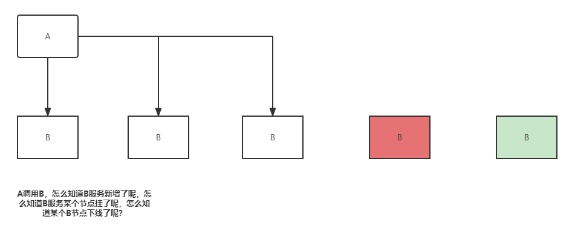
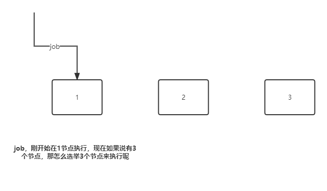

### 1.1 zookeeper概要

#### 1.1.1 zookeeper产生背景：
项目从单体到分布式转变之后，将会产生多个节点之间协同的问题。如：
1. 每天的定时任务由哪个节点来执行？
1. RPC调用时的服务发现？
1. 如何保证并发请求的幂等性？
1. .......

这些问题可以统一归纳为多节点协调问题，如果靠节点自身进行协调这是非常不可靠的，性能上也不可取。必须由一个独立的服务做协调工作，它必须可靠，而且保证性能。

#### 1.1.2 zookeeper概要：
Zookeeper是用于分布式应用程序的协调服务。它公开了一组简单的API，分布式应用程序可以基于这些API用于同步，节点状态，配置等信息，服务注册等信息。其由java编写，支持Java和C两种语言的客户端。世界上最好的语言php是没法调用zookeeper的。

#### 1.1.3 znode节点
zookeeper中数据基本单元叫节点，节点之下可包含子节点，最后以树级方式呈现。每个节点拥有唯一的路径path。客户端基于path上传节点数据。zookeeper收到后会实时通知对该路径进行监听的客户端。

#### 1.1.4 部署与常规配置
zookeeper基于java开发，下载后只要有对应JVM环境即可运行。其默认端口号是2181运行前得保证其不冲突。

目前最新版本是3.8.0