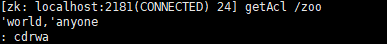
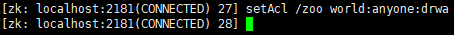
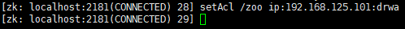
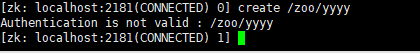

| 方案 | 描述 |
|-|-|
|world|开放模式，所有人都可以访问（默认设置）|
|ip|ip模式，限定客户端IP访问|
|auth|用户密码认证模式，只有在会话中添加了认证才可以访问|
|digest|与auth类似，区别在于auth用明文密码，digest用sha-1+base64加密后的密码|

认证模型是对单个节点的znode

权限位也是对单个节点。znode
| 权限位 | 权限 | 描述 | 
|-|-|-|
|c|create|可以创建子节点|
|d|delete|可以删除子节点（仅下一级节点）|
|r|read|可以读取节点数据及显示子节点列表|
|w|write|可以设置节点数据|
|a|admin|可以设置节点访问控制权限列表|

#### 命令acl的使用
```powershell
getAcl /path
```

认证模型和权限位都获取

设置znode的acl
```powershell
setAcl /path world:anyone:权限位
setAcl /path ip:ip地址|地址段：权限位 
setAcl /path auth:用户名：密码：权限位
```

给101的ip，设置没有创建的权限，那在101创建就会失败



直接去设置auth会报错的，要先增加一个认证用户
```powershell
addauth digest richmail:richmail
```

不太懂这个用户认证和digest认证

密钥 通过sha1与base64组合加密码生成，可通过一下命令生成
```powershell
echo -n <用户名>:<密码> | openssl dgst -binary -sha1 | openssl base64
```
```powershell
d8/975qyOnWG9yPGyhvUDVdG1mo=
```
为节点设置digest权限后，访问前必须执行addauth，当前会话才可以访问。
 
