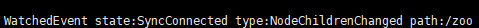
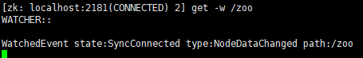
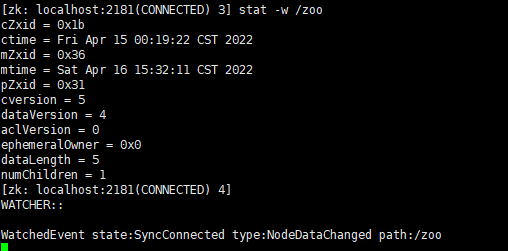
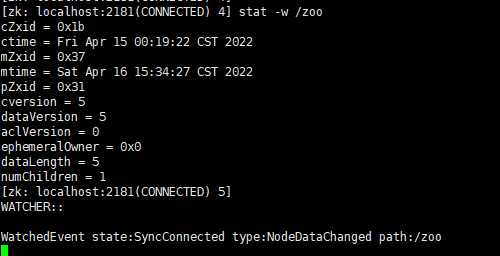

zk的客户端监听都是只能监听一次，就失效了，需要再去监听，循环往复

1.监听子节点的变化（增删）
```powershell
ls -w path
```

2.监听节点数据的变化
```powershell
get -w path
```

3.监听节点属性的变化
包括了上面的get -w
```powershell
stat -w path
```

但是对子节点的创建和修改是没有，监听到的


可以看到在linux里面，用客户端连接,用命令监听，get或者ls，都会把当前的内容给显示出来，然后再异步的返回监听提醒，至此监听就消失了。需要重复再监听目标节点。