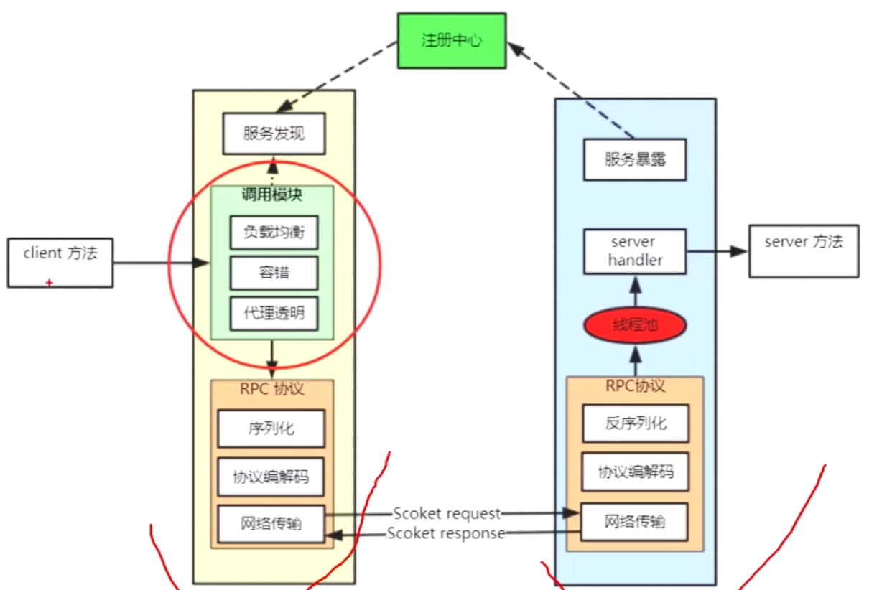
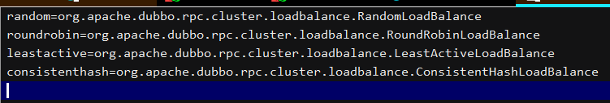

dubbo调用模块核心功能发起一个远程方法的调用并顺利拿到返回结果：
1、透明代理：通过动态代理技术，屏蔽远程调用细节以提高编程友好性
2、负载均衡：当有多个提供者，如何选择哪个进行调用的负载算法
3、容错机制：当服务调用失败时采取的策略
4、调用方式：支持同步调用，异步调用



调用者列表
RegistryDirectory#invokers

AbstractClusterInvoker#select
```java
protected Invoker<T> select(LoadBalance loadbalance, Invocation invocation, List<Invoker<T>> invokers, List<Invoker<T>> selected) throws RpcException {
        if (CollectionUtils.isEmpty(invokers)) {
            return null;
        } else {
            String methodName = invocation == null ? "" : invocation.getMethodName();
            boolean sticky = ((Invoker)invokers.get(0)).getUrl().getMethodParameter(methodName, "sticky", false);
            if (this.stickyInvoker != null && !invokers.contains(this.stickyInvoker)) {
                this.stickyInvoker = null;
            }

            if (sticky && this.stickyInvoker != null && (selected == null || !selected.contains(this.stickyInvoker)) && this.availablecheck && this.stickyInvoker.isAvailable()) {
                return this.stickyInvoker;
            } else {
                Invoker<T> invoker = this.doSelect(loadbalance, invocation, invokers, selected);
                if (sticky) {
                    this.stickyInvoker = invoker;
                }

                return invoker;
            }
        }
    }
```

所有调用必须经过RPC协议
http协议在dubbo中很奇怪，dubbo就是http的客户端，用OkHttp使用http
如果要用http，dubbo不是很好的选择，

透明代理：
org.apache.dubbo.config.ReferenceConfig#createProxy
ClassGenerator
JavassistProxyFactory
Javassist:是一个开源的分析、编辑和创建Java字节码的类库。类比cglib

负载均衡：
1、随机random ：按权重设置随机比率
2、轮训roundrobin ： 按公约后的权重设置轮训比率
3、最少活跃调用数leastactive ： 相同活跃数的随机，活跃数指调用前后计数差。
4、一致性Hash consistenthash ： 相同的参数总是发到同一台机器。

客户端3种，服务端3种，控制台1种级别最高

