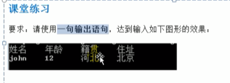

转义字符 英文 escape char

常用的转义字符

\t 制表符对齐

\n 换行符

\\ 一个\

\r 回车enter键位

```go
package main

import "fmt"

func main() {
	fmt.Println("tom\tjack")

	fmt.Println("tom\njack")

	fmt.Println("tom\"jack\"haha")

	fmt.Println("天龙八部\r张飞")

}
```

#### 作业



```go
fmt.Println("姓名\t年龄\t籍贯\t住址\njohn\t12\t河北\t北京")
```