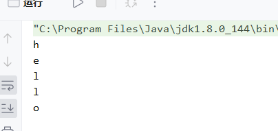

#### RandomAccessFile的使用

```java
File file = new File("D:\\hello.txt");
RandomAccessFile raf = new RandomAccessFile(file, "r");
byte[] bytes = new byte[5];
//已经读取了三个字节
int a = raf.read();
System.out.println((char)a);
a = raf.read();
System.out.println((char)a);
a = raf.read();
System.out.println((char)a);
a = raf.read();
System.out.println((char)a);
a = raf.read();
System.out.println((char)a);
```


##### 跳过字节的方法
seek 跳过绝对长度

skipbytes 跳过当前读的时候长度

##### 写文件的特点
覆盖对应字节数的过程。把我需要占用字节数的内容给替换掉.
```java
    public static void main(String[] args)throws Exception {
        File file = new File("D:\\hello.txt");
        RandomAccessFile raf = new RandomAccessFile(file, "rw");
        //没有把文件重新覆盖
        //而是把字符给覆盖了。
        //写数据的特点，写入的内容，会自动替换掉对应的位置的数据。
        raf.seek(5);
        raf.write("zhangsan".getBytes("UTF-8"));
    }
```

测试单线程去跑文件的,耗时
```java
public static void main(String[] args)throws Exception {
File file = new File("E:\\fuck\\vec-380.mp4");

FileInputStream fileInputStream = new FileInputStream(file);
FileOutputStream fileOutputStream = new FileOutputStream("G:\\11.mp4");

byte[] bytes = new byte[1024 * 8];
int len;
long start = System.currentTimeMillis();
while ((len = fileInputStream.read(bytes))!=-1){
    fileOutputStream.write(bytes,0,len);
}
fileInputStream.close();
fileOutputStream.close();

long end = System.currentTimeMillis();
System.out.println((end-start)/1000);
}
```
结果为3s

测试开5个线程去写，耗时
```java
public static void main(String[] args)throws Exception {
        File file = new File("E:\\fuck\\vec-380.mp4");
        File file1 = new File("G:\\11.mp4");
        //开启5个线程
        int threadNum = 5;

        long length = file.length();
        //向上取整
        int part = (int) Math.ceil(length / threadNum);
        //阻塞主线程，当子线程都走完了，再走主线程

        ArrayList<Thread> threads = new ArrayList<>();
        for (int i = 0; i < threadNum; i++) {
            final int k = i;
            Thread thread = new Thread(() -> {
                //线程具体做的事情
                try {
                    RandomAccessFile readFile = new RandomAccessFile(file, "r");
                    RandomAccessFile writeFile = new RandomAccessFile(file1, "rw");
                    //从指定位置读
                    readFile.seek(k * part);
                    writeFile.seek(k * part);

                    byte[] bytes = new byte[1024 * 8];
                    int len = -1, plen = 0;
                    while (true) {
                        len = readFile.read(bytes);
                        //读完了，退出循环
                        if (len == -1) {
                            break;
                        }
                        //如果不等于-1,则累加求和
                        plen = plen + len;

                        //将读取的数据进行写入
                        writeFile.write(bytes, 0, len);

                        if (plen >= part) {
                            break;
                        }
                    }

                } catch (Exception e) {
                    throw new RuntimeException(e);
                }
            });
            thread.start();
            //把这5个线程保存到集合中
            threads.add(thread);
        }
        long begin = System.currentTimeMillis();
        for (Thread thread:threads){
            thread.join();//将线程加入，并阻塞主线程
        }

        long end = System.currentTimeMillis();
        System.out.println("拷贝消耗了，"+(end-begin)/1000);
    }
```

多线程耗时了35s

