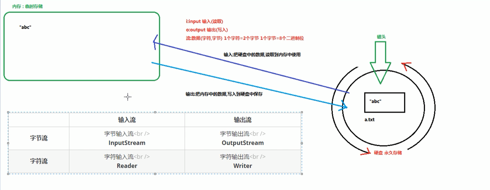
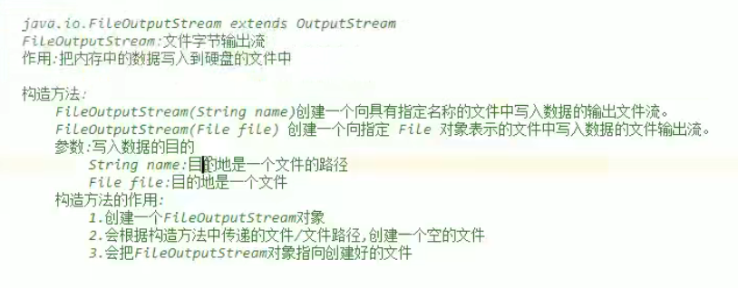

输入：把硬盘中的数据，读取到内存中使用

输出：把内存的数据，写入到硬盘中保存

流：（字符。字节）1个字符=2个字节 一个字节8个二进制位

#### 一切皆为字节
一切皆为字节，所有文件数据都是以二进制字节流进行存储的。

#### 字节输出流OutputStream（抽象类）
#####FileOutputStream往文件中写入输出流



写入数据的原理：内存->硬盘

java程序 -》 jvm -》 os操作系统 -》 os调用写数据的方法 -》 把数据写入文件中

1. 创建一个FileOutputStream对象，构造方法中传递写入数据的目的地
1. 调用对象中的write方法，把数据写入到文件中
1. 释放资源（流使用会占用一定的内存，使用完毕要把内存清空，提供程序的效率）

```java
FileOutputStream fileOutputStream = new FileOutputStream("D:\\a.txt");
fileOutputStream.write(97);
fileOutputStream.close();
```