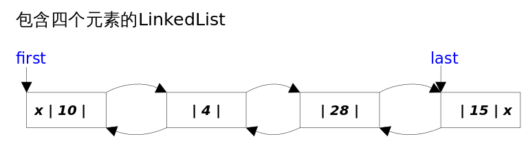

LinkedList实现List，Deque接口，顺序容器，一个队列（Queue），还可以看成一个stack。



#### 底层数据结构
LinkedList底层双向链表实现。双向链表的每个节点用Node表示。LinkedList通过first和last引用分别指向链表的第一个和最后一个元素。当链表为空的时候first和last都指向null。

```java
    transient int size = 0;

    /**
     * Pointer to first node.
     * Invariant: (first == null && last == null) ||
     *            (first.prev == null && first.item != null)
    实现了Serilizable接口，将不需要序列化的属性前添加关键字transient，它不会序列化。
     */
    transient Node<E> first;

    /**
     * Pointer to last node.
     * Invariant: (first == null && last == null) ||
     *            (last.next == null && last.item != null)
     */
    transient Node<E> last;
```
Node内部私有类
```java
private static class Node<E> {
    E item;
    Node<E> next;
    Node<E> prev;

    Node(Node<E> prev, E element, Node<E> next) {
        this.item = element;
        this.next = next;
        this.prev = prev;
    }
}
```