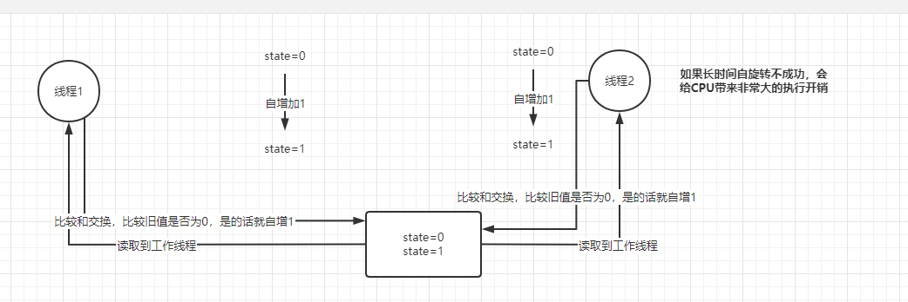

取值，询问，修改

多个线程他们可能要访问同一个数据

HashMap map = new HashMap();

此时有多个线程要同时读写类似上面的这种内存的数据，此时必然出现多线程的并发安全问题。

我们可以使用sync
sync(map){
    //对map里的数据进行复杂的读写处理
}

并发包下面的其他的一些技术
CAS
int i=0;
一段代码
//会有多个线程进行执行
public void method(){
    i++;
}

原子类，AutomicInterger就是基于CAS去执行的。
i.incrementAndGet();

乐观锁和mysql的原理一致。但是mysql这个没有去自旋。
update xxxxx set count={count},version={version+1} where id={id} and version={version};

hosts文件位置
依次双击打开“windows”→“System32”→“drivers”→“etc”。