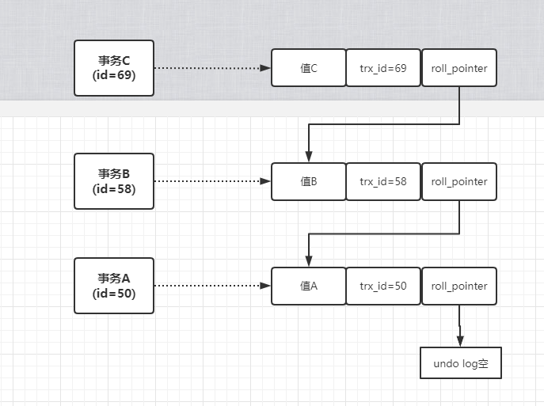
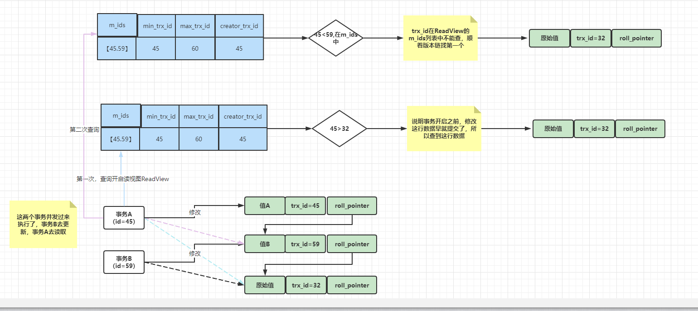

MVCC多版本并发控制机制

RR隔离级别，脏写，脏读，不可重复读，幻读，都不会发生。

undo log版本链

每条数据都有隐藏字段 trx_id（最近事务id）,roll_pointer（指向你更新这个事务之前生成的undo log）

可以根据这个事务版本链去追踪最新的值到底是谁。

ReadView，执行一个事务的时候，生成一个ReadView，里面比较关键的东西有4个
* m_ids,此时有哪些事务在Mysql里面执行还没提交
* min_trx_id, 就是m_ids里最小的值
* max_trx_id, mysql下一个要生成事务的id，最大事务id
* creator_trx_id, 这个事务的id

