Mysql的数据存储格式。
磁盘数据页的存储结构
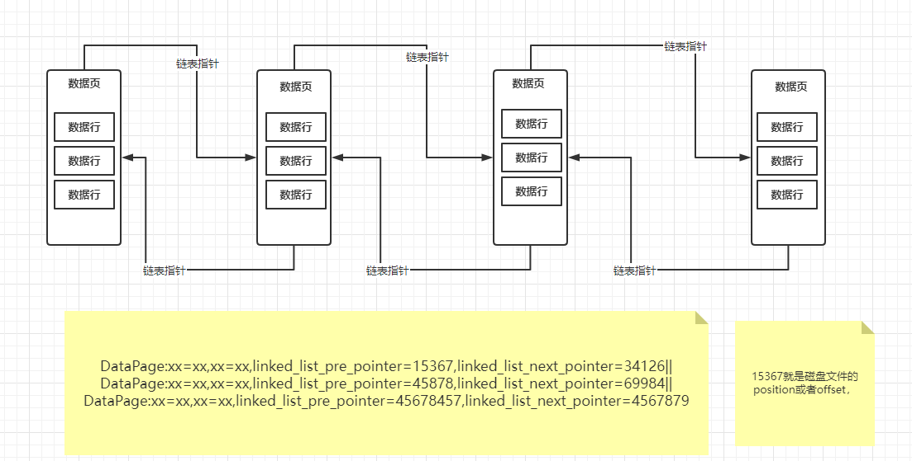

数据页是组成双向链表的，然后数据页内部的数据行是组成单项链表的，而且数据行是根据主键从小到大排序的。

每个数据页都会有一个页目录，里面根据数据行的主键存放了一个目录，同时数据行是被分散存储到不同的槽位里去，所以实际上每个数据页的目录里，就是这个页里每个主键所在槽位的映射关系。
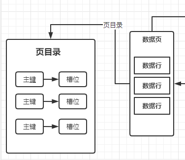

根据主键查找一条数据，假设表里没几条数据，总共就一个数据页，那么就太简单了，先到数据页的页目录里根据主键进行二分查找，要是根据非主键的其他字段查找，没办法用主键的页目录来二分查找，只能进入到数据页里，根据单向链表依次遍历查找数据了，这就性能很差了。

如果有很多数据页，所有数据页都是组成双向链表，直接从第一个数据页遍历所有数据页，从第一个开始，你得先把第一个数据页从磁盘上读取到内存buffer pool的缓存页里来。

全表扫描：在没有任何索引情况下，根据双向链表依次把磁盘上的数据页加载到缓存页里去，然后在一个缓存页内部来查找那条数据。


一个表在不停插入数据的时候，会涉及到一个“页分裂的过程”
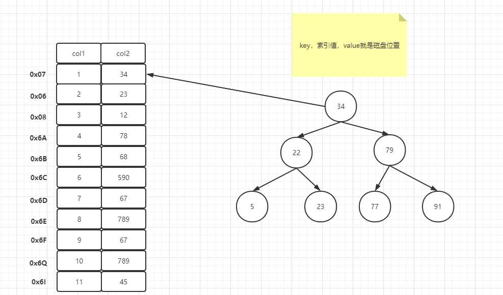

**索引**是帮助Mysql高效获取数据的**排好序**的**数据结构**

索引数据结构
* 二叉树
* 红黑树
* Hash表
* B-Tree

data structure visualizations 网站  
BST.html 二叉树操作界面  

二叉树对于单边增长的数据，对于查数据没有一点帮助，纯粹是
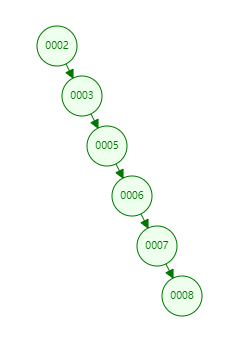

红黑树：自动平衡二叉树  
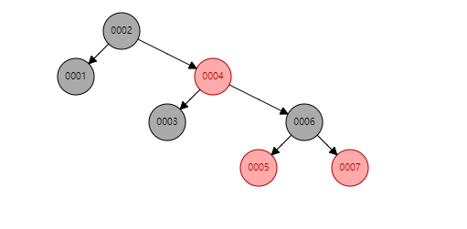
树的高度，太高了。加入500万数据，500万索引，这树的高度就很高高，如何查红黑树的高度，根据节点数据数量？

B树就可以有效的控制树的高度

B+树，非叶子节点是没有data数据，data数据都放在叶子节点里面去了，说明叶子节点里面肯定有这张表所有的索引。
非叶子节点，叫冗余索引，取（叶子节点的某些位置的索引，取部分索引，构建B+树）
B+树，从左到右是处于递增的。B树也是这样。
B+树，叶子节点是有指针连接，提高区间访问的性能
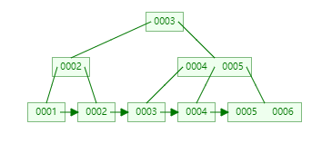
先把根节点，load到内存里面去，折半二分查找，然后再把二级叶子节点，加载到内存，比对，再去找，load到内存进行比对。找到就完事了。

页节点，在mysql分配的大小是16KB。16384
```java
show global status like 'Innodb_page_size'
```
结果
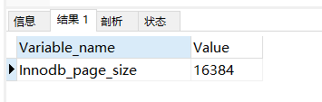
在内部里面比较大小和load数据页到内存里面是磁盘IO比较起来，IO是消耗很大的。

出现一个索引，就有一个叶子节点，8+6,一个数据页可以放1170节点
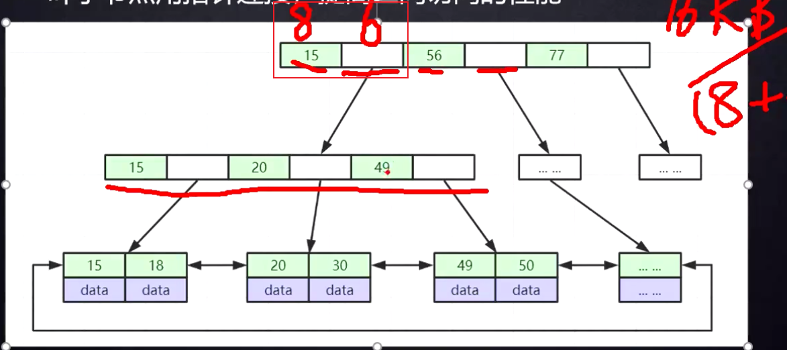
图上的指针，更好让范围查找更好去查。B树是没有的。B树去范围查找就要一个一个再从根节点再去查找。标准的B+树是单箭头，但是Mysql的B+树是双向的。

1170*1170*16=2000多万

根节点可能是常驻内存的，那耗费性能的就是从三层非叶子节点找到那个节点。
B+树的高度，是由非叶子节点能放多少个索引元素。

16的n次方=2000多万，肯定大于3.

MyISAM索引文件和数据文件是分离的（非聚集）
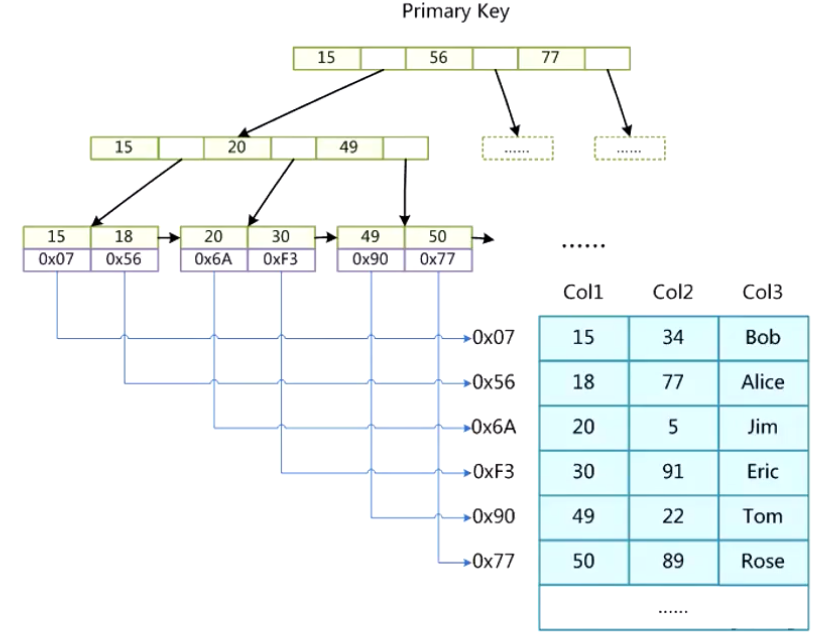

存储引擎生效的是数据库表。建表的时候可以选择建表的。

col1 作为索引，MYI=my index MYD=my data
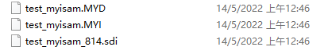
myi文件内部，左边B+树结构组织好
查找col1=30，遍历到30拿到OxF3，用磁盘文件地址，然后到MYD里面去进行定位。

InnoDB索引实现（聚集）
* 表数据文件本身就是按B+Tree组织的一个索引结构文件
* 聚集索引-叶子节点包含了完整的数据记录
ibd文件对应 innodb 

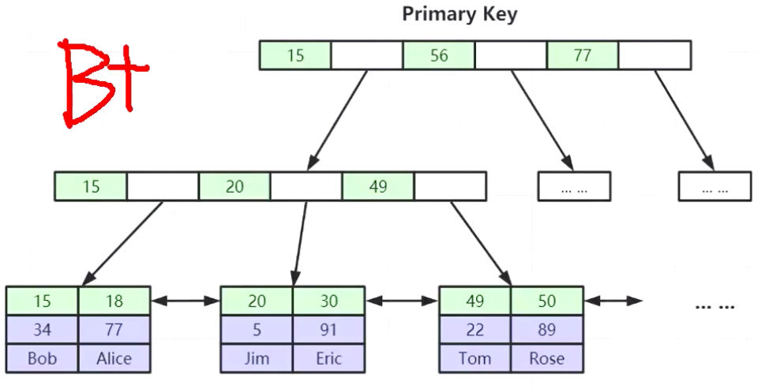

为什么建议InnoDB表必须建主键，并且推荐使用整型的自增主键？  
如果没有主键，就会从索引里面找所有键都不相等的一列做索引，如果没找到就用隐藏自增字段帮你去建立B+Tree。自己建了主键，就不需要mysql去挑选去建立，做许多的工作。  

数据比大小，是整型比大小快，还是uuid去比较（ascii）逐个去比较。整型快。

生产环境存在磁盘上，不是一般硬盘，是固态硬盘，SSD。

聚集索引，说的就是innodb这种，索引和数据是放在一块的。
非聚集索引，说的是myisam这种，索引和数据是分开的，查找要跨文件去找。

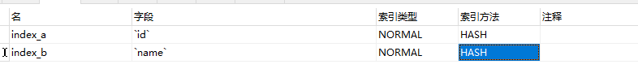
Hash索引
* 对索引的key进行一次hash计算就可以定位出数据存储的位置
* 很多时候Hash索引要比B+树索引更高效
* 仅仅能满足 = IN ，不支持范围查询
* hash冲突问题

先把col3的值，进行hash，放在hash桶里面，跟hashmap的key类似啊。进行hash运算，很快就可以定位到磁盘地址。  
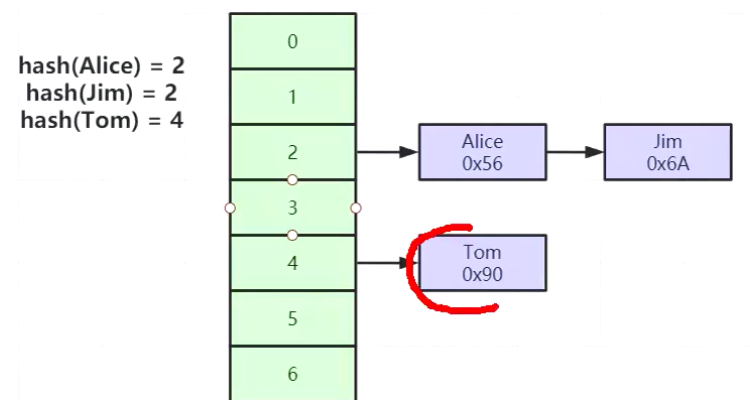

插入的时候是无序的，但是维护的时候是进行有序的，树还做了平衡

非主键索引：二级索引，跟主键索引有什么区别呢，叶子节点会有问题
INnoDB表只有一个聚集索引就是主键（没有就是隐藏主键rowId）
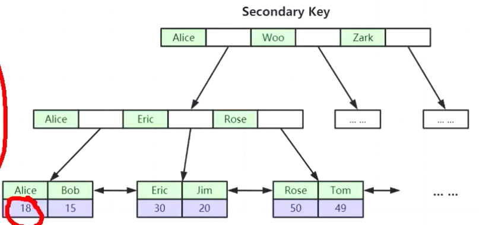
为什么非主键索引结构叶子节点存储的是主键值？（一致性和节省存储空间）
每加一个索引，就多一个索引树。

联合索引的底层存储结构长什么样？
（a，b，c）也是B+树的结构。
```java
key 'idx_name_position'('name','age','position') using btree
```
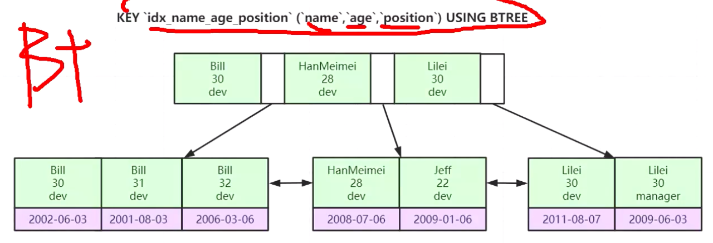
按照索引建立的先后顺序，先比较name，再比较age，再比较position，比较先后顺序。ascii去进行比较。再根据主键去区别，回表查找真正要的元素。
一般提上去这一页的第一个最小的这一个成为冗余索引
对于联和索引来说，要按照建立索引的顺序去用，而不能跳过去。排序的时候就是按照索引从左到右去进行排序的。
全表扫描


对于InnoDB如果用二级索引去查找，先用二级索引定位到主键，再用主键到聚集索引里面去查找（回表）。

常见的索引失效：
* 以%开头的like查询
* 创建了组合索引，但查询条件不满足“最左匹配原则”。如 创建索引（a，b，c）使用b，c去查询。
* 查询条件中使用or，且or的前后条件中有一个列没有索引，涉及的索引都不会被使用到
* 在索引列上的操作，函数upper()等，or、! = (<>),not in等

Mysql存储引擎：Myisam和Innodb
更新操作时，为了保证表数据的准确性，通常都加锁，为了提交系统的高并发能力，我们通常采用行锁，减少锁冲突，锁等待时间。InnodB
行锁升级为表锁，有哪些场景呢？