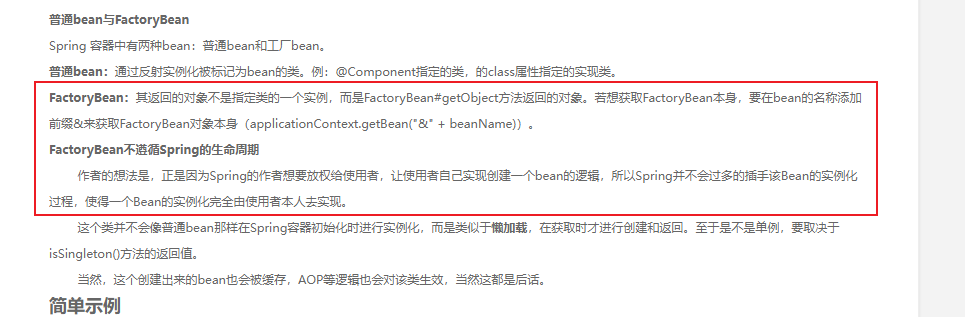

#### BeanFactory:
1. 负责生产和管理Spring中bean的一个工厂
1. IOC容器的核心接口。
1. 多种实现，DefaultListableBeanFactory。

#### FactoryBean：
FactoryBean是一个工厂类接口，用户可以实现该接口定制实例化Bean的逻辑。
一般Spring是通过反射机制利用的class属性指定实现类实例化Bean，某些情况下，实例化Bean过程很复杂。
