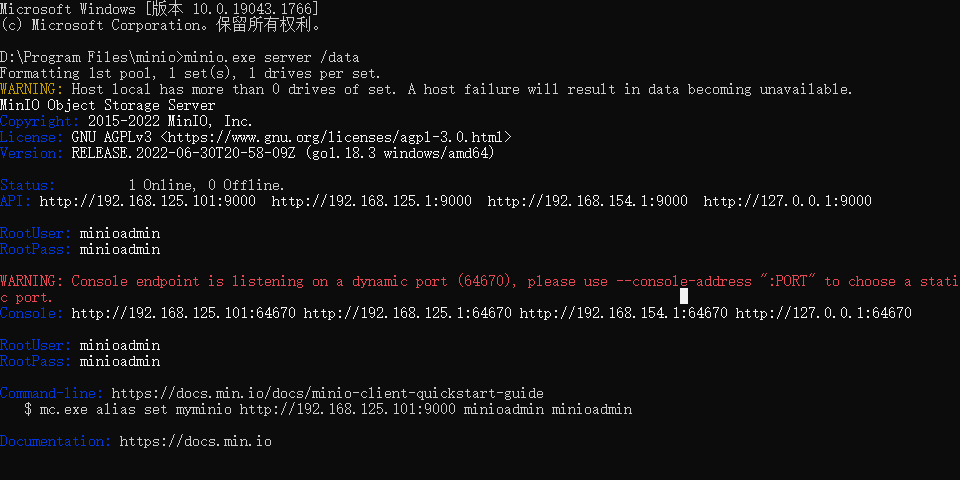

##### 启动

1. 下载下来，放在D盘的program files里面，minio文件夹，进去打开cmd
```powershell
minio.exe server /data
```
这个data文件夹，是D盘的，不是这个minio文件夹里边的



首页loginPage访问：<http://localhost:9000>

登录名称：minioadmin
登录密码：minioadmin