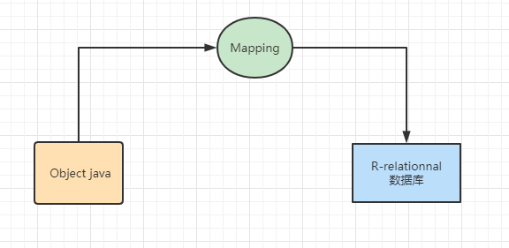

持久层的ORM框架，使用简单。手写SQL语句，比较灵活。自动化、移植性不高，迁移新的数据库要改sql语句，半自动ORM框架。

ORM == Object R-Relational Mapping

任何ORM框架，执行数据库操作，都离不开JDBC。（heberinate全ORM框架，根本不用写sql语句，只要用配置维护好表的关系）

（JDBC的四大核心对象）：
//TODO JDBC执行数据库操作代码

JDBC弊端：
1. jdbc数据库配置、sql语句在代码中硬编码，所以mybatis用xml解耦。
1. jdbc频繁创建和关闭数据库连接，mybatis使用了连接池。
1. jdbc设置参数麻烦，还要弄顺序，参数中间去了一个，后面都要跟着去掉，就像链表一下，前进后退。参数设置非常不方便，mybatis通过动态sql，获取我们设置的值，动态sql标签。
1. jdbc执行查询的时候，解析返回结果集，很麻烦，mybatis设置resultType，resultMap进行映射。
1. JDBC没有提供缓存【减轻数据库的压力】，mybatis提供了一二级缓存解决。