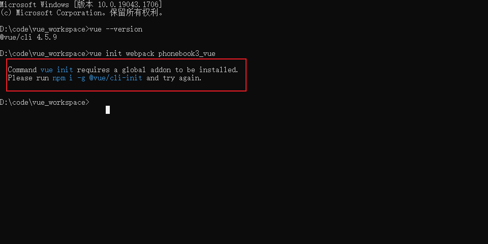
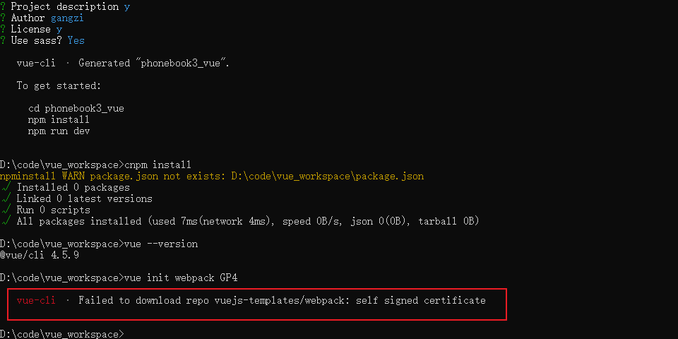

1、要先安装nodejs
2、再安装vue-cli
然后查看vue的版本
vue --version


当出现此种情况时
```java
npm install -g @vue/cli-init
```

再执行vue新建vue-cli
```java
vue init webpack phonebook3
```

出现以下画面，解决办法


在.vuejs-templates下面git clone里面的
```java
https://github.com/vuejs-templates/webpack.git
```
然后再输入

vue init webpack phonebook4 --offline

表示离线操作
然后一顿enter就好了，遇到喜欢的地方停顿n，不喜欢的地方停顿Y

cmd乱码  在控制台输入CHCP 65001

然后再执行npm install一些玩意
```java
npm install stylus --save

npm install stylus-loader --save
```

在主页App.vue ，设置路由
```java
<router-view></router-view>
```

这样的话,在前台界面url如果跟路由里面设置的是一样的话，就显示那个组件。路由是用来管理组件的，
```java
这就是说从src文件夹下，引入这个组件
import Login from '@/pages/Login'
```