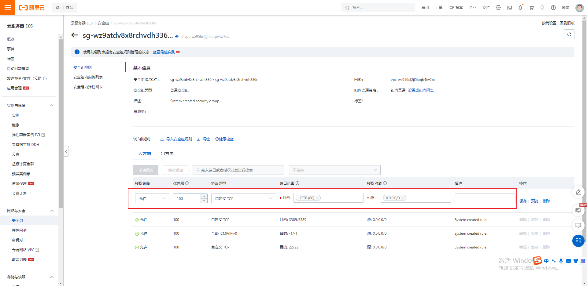
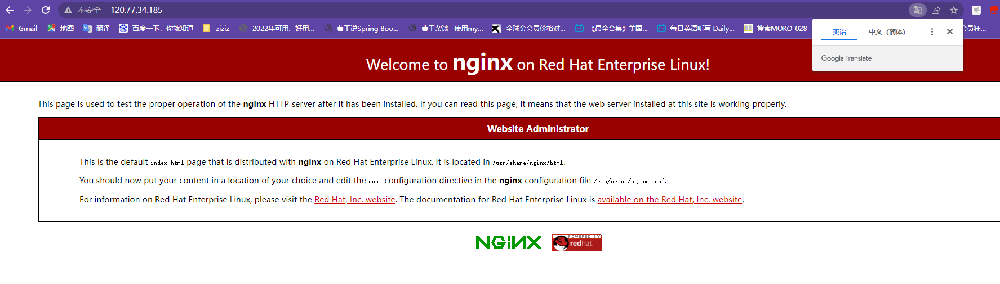
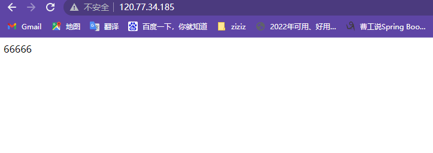

```xshell
yum install nginx
systemctl start nginx

设置开机启动
systemctl enable nginx
```
nginx默认监听80端口

现在阿里云这台服务器，添加安全规则


然后访问公网ip http://120.77.34.185



nginx的界面是放在/usr/share/nginx里边的
html下的index.html

现在往里面写6666，再访问看看
```PowllShell
cd /usr/share/nginx/html/
echo "66666" > index.html

```

