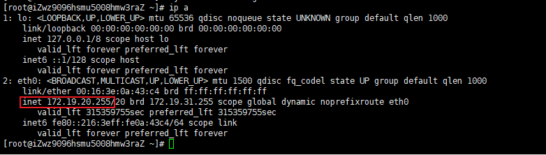
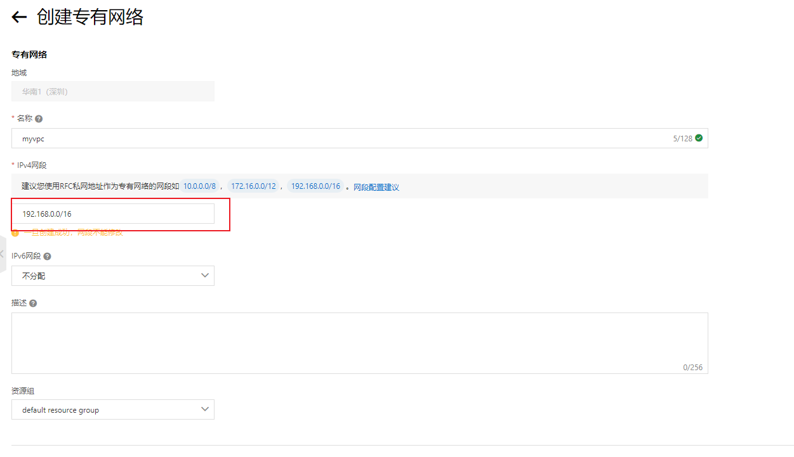
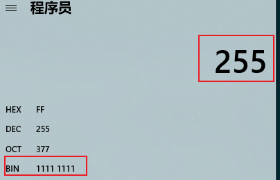
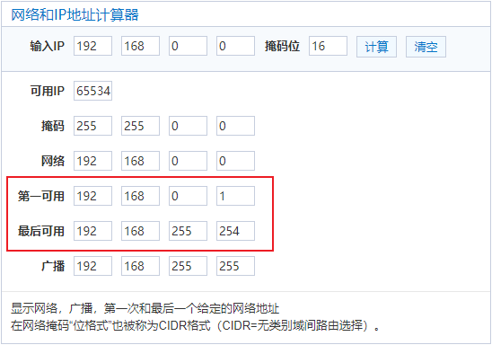
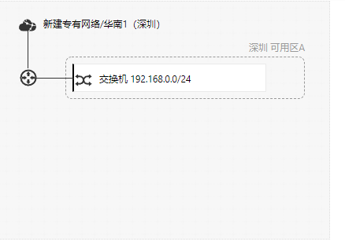
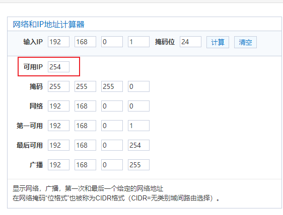
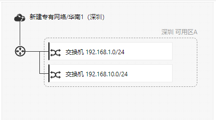

多个服务器集群设置。

使用私有ip进行集群设置。

走内网，不会有带宽限制

```dotnetcli
ip -a
```


vpc：私有网络、专有网络（划分网段）




192.168.0.0/16[16的意思是掩码，前16位不变，后16位是动态变化的]

转成二进制

**11000000** **10101000** 00000000 00000000

192.168.0.0 - 192.168.255.255[255就是8位全是11111111]


也就是说，使用16位掩码，一个vpc机器的数量有6万多

256*256=65536




##### 交换机



有254可用





vpc更多的好处是隔离，比如开发的机器是同一组网段下，只要是同一个vpc网络下。开发人员跟生产机器是完全隔离的。安全性


