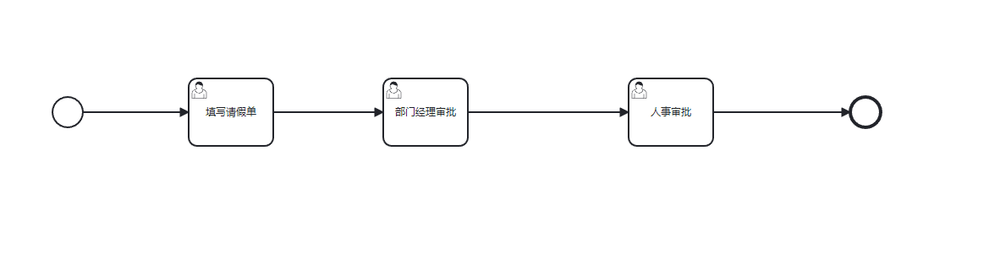
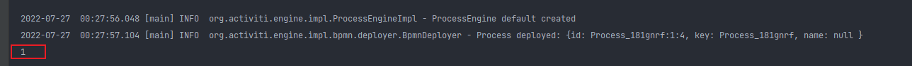

##### 使用Camuada画好流程图之后,放入test的resources文件夹下



还有文件holiday.bpmn
```xml
<?xml version="1.0" encoding="UTF-8"?>
<bpmn:definitions xmlns:bpmn="http://www.omg.org/spec/BPMN/20100524/MODEL" xmlns:bpmndi="http://www.omg.org/spec/BPMN/20100524/DI" xmlns:dc="http://www.omg.org/spec/DD/20100524/DC" xmlns:di="http://www.omg.org/spec/DD/20100524/DI" xmlns:modeler="http://camunda.org/schema/modeler/1.0" id="Definitions_01ijjqa" targetNamespace="http://bpmn.io/schema/bpmn" exporter="Camunda Modeler" exporterVersion="5.1.0" modeler:executionPlatform="Camunda Platform" modeler:executionPlatformVersion="7.17.0">
  <bpmn:process id="Process_181gnrf" isExecutable="true">
    <bpmn:startEvent id="StartEvent_1">
      <bpmn:outgoing>Flow_1uwufew</bpmn:outgoing>
    </bpmn:startEvent>
    <bpmn:sequenceFlow id="Flow_1uwufew" sourceRef="StartEvent_1" targetRef="Activity_1npyna7" />
    <bpmn:userTask id="Activity_1npyna7" name="填写请假单">
      <bpmn:incoming>Flow_1uwufew</bpmn:incoming>
      <bpmn:outgoing>Flow_0b4ubqr</bpmn:outgoing>
    </bpmn:userTask>
    <bpmn:userTask id="Activity_0pkiaxt" name="部门经理审批">
      <bpmn:incoming>Flow_0b4ubqr</bpmn:incoming>
      <bpmn:outgoing>Flow_0valpjd</bpmn:outgoing>
    </bpmn:userTask>
    <bpmn:sequenceFlow id="Flow_0b4ubqr" sourceRef="Activity_1npyna7" targetRef="Activity_0pkiaxt" />
    <bpmn:userTask id="Activity_03s26sy" name="人事审批">
      <bpmn:incoming>Flow_0valpjd</bpmn:incoming>
      <bpmn:outgoing>Flow_0yncbjq</bpmn:outgoing>
    </bpmn:userTask>
    <bpmn:sequenceFlow id="Flow_0valpjd" sourceRef="Activity_0pkiaxt" targetRef="Activity_03s26sy" />
    <bpmn:endEvent id="Event_17cngag">
      <bpmn:incoming>Flow_0yncbjq</bpmn:incoming>
    </bpmn:endEvent>
    <bpmn:sequenceFlow id="Flow_0yncbjq" sourceRef="Activity_03s26sy" targetRef="Event_17cngag" />
  </bpmn:process>
  <bpmndi:BPMNDiagram id="BPMNDiagram_1">
    <bpmndi:BPMNPlane id="BPMNPlane_1" bpmnElement="Process_181gnrf">
      <bpmndi:BPMNEdge id="Flow_1uwufew_di" bpmnElement="Flow_1uwufew">
        <di:waypoint x="215" y="120" />
        <di:waypoint x="340" y="120" />
      </bpmndi:BPMNEdge>
      <bpmndi:BPMNEdge id="Flow_0b4ubqr_di" bpmnElement="Flow_0b4ubqr">
        <di:waypoint x="440" y="120" />
        <di:waypoint x="570" y="120" />
      </bpmndi:BPMNEdge>
      <bpmndi:BPMNEdge id="Flow_0valpjd_di" bpmnElement="Flow_0valpjd">
        <di:waypoint x="670" y="120" />
        <di:waypoint x="860" y="120" />
      </bpmndi:BPMNEdge>
      <bpmndi:BPMNEdge id="Flow_0yncbjq_di" bpmnElement="Flow_0yncbjq">
        <di:waypoint x="960" y="120" />
        <di:waypoint x="1122" y="120" />
      </bpmndi:BPMNEdge>
      <bpmndi:BPMNShape id="_BPMNShape_StartEvent_2" bpmnElement="StartEvent_1">
        <dc:Bounds x="179" y="102" width="36" height="36" />
      </bpmndi:BPMNShape>
      <bpmndi:BPMNShape id="Activity_1trclj2_di" bpmnElement="Activity_1npyna7">
        <dc:Bounds x="340" y="80" width="100" height="80" />
      </bpmndi:BPMNShape>
      <bpmndi:BPMNShape id="Activity_1kj5k5o_di" bpmnElement="Activity_0pkiaxt">
        <dc:Bounds x="570" y="80" width="100" height="80" />
      </bpmndi:BPMNShape>
      <bpmndi:BPMNShape id="Activity_06rxsjd_di" bpmnElement="Activity_03s26sy">
        <dc:Bounds x="860" y="80" width="100" height="80" />
        <bpmndi:BPMNLabel />
      </bpmndi:BPMNShape>
      <bpmndi:BPMNShape id="Event_17cngag_di" bpmnElement="Event_17cngag">
        <dc:Bounds x="1122" y="102" width="36" height="36" />
      </bpmndi:BPMNShape>
    </bpmndi:BPMNPlane>
  </bpmndi:BPMNDiagram>
</bpmn:definitions>
```

然后执行如下代码
```java
@Test
public void testProcessEngine2(){
    ProcessEngineConfiguration configuration = ProcessEngineConfiguration.createProcessEngineConfigurationFromResource("activiti.cfg.xml");
    ProcessEngine processEngine = configuration.buildProcessEngine();

    RepositoryService repositoryService = processEngine.getRepositoryService();

    //定义一个流程
    Deployment deployment = repositoryService.createDeployment()
            .addClasspathResource("holiday.bpmn")
            .addClasspathResource("holiday.png")
            .name("请假流程")
            .key("Process_181gnrf")
            .deploy();

    System.out.println(deployment.getId());
}
```

打印出来的结果是1



https://www.cnblogs.com/cjsblog/p/14983092.html
