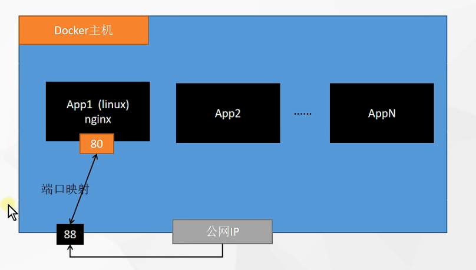
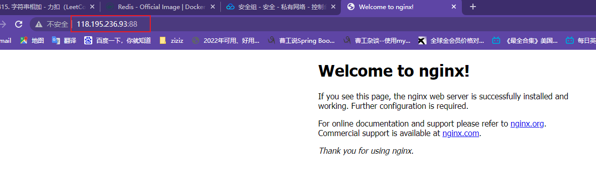

docker相当于是一个小linux，那么在小linux里面是怎么安装软件的呢？  

查看镜像
```java
docker images 
docker images -q #查看镜像的id
```

搜索镜像
```java
docker search 镜像名称
```

拉取镜像
```java
docker pull 镜像名称
docker pull 镜像名称:版本号
```

怎么找版本好呢？到docker hub上面找，跟maven仓库一样

**删除镜像**
```java
docker rmi 镜像id #删除指定本地镜像
docker rmi `docker images-q` #删除所有本地镜像
```

制作镜像，
```java
docker commit [容器id] [容器name:容器版本号version]
```

##### 启动镜像
```java
docker run [OPTOINS] IMAGE [COMMAND] [ARG...]

# -d 后台运行
# --name 指定名称
docker run --name=mynginx -d  nginx:1.22.0

#--restart=always 开机自启动
docker run --name=mynginx -d --restart=always nginx:1.22.0

#修改容器的属性，但是修改不了端口映射，只能删掉
docker update [containerId] 属性

#强制删除，正在运行中的
docker rm -f [containerId]

#-p 就是端口，主机88端口，到80端口
docker run --name=mynginx -d --restart=always -p 88:80 nginx:1.22.0
```




看到了13讲（还没看完）