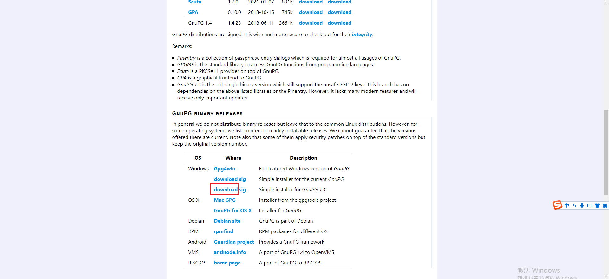

<https://blog.csdn.net/lizhengjava/article/details/81704283>

##### 发布jar包

1. 注册账号<https://issues.sonatype.org/secure/Signup!default.jspa>
1. 创建一个ussue，new project类型
1. 配置仓库地址，和server账号 进行中
1. 安装PGP<https://www.gnupg.org/download/>

*** 
https://issues.sonatype.org/browse/OSSRH-82262

修改gourpId为**<io.github.cocodex>**
在自己的github上，新建仓库命为<https://github.com/cocodx/OSSRH-82268>让管理员验证

