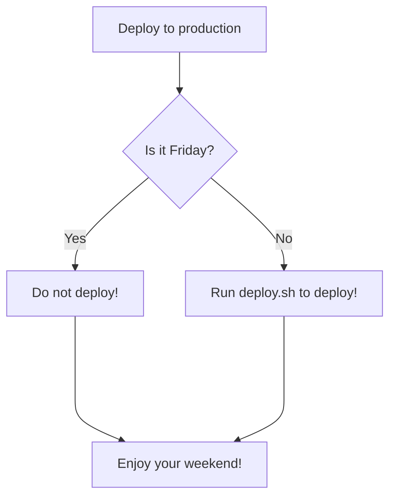

```mermaid
flowchart TD
    A[Deploy to production] --> B{Is it Friday?};
    B -- Yes --> C[Do not deploy!];
    B -- No --> D[Run deploy.sh to deploy!];
    C ----> E[Enjoy your weekend!];
    D ----> E[Enjoy your weekend!];
```

哈哈 流程图🧩