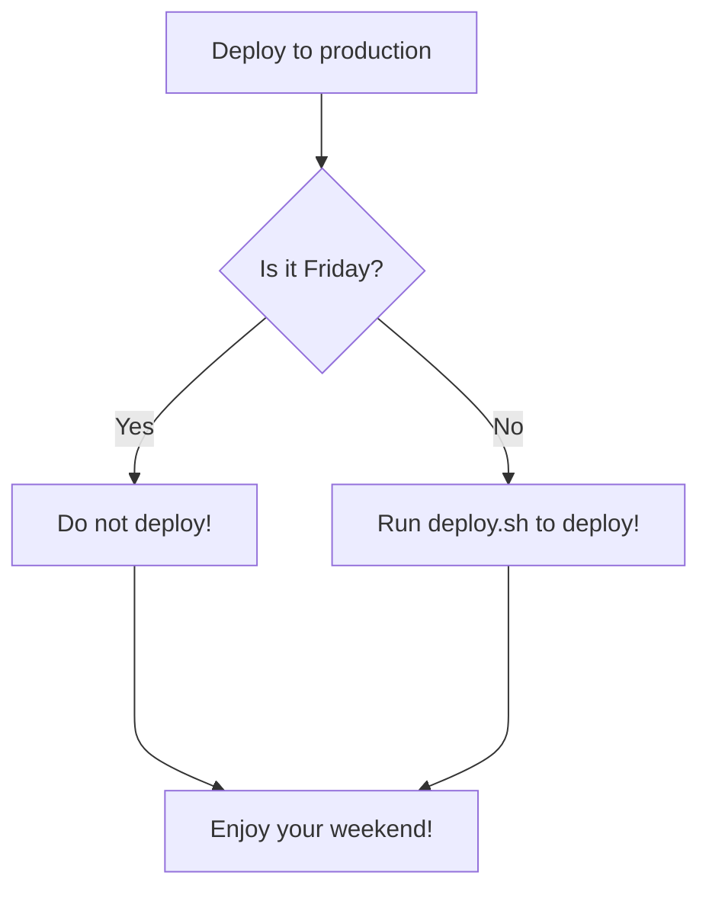
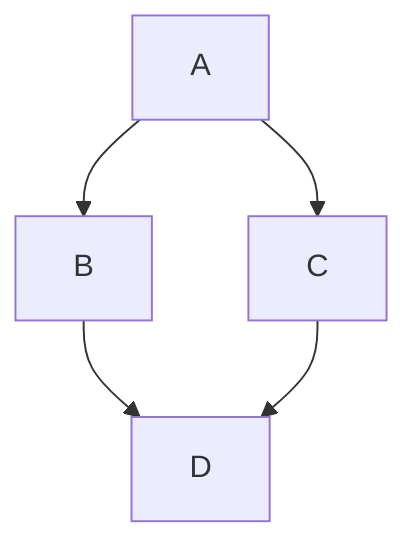
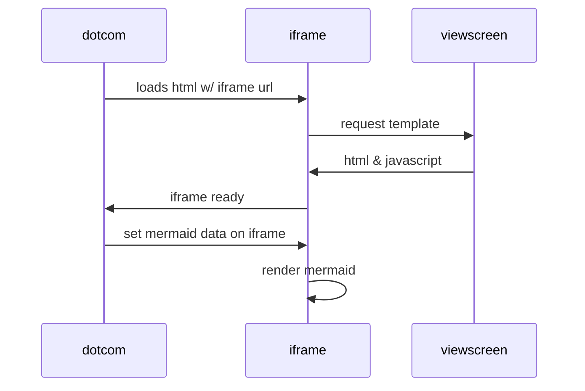

```mermaid
flowchart TD
    A[Deploy to production] --> B{Is it Friday?};
    B -- Yes --> C[Do not deploy!];
    B -- No --> D[Run deploy.sh to deploy!];
    C ----> E[Enjoy your weekend!];
    D ----> E[Enjoy your weekend!];
```

哈哈 æµç¨‹å›¾ðŸ§©

```mermaid
    graph TD;
        A-->B;
        A-->C;
        B-->D;
        C-->D;
```

🎭

```mermaid
sequenceDiagram
    participant dotcom
    participant iframe
    participant viewscreen
    dotcom->>iframe: loads html w/ iframe url
    iframe->>viewscreen: request template
    viewscreen->>iframe: html & javascript
    iframe->>dotcom: iframe ready
    dotcom->>iframe: set mermaid data on iframe
    iframe->>iframe: render mermaid
```