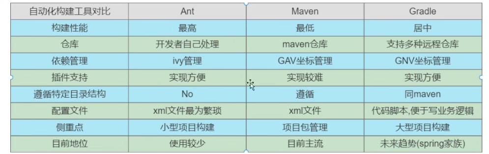
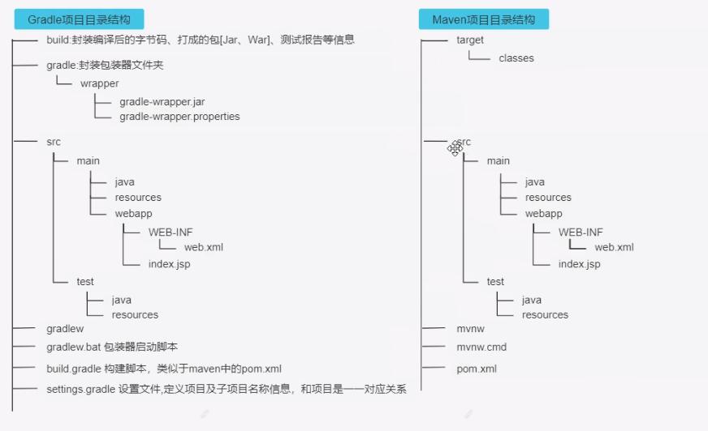

ant: 2000年 apache build.xml 文件管理项目
优缺点：速度快，需编写繁杂的xml文件构建指令，对开发文件是一个挑战。

maven：apache 基于pom.xml文件管理
优缺点：大型项目构建，侧重于包管理，速度比gradle慢

gradle：goole基于grovey语言开发的，spring5.0都是用grovey管理。

springboot的Gradle插件需要6.8x版本及以上。我们这里选择7.x版本。

