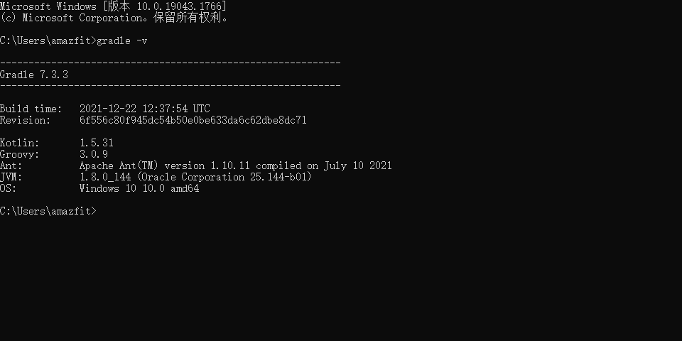
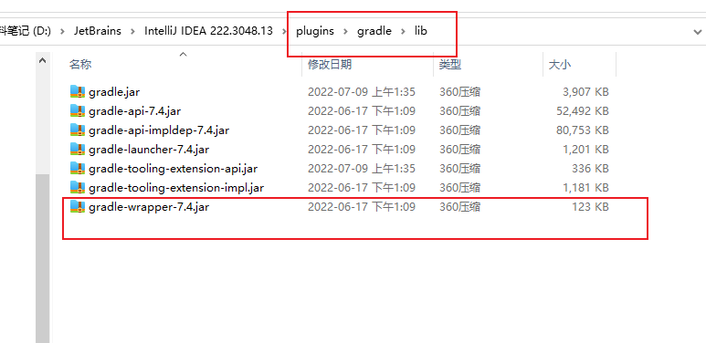
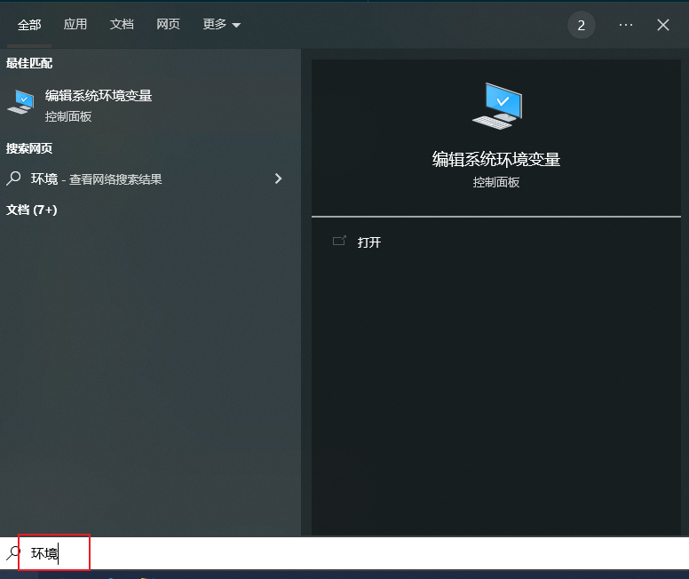
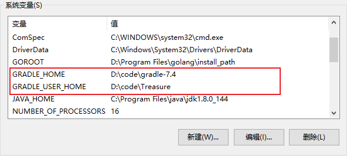
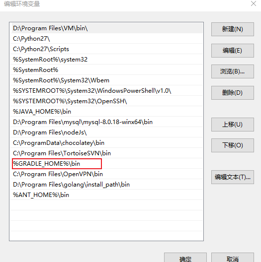
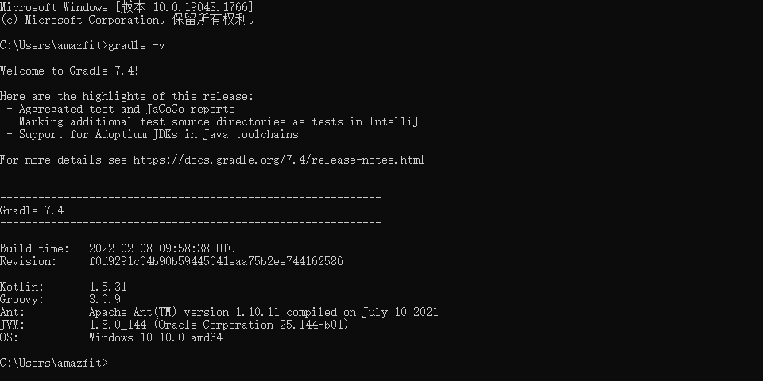

查看gradle版本
```java
gradle -v
```


查看idea支持的gradle版本
D:\JetBrains\IntelliJ IDEA 222.3048.13\plugins\gradle\lib


下载界面 https://gradle.org/releases/

#### 配置系统环境变量



跟安装java没什么区别
```java
GRADLE_HOME ： 文件目录
GRADLE_USER_HOME ： jar包本地库
```



