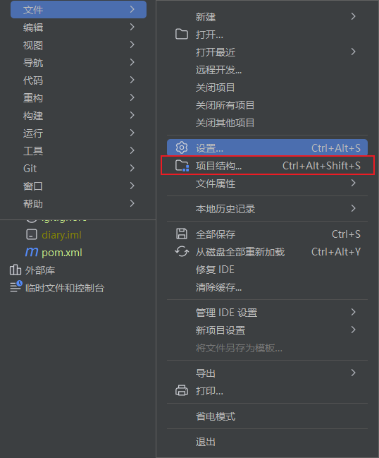
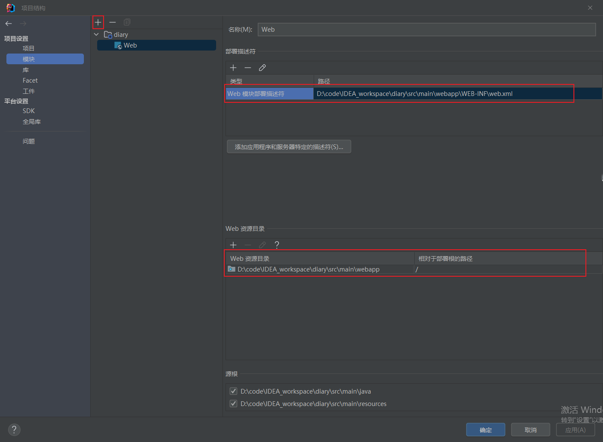
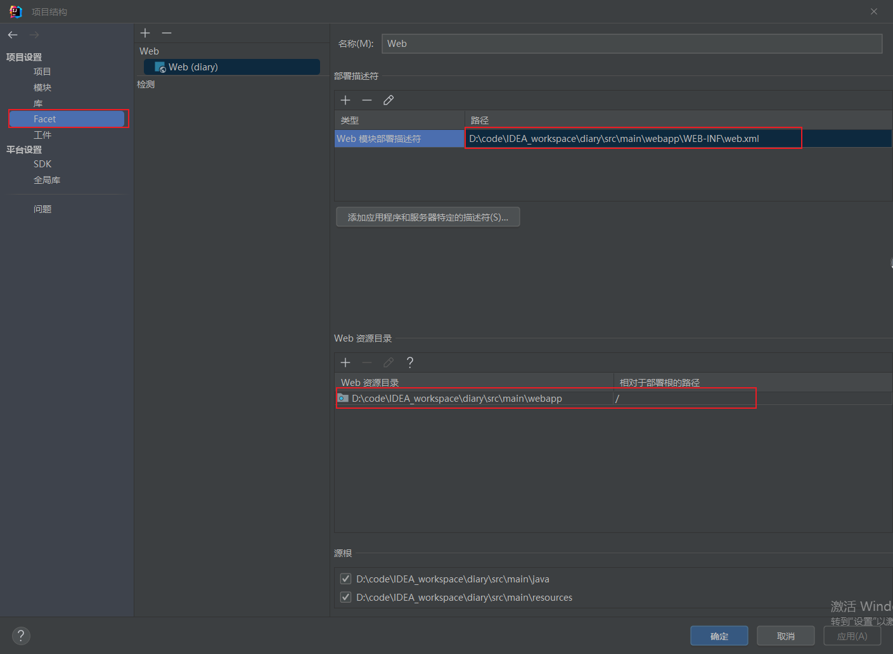

1. 用idea新建一个普通的maven目录
1. 在src/main下新建webapp目录，在里面新建子目录WEB-INF，在里面新建web.xml文件
1. 在idea打开项目结构设置，添加web模块。保存即可。


```xml
<?xml version="1.0" encoding="UTF-8"?>
<web-app xmlns:xsi="http://www.w3.org/2001/XMLSchema-instance"
         xmlns="http://java.sun.com/xml/ns/javaee"
         xmlns:web="http://java.sun.com/xml/ns/javaee/web-app_2_5.xsd"
         xsi:schemaLocation="http://java.sun.com/xml/ns/javaee http://java.sun.com/xml/ns/javaee/web-app_2_5.xsd"
         id="WebApp_ID" version="2.5">


</web-app>
```








