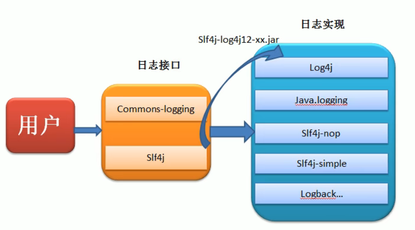
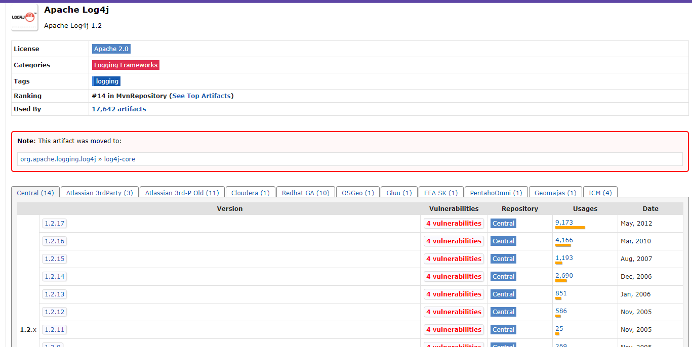

####日志接口
JCL：后来更名为commons Logging，简称JCL  
SLF4J：简易Java日志门面，只提供相关接口，和其他日志工具之间需要桥接

####日志实现
* JUL：JDK中的日志工具，1.4之后sun官方自己维护
* Log4j：隶属于Apache的，不再维护
* Log4j2：Log4j的升级版本，与Log4j变化很大，不兼容
* Logback：一个具体的日志实现框架，和Slf4j是同一个工作，性能很好



####上古时代
在JDK1.3以前，java打日志System.out.println(),System.err.println()或者e.printStackTrace(),这样非常大的缺陷，粒度太大。

***
2001年Log4j，捐给Apache，后来衍生其他语言的。。。

它定义的Logger（在哪写）、Appender（写日志）、Level（info，debug，error）等概念.Log4j性能是个问题，在Logback和Log4j2出来以后，2015年就不再维护了。

```xml
<dependency>
    <groupId>log4j</groupId>
    <artifactId>log4j</artifactId>
    <version>1.2.17</version>
</dependency>
<dependency>
    <groupId>log4j</groupId>
    <artifactId>apache-log4j-extras</artifactId>
    <version>1.2.17</version>
</dependency>

```