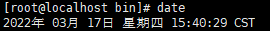

查看firewalld状态
> systemctl status firewalld

关闭firewalld
> systemctl stop firewalld

开机禁用firewalld
> systemctl disable firewalld

**ssh默认端口是22**
**ftp默认端口是21**

解压gz文件
> tar zxvf jdk-8u211-linux-x64.tar.gz

建立软连接，它的功能是为某一个文件在另外一个位置建立一个不同的链接
> ln -s 源文件 目标文件

启动zookeeper，进行bin目录
> ./zkServer.sh start

切换用户
```powershell
sudo -su richmail
```

vim显示行号，进行命令模式
```powershell
:set nu 或者 :set number
```

查看进程端口
```powershell
netstat -lnpt |grep 40380
```

显示文件的大小
```powershell
du -h *.*
```

显示文件的权限
```powershell
ls -al
```

查看当前系统时间
```powershell
date
```

cst=chinese standard time 
查看硬件时间
```powershell
clock
```
