##### 1.1点击安装按钮
.jpg)
##### 1.2选择高级
.jpg)
##### 1.3默认下一步
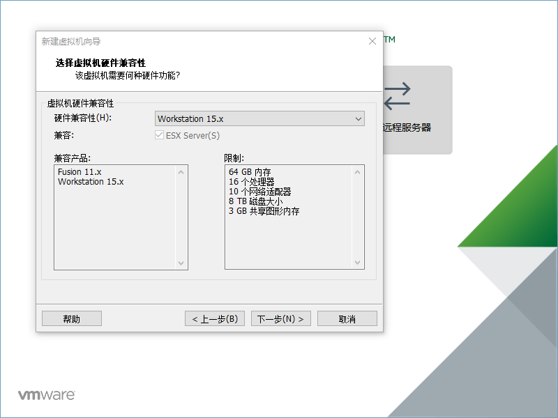
##### 1.4选择稍后安装
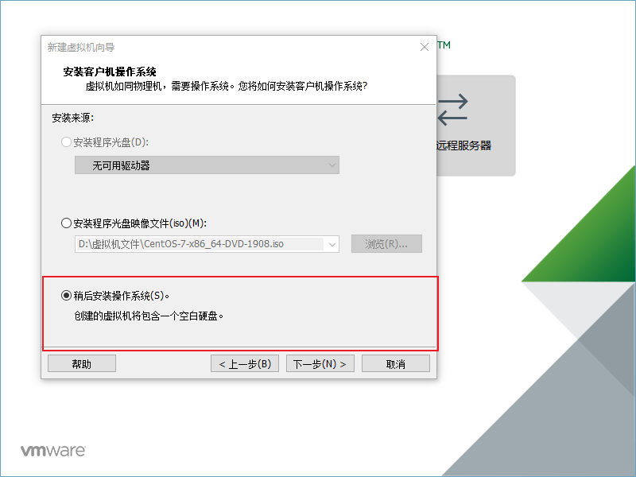
##### 1.5选择对应的

##### 1.6设置名称和安装位置
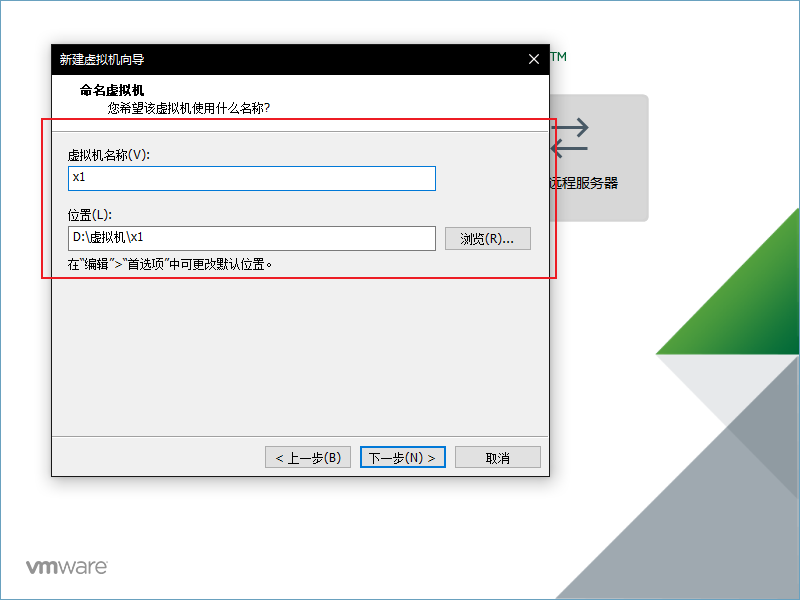
##### 1.7默认就好
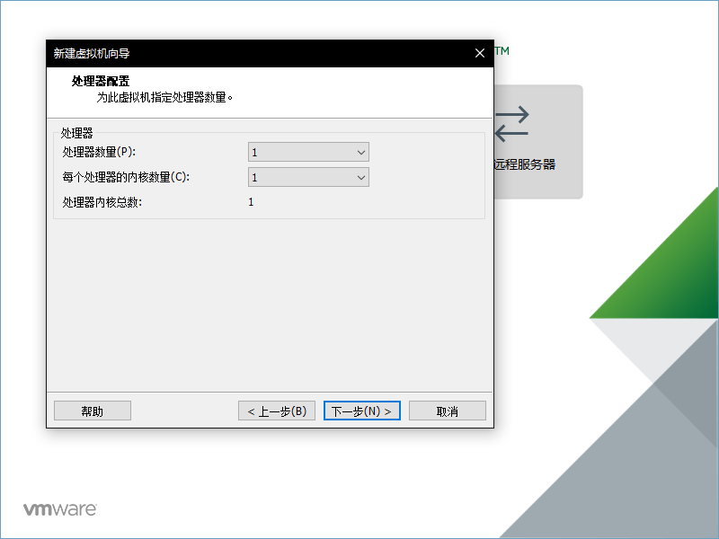
##### 1.8由于我电脑是32GB内存，设置2GB就可以了
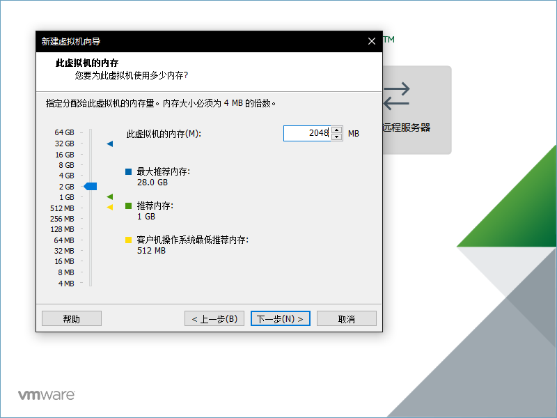
##### 1.9网络选择NAT

##### 2.0下两步默认
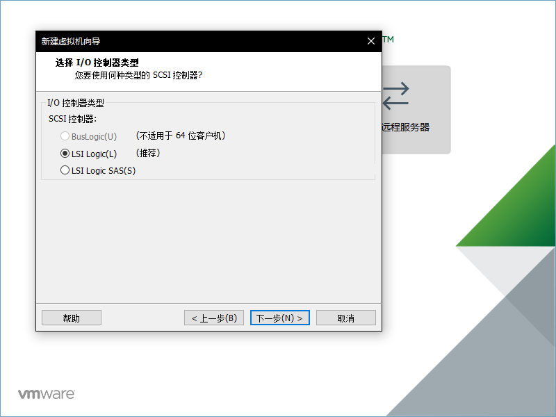
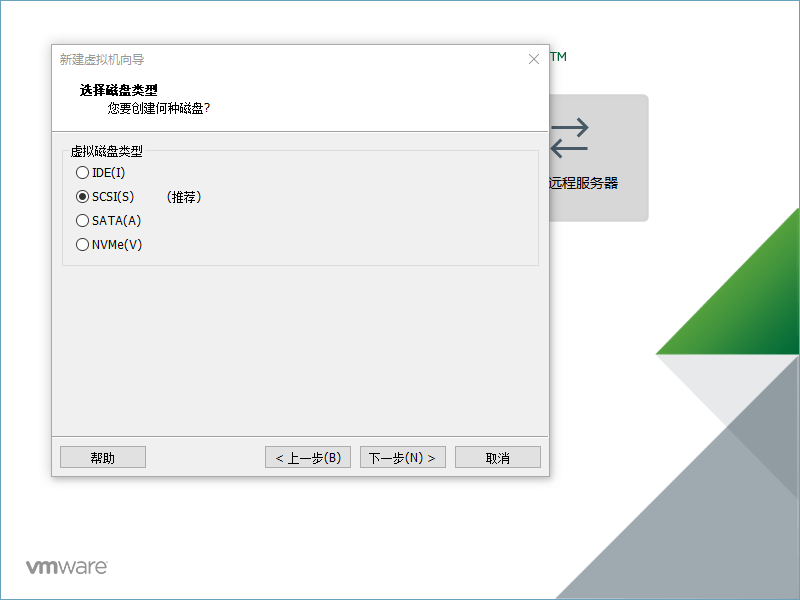

##### 2.1点击创建新虚拟磁盘

##### 2.2磁盘给20GB，将虚拟磁盘拆分成多个文件
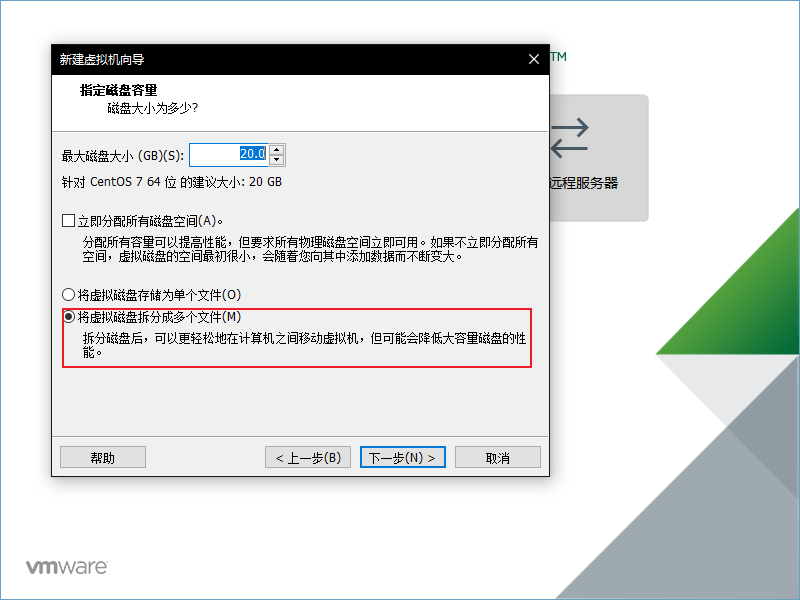
##### 2.3点击下一步
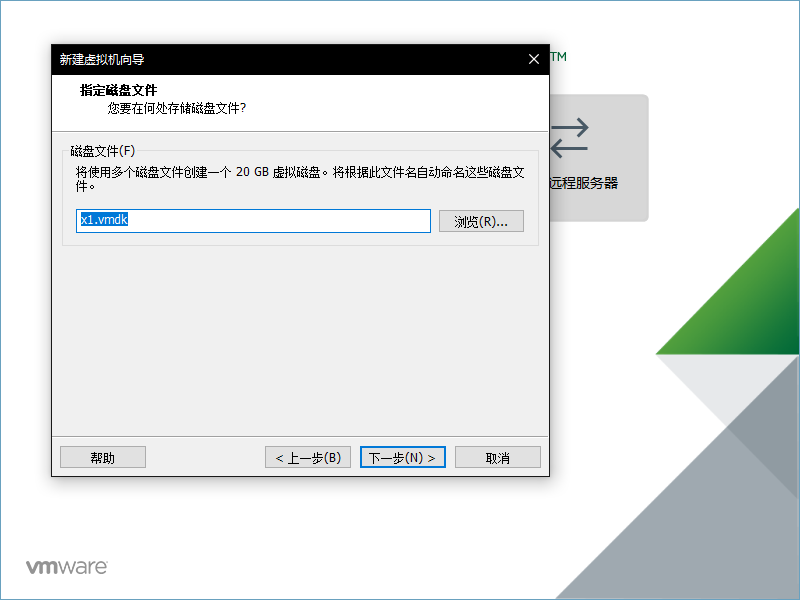

##### 2.4已经添加进去了
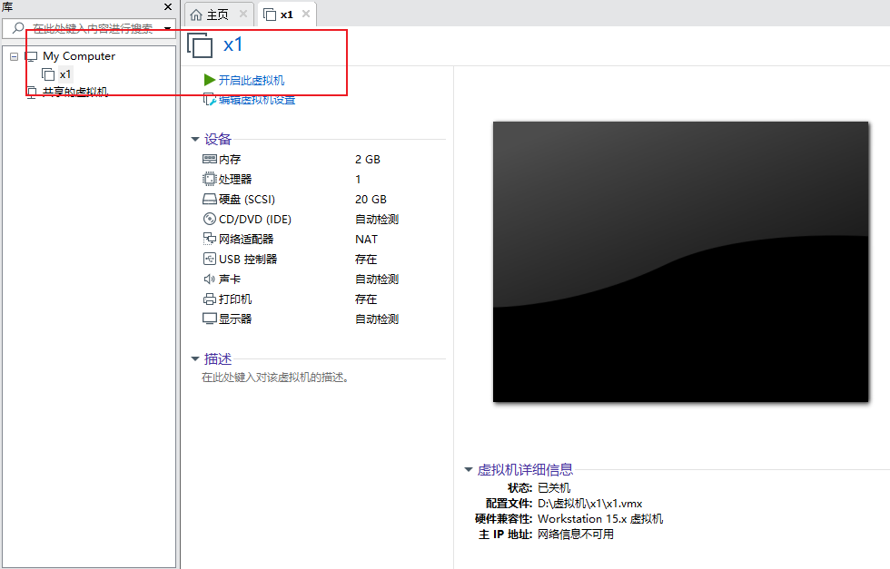
##### 2.5编辑虚拟机位置
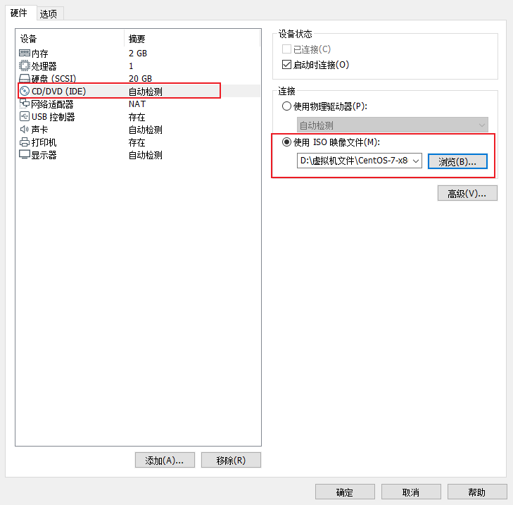

##### 2.6点击确定，然后开启虚拟机，然后install

##### 2.7选择中文
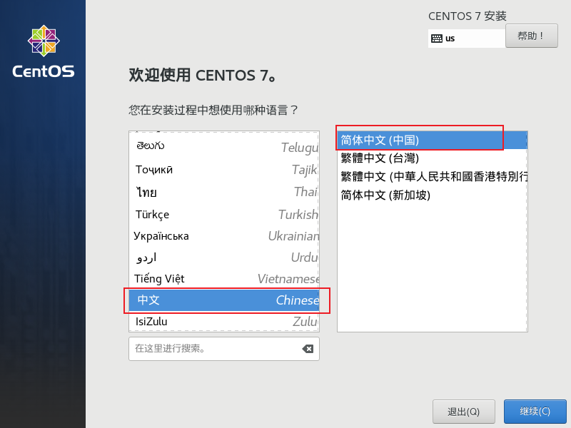

##### 3.0重启之后，ip addr
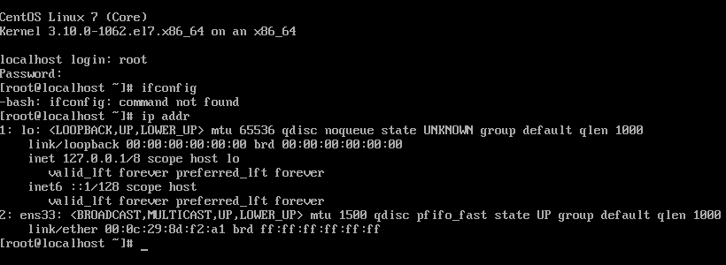
发现ens33，没有inet属性，那么就没法通过IP连接虚拟机。

接着来查看ens33网卡的配置： vi /etc/sysconfig/network-scripts/ifcfg-ens33   注意vi后面加空格

vi是Linux内置的文本编辑器命令 打开文件的意思
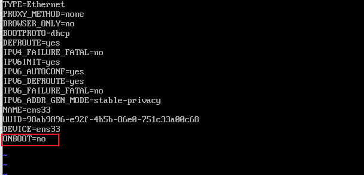
改为yes

然后重启网络服务： sudo service network restart 

然后再 ip addr查看
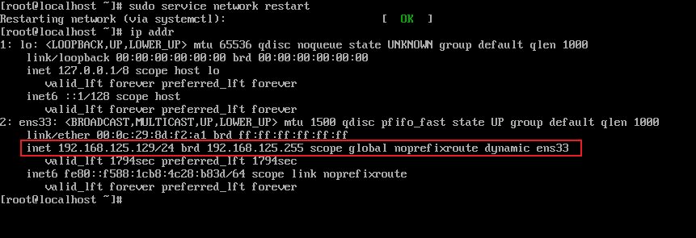

要把网络再改成桥接模式，不勾选复制，才行，再重启，如此美妙的画面
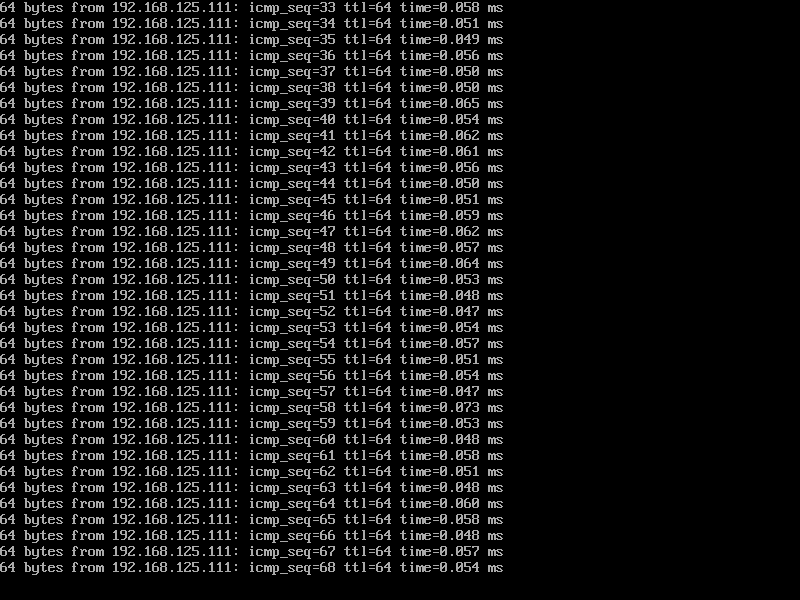
