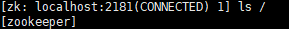
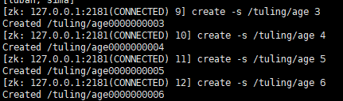
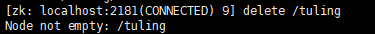
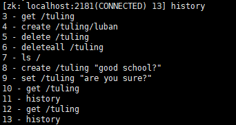
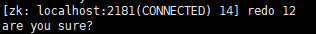

zookeeper在linux的一些操作

启动zookeeper方式1,进入bin目录，并将conf目录下面的zoo_simple.cfg改为zoocfg
> ./zkServer.sh start

启动zookeeper方式2,进入bin目录
> ./zkServer.sh ../conf/zoo_simple.cfg start

通过客户端进行连接1
> ./zkCli.sh

通过客户端进行连接2
```powershell
./zkCli.sh 127.0.0.1:2181
```

退出zkCli.sh客户端
```powershell
quit
```

关闭会话1
```powershell
close
```

重新连接2
```powershell
connect 127.0.0.1:2181
```

查看zookeeper根节点,-R 查看所有的
```powershell
ls /
```


创建节点（默认就是持久节点）
```powershell
create /tuling "good school"
```

创建临时节点,在会话关闭自后，就会被销毁
```powershell
create -e /tuling/sima "hello"
```

创建序号节点
```powershell
create -s /tuling/age 3
```


创建临时序号节点
```powershell
create -s -e /tuling/age 3
```

获取节点
```powershell
get /tuling 
```

修改节点数据
```powershell
get /tuling "ok ok"
```

删除节点，如果tuling这个节点下面还有子节点，会删除失败的,可以使用deleteall删除
```powershell
delete /tuling
```


删除当前的节点及其子节点
```powershell
deleteall /tuling
```

显示操作历史
```powershell
history
```


重复执行redo + 操作历史的序号
```powershell
redo 12
```


