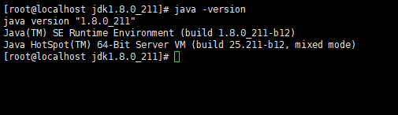

在前置条件解压，jdk的gz包之后。配置环境变量
tar -zxvf jdk-8u211-linux-x64.tar.gz  

##### 1.1 记住jdk的路径
> /home/software/jdk1.8.0_211

##### 1.2 修改profile文件
> vim /etc/profile

##### 1.3 在末尾添加如下信息
```powershell
export JAVA_HOME=/home/software/jdk1.8.0_211  #jdk安装目录
 
export JRE_HOME=${JAVA_HOME}/jre
 
export CLASSPATH=.:${JAVA_HOME}/lib:${JRE_HOME}/lib:$CLASSPATH
 
export JAVA_PATH=${JAVA_HOME}/bin:${JRE_HOME}/bin
 
export PATH=$PATH:${JAVA_PATH}
```

##### 1.4 保存退出，再刷新profile
> source /etc/profile

##### 1.5 测试java安装是否成功
> java -version

