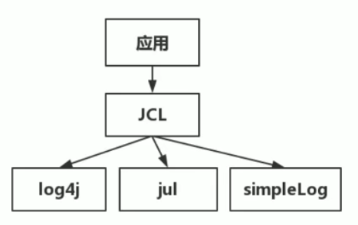

JUL的api和log4j是完全不同的（参数只接受string），由于日志系统互相没有关联，彼此没有约定，不同人的代码使用不同日志，替换和统一也变成了棘手的事情。假如你的应用使用log4j，然后项目引用了一个其他团队的库，他们使用了JUL，你的应用就得使用两个日志系统，然后其他的团队又使用了simplelog。。。。。。。这个情况如果要调整日志的输出级别，用于跟踪某个信息，简直就是一场灾难。

答案就是进行抽象，抽象出一个接口层，对每个日志都适配或者转接，这样提供给别人的库都直接使用抽象层即可，以后调用的时候，就调用这些接口。

commons-logging-xx.jar
jcl只提供接口  
JCL应运而生，具体的实现则在运行时动态寻找，只需要针对JCL接口开发，而调用组件的应用程序则可以在运行时搭配自己喜好的日志实践工具。

jcl会在classLoader中进行查找，如果能找到log4j，则默认使用log4j，如果没有则使用JUL（jdk自带的）实现的，再没有则使用JCL内部提供的SimpleLog实现。