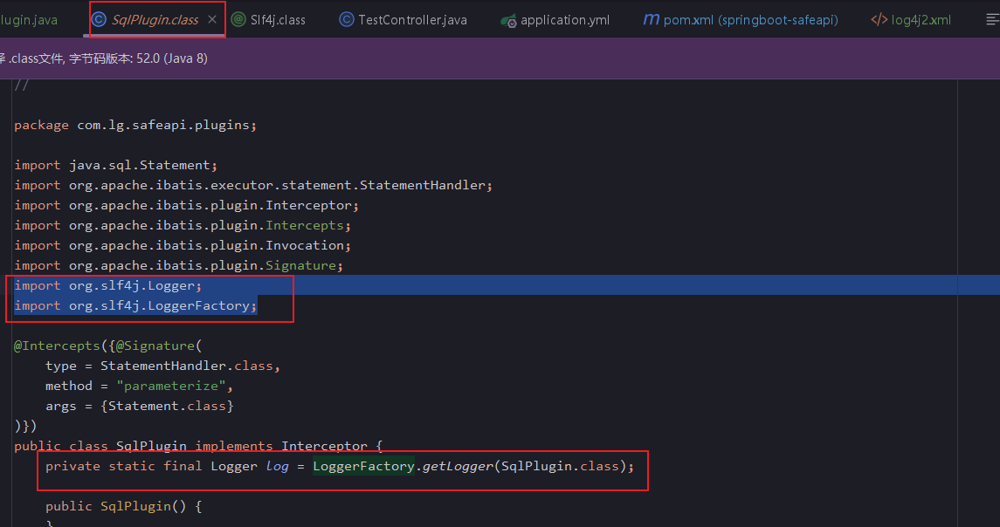

当一个类上面打上slf4j注解。这个类编译之后呢，
```java
@Slf4j
```
编译之后
```java
import org.slf4j.Logger;
import org.slf4j.LoggerFactory;

private static final Logger log = LoggerFactory.getLogger(SqlPlugin.class);
```


可以使用logback，或者log4j2集成slf4j