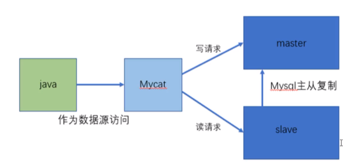
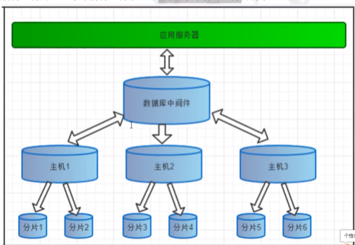
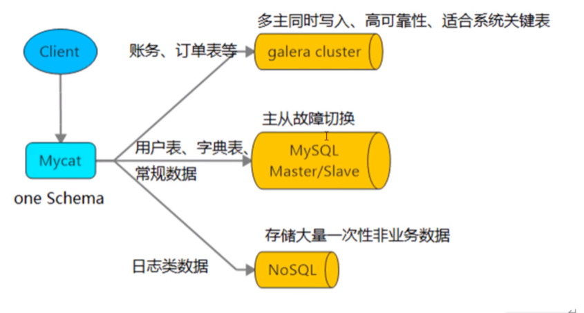

Mycat是数据库中间件
中间件：是一类连接软件组件和应用的计算机软件，便于沟通
Tomcat，web中间件
数据库中间件：连接java应用程序和mysql数据库

为什么要Mycat？
1，java与数据库紧耦合
2，高访问量和高并发对数据库的压力
3，读写请求数据不一致

数据库中间件选型：
Cobar：阿里团队，已多年无更新维护
Mycat：基于Cobar，开源社区维护
OneProxy：不开源的商业中间件
KingShard：go语言开发
Atlas：360团队开发

mycat官网：http://www.mycat.org.cn/

能干什么？
1、读写分离

2、数据分片 垂直、水平拆分、垂直+水平拆分 分库分表
、
3、多数据源整合

原理：通过拦截，它拦截了用户发送过来的SQL语句，首先对SQL语句做了一些特定的分析，如分片分析、路由分析、读写分离分析、缓存分析等。然后将此SQL发往真是的数据库。返回结果做适当的处理