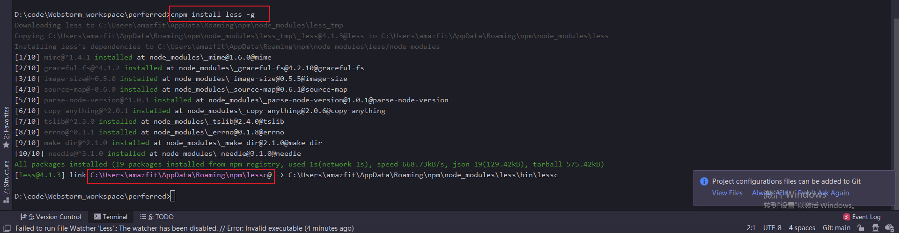
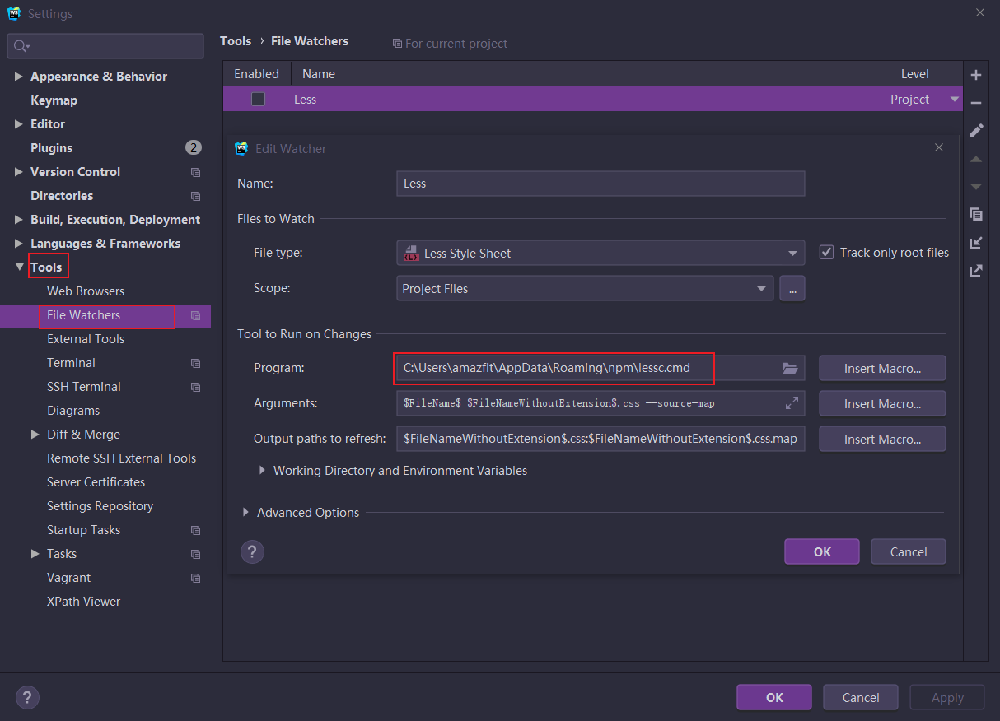
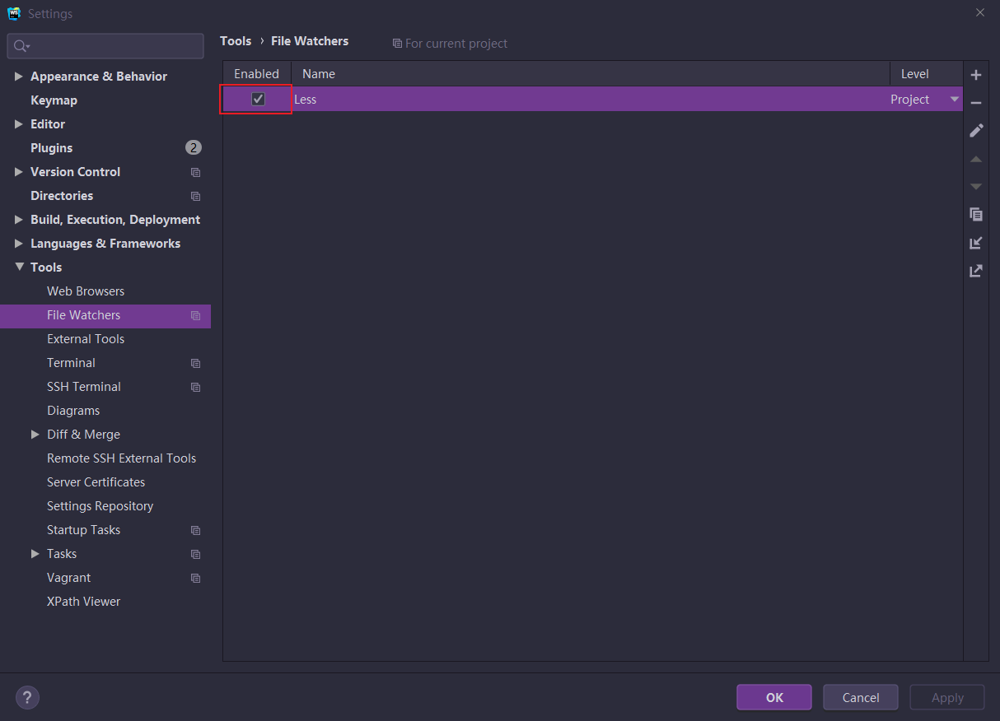

1. 使用node去安装less
1. 然后webstorm配置less解析，去解析称为css

具体过程如下
***
##### node安装less

```powershell
//全局安装less
cnpm install less -g
```



```powershell
C:\Users\amazfit\AppData\Roaming\npm\lessc
```

##### 将此地址配置到webstorm的less监听器设置中去
点击setting -> tools -> file watcher



aplly之后，设置Enable的checkbox框


**再重启一下webstorm**